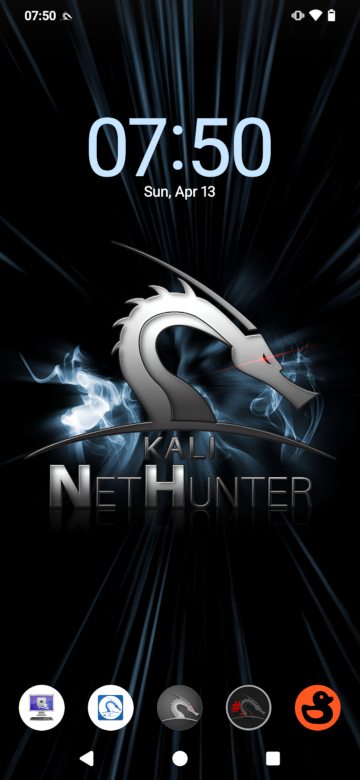

# 개봉부터 넷헌터 실행까지 4단계:
1. adb와 fastboot 설치
2. 부트로더 잠금 해제
3. LineageOS 리커버리와 LineageOS 22, Magisk 플래시
4. 넷헌터 설치

## 1. adb와 fastboot 설치

```console
kali@kali:~$ sudo apt update
[...]
kali@kali:~$ sudo apt install adb fastboot
[...]
kali@kali:~$
```

## 2. 부트로더 잠금 해제

1. 설정 → 휴대전화 정보로 이동한 후 "빌드 번호"를 7번 탭하여 "개발자 옵션"을 활성화해요
2. 설정 → 시스템 → 개발자 옵션으로 이동하여 "OEM 잠금 해제"를 탭한 후 기기를 종료해요
3. 볼륨 다운 + 전원 버튼을 눌러 "FASTBOOT" 화면이 나올 때까지 기다리고, PC에 연결해요
4. 터미널에서 `fastboot flashing unlock` 실행 후 볼륨 다운을 누르고 "FASTBOOT"가 다시 나타나면 `fastboot flashing unlock_critical` 실행
5. 재부팅 후 부팅 화면에 "Unlocked"가 보여야 해요

## 3. LineageOS 리커버리와 LineageOS 22, Magisk 플래시

1. [boot_los22.img](https://thebiggestboi.skyblueborb.workers.dev/0:/boot_los22.img)를 다운로드해요
2. 볼륨 다운을 누르며 기기를 재부팅해 "FASTBOOT" 화면이 나오면 PC에 연결해요
3. 터미널에서 boot_los22.img가 있는 디렉토리로 이동해 아래처럼 리커버리를 플래시해요
```console
kali@kali:~$ cd Downloads/
[...]
kali@kali:~/Downloads$ fastboot flash boot_a boot_los22.img
[...]
kali@kali:~/Downloads$ fastboot flash boot_b boot_los22.img
[...]
kali@kali:~/Downloads$
```
4. `fastboot reboot` 실행 후 볼륨 업 버튼을 눌러 "RECOVERY" 화면이 나올 때까지 기다려요
5. "Apply update" → "Apply from ADB"를 탭해요
6. [lineage-22.0-20241114-UNOFFICIAL-laurel_sprout.zip](https://thebiggestboi.skyblueborb.workers.dev/0:/lineage-22.0-20241114-UNOFFICIAL-laurel_sprout.zip)을 다운로드해요
7. LineageOS 22를 플래시해요
```console
kali@kali:~/Downloads$ adb devices
* daemon not running; starting now at tcp:5037
* daemon started successfully
List of devices attached
dea044c9    sideload

kali@kali:~/Downloads$ adb sideload lineage-22.0-20241114-UNOFFICIAL-laurel_sprout.zip
[...]
kali@kali:~/Downloads$
```
8. 설치가 끝날 때까지 기다리고, 오류가 나오면 "Yes"를 탭해요
9. 설치가 완료되면 "Reboot system now"를 탭해요
10. 일반 안드로이드 폰처럼 기기를 설정해요
11. 설정을 마친 후 재부팅하고 볼륨 업을 누르세요
12. "RECOVERY" 화면이 보이면 "Apply update" → "Apply from ADB"를 탭해요
13. [Magisk-v28.1.apk](https://github.com/topjohnwu/Magisk/releases/download/v28.1/Magisk-v28.1.apk)를 다운로드해요
14. Magisk를 플래시해요
```console
kali@kali:~/Downloads$ adb devices
dea044c9    sideload

kali@kali:~/Downloads$ adb sideload Magisk-v28.1.apk
[...]
kali@kali:~/Downloads$
```
15. 기기를 재부팅하고 새로 설치된 "Magisk" 앱을 열어 화면 안내에 따라 설정해요

## 4. 넷헌터 설치

1. [kali-nethunter-2025.3-laurel-sprout-los-fifteen-full.zip](https://kali.download/nethunter-images/kali-2025.3/kali-nethunter-2025.3-laurel-sprout-los-fifteen-full.zip)을 다운로드해요
2. PC에서 기기로 복사해요
3. Magisk 앱을 열고, 모듈 → 저장소에서 설치를 선택한 후 "kali-nethunter-2025.3-laurel-sprout-los-fifteen-full.zip"을 선택해요
4. 설치가 끝날 때까지 기다린 후 "Reboot System"을 탭해요
5. 폰이 시작되면 칼리 부트 애니메이션을 볼 수 있어요

### Xiaomi Mi A3에서 칼리 넷헌터를 즐기세요!

이슈와 풀 리퀘스트로 개발에 도움을 주세요. 감사합니다.
