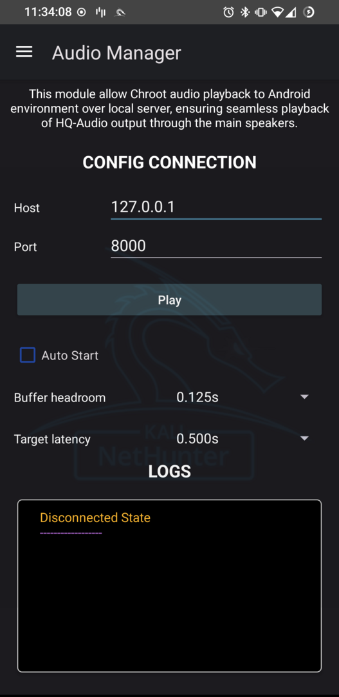

## 소개
이 모듈은 KeX 세션에서 소리를 활성화해요.

칼리 넷헌터와 함께 오디오 매니저를 설정하고 사용하는 단계별 지침이에요.

칼리 넷헌터 GUI 인터페이스를 사용하는 동안 라이브 오디오 스트리밍을 활성화하려면 단계를 주의 깊게 따라하세요.

## 1단계: 일회성 설정

### 1. 칼리 넷헌터 열기

기기에서 칼리 넷헌터 앱을 실행하세요.

### 2. KeX 매니저로 이동

앱 내에서 KeX 매니저로 이동하세요.

### 3. 서버 설정 (필요한 경우)

원하는 사용자를 위해 KeX 서버를 설정하세요.

## 2단계: 서버 시작

### 1. KeX 매니저로 돌아가기

칼리 넷헌터 앱으로 돌아가서 KeX 매니저를 다시 열어요.

### 2. 서버 실행

"Run Server"를 선택하여 선택한 사용자를 위한 KeX 서버를 시작하세요.

## 3단계: 오디오 서버 활성화

### 1. 오디오 서버 활성화

KeX 서버가 실행되면 돌아가서 KeX 매니저에서 오디오를 활성화하세요.

## 4단계: 오디오 매니저 구성

### 1. 오디오 매니저 열기

기기에서 오디오 매니저를 열어요.

### 2. IP와 포트 설정

오디오 매니저에서 다음 세부 정보를 입력하세요 (기본 설정):

IP: 127.0.0.1

포트: 8000

### 3. 재생 클릭

재생 버튼을 누르세요.

연결 상태에 따라 오류 메시지 또는 성공 메시지가 표시될 거예요.

## 5단계: GUI 인터페이스 접근

### 1. KeX 클라이언트로 이동

KeX 클라이언트를 열어요.

### 2. GUI 인터페이스 시작

이제 칼리용 GUI 인터페이스를 사용할 수 있어요.

### 3. 라이브 오디오 스트리밍 즐기기

모든 것이 올바르게 설정되었다면 시스템에서 라이브 오디오 스트리밍을 할 수 있을 거예요.

## 결론

이 단계들을 따르면 활성 오디오 스트림과 함께 칼리 넷헌터 설정이 완료돼요. 넷헌터 환경에서 작업하는 동안 원활한 사운드 통합을 위해 오디오 매니저 사용을 즐겨보세요.

