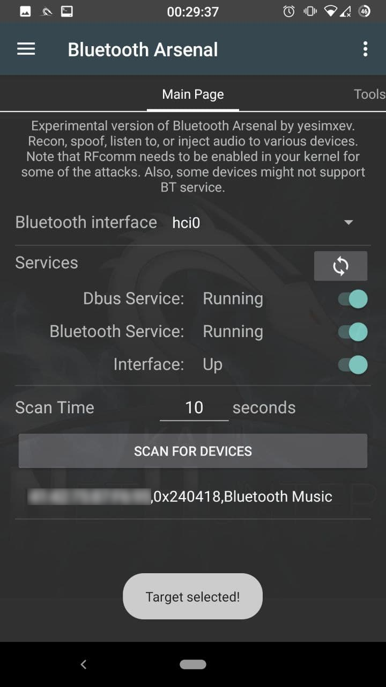
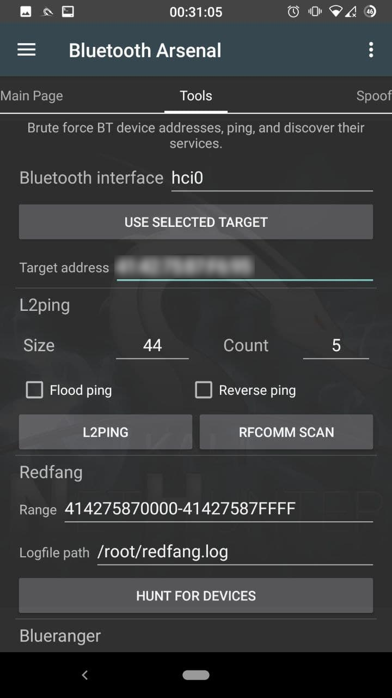
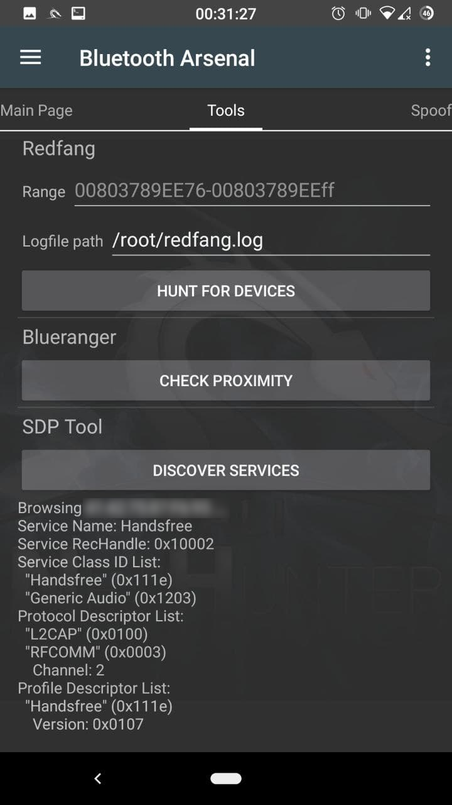
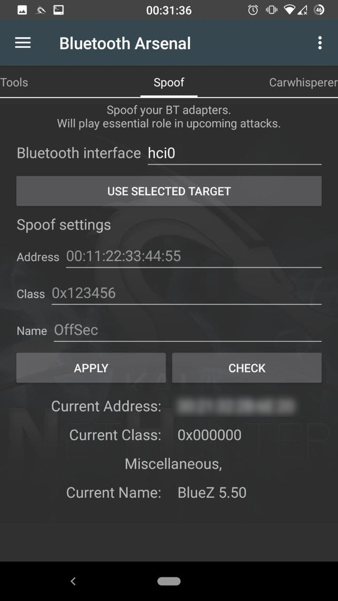
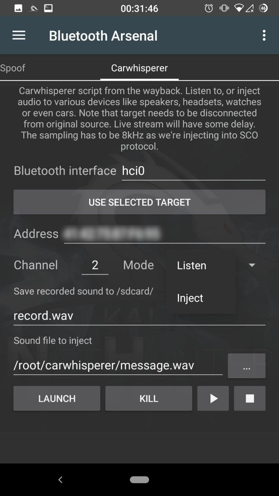
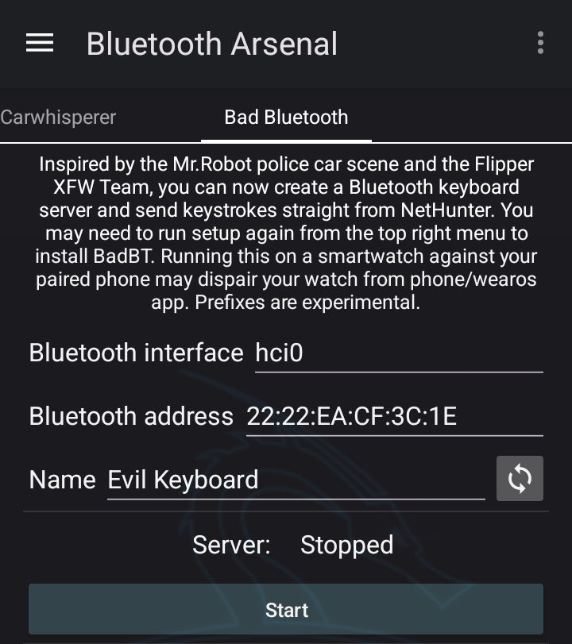

블루투스-아스날은 블루투스 기반 공격을 위한 제어 센터예요.

## 블루투스 아스날 시작하기

햄버거 메뉴 항목을 클릭하고 "Bluetooth Arsenal"을 선택하여 블루투스 메뉴를 열어요. 여기서 서비스를 시작하고 중지하고, 인터페이스를 활성화하고, 검색 가능한 기기를 스캔할 수 있어요. 다음 페이지의 Redfang을 사용하면 검색 모드가 아닌 기기도 찾을 수 있어요. BLE(Bluetooth Low Energy, 저전력 블루투스)는 아직 지원되지 않아요.

첫 실행 시에만: 환영 팝업에서 "Check and install"을 탭하여 의존성(dependencies)을 설치해요. 나중에 설정하거나 업데이트해야 하는 경우, 오른쪽 상단 모서리의 옵션 메뉴를 언제든지 사용하세요.

## 메인 메뉴

아직 연결하지 않았다면 OTG를 통해 블루투스 어댑터를 연결하고, 새로고침 아이콘을 눌러서 스피너 메뉴에 표시되도록 해요.
스위치를 사용하여 dbus, 블루투스 서비스를 활성화하고 어댑터(hci0)를 활성화해요. 두 번째 어댑터(hci1)를 선택한 경우, 다시 새로고침을 탭하고 인터페이스 스위치로 그것도 활성화해요. 스피너에서 스캔에 필요한 인터페이스를 선택해요. 10초가 적절하지 않다면 스캔 시간을 입력해요. 이제 스캔할 준비가 됐어요. "SCAN FOR DEVICES"를 누르세요. 기기가 발견되면 탭하여 나중에 사용할 수 있도록 선택해요.

## 도구

여러 어댑터를 사용하는 경우 인터페이스 이름을 입력해요. "USE SELECTED TARGET"을 탭하여 선택한 대상 주소를 붙여넣을 수 있어요.

#### L2ping

대상의 블루투스 스택을 크래시시키는 데 이상적이어서, 연결된 기기가 연결 해제되어 검색이나 공격에 노출될 수 있어요. 필요한 경우 크기나 카운트를 수정해요. 플러드 핑(flood ping)은 페어링된 기기의 연결을 끊을 가능성도 높여줘요. 리버스 핑은 에코 요청 대신 에코 응답을 보내요.

#### Redfang

페어링 모드가 아닌 기기를 찾는 데 사용해요. 대상 범위를 입력하고 필요한 경우 로그 파일 경로를 수정해요. "HUNT FOR DEVICES"를 탭하여 시작해요.

#### Blueranger

대상이 얼마나 가까이 있는지 확인해요. "CHECK PROXIMITY"를 탭하여 시작해요.

#### SDPtool

대상의 서비스를 살펴보고 열린 서비스를 찾아요. 핸즈프리 서비스는 우리가 공격할 수 있는 취약한 오디오 서비스예요. "DISCOVER SERVICES"를 탭하여 시작해요.

## 스푸핑

여러 어댑터를 사용하는 경우 인터페이스 이름을 입력해요. "USE SELECTED TARGET"을 탭하여 선택한 대상의 주소, 이름, 클래스를 붙여넣거나, 원하는 수정 사항을 입력해요.

"APPLY"를 탭하여 설정해요. "CHECK"을 탭하여 확인할 수도 있어요.

## Carwhisperer

여러 어댑터를 사용하는 경우 인터페이스 이름을 입력해요. "USE SELECTED TARGET"을 탭하여 선택한 대상 주소를 붙여넣을 수 있어요.

대상의 핸즈프리 서비스가 다른 채널에 있는 경우 채널을 수정해요. 모드를 선택해요:

#### Listen(듣기)

대상의 마이크에서 오디오 녹음을 시작해요. 필요한 경우 녹음 파일명을 수정해요.

#### Inject(주입)

선택한 오디오를 대상에 주입하여 스피커에서 재생되도록 해요. 주입할 오디오 파일의 경로를 입력하거나 선택해요.

"LAUNCH"를 탭하면 터미널에서 스크립트가 시작돼요. 터미널에서 CTRL+C로 종료하거나 앱에서 "KILL"을 탭하여 종료할 수 있어요.
재생 버튼은 듣기가 실행 중이면 스피커에서 라이브 스트리밍을 시작하고, 그렇지 않으면 마지막 녹음을 재생해요.
정지 버튼은 재생을 중지하며, 일시정지는 지원되지 않아요.

## Bad Bluetooth

#### 서버

BadBT 서버에 사용할 원하는 키보드 블루투스 인터페이스, 주소, 이름을 입력해요. dbus와 블루투스 서비스를 포함하여 인터페이스가 작동 중인지 확인해요.

"Start Server"를 탭하면 터미널 창에서 실행되어 대상 클라이언트의 연결을 받을 준비가 돼요. 일부 대상의 경우 페어링 과정에서 터미널에 "yes"를 입력해야 할 수도 있어요.

#### 클라이언트

대상이 연결되면 넷헌터 앱으로 돌아가서 문자열을 보낼 차례예요. 또는 인터랙티브 모드를 사용할 수도 있어요(폰에 물리적 키보드가 연결되어야 함).

문자열 보내기 모드에서는 Android Home, Browser, Windows CMD 등과 같은 기본 접두사를 설정할 수 있어요.

이러한 모드는 실험적이며, HID Ducky 형식이 구현될 가능성이 있어요.

준비가 되면 "Send"를 탭하세요.

