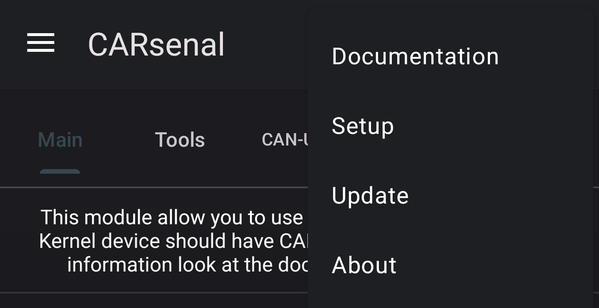
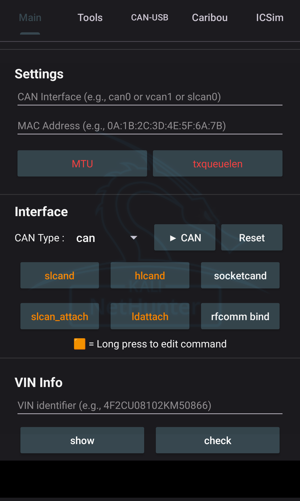
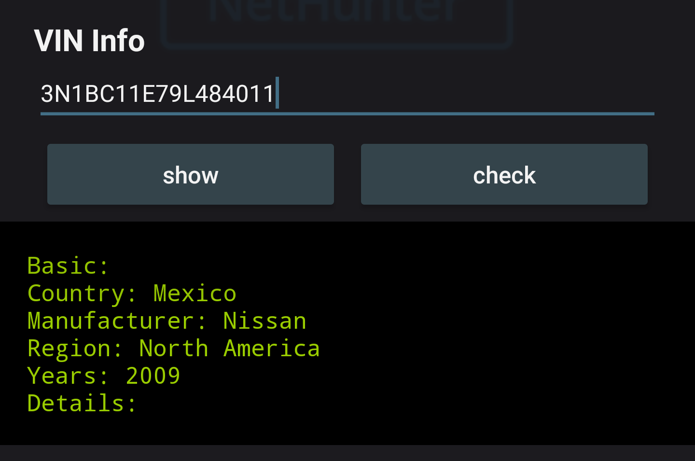
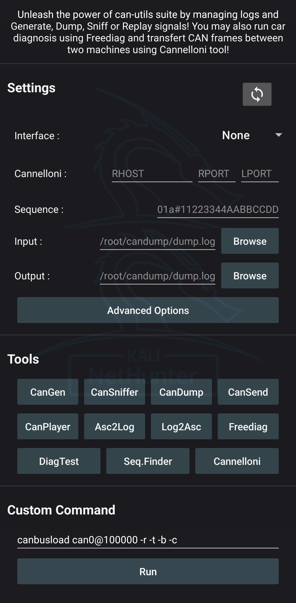
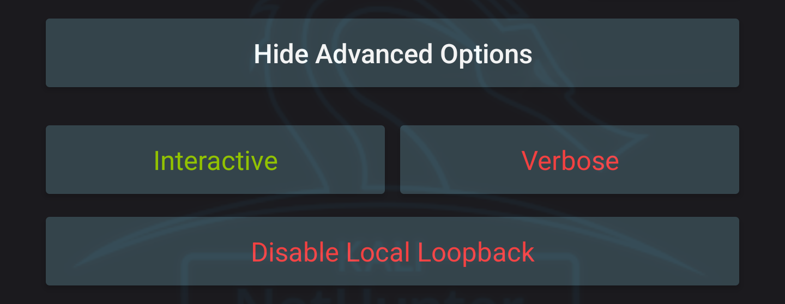
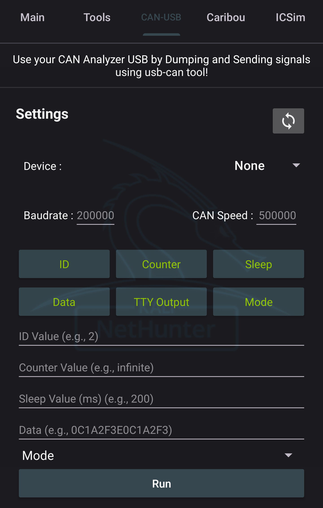
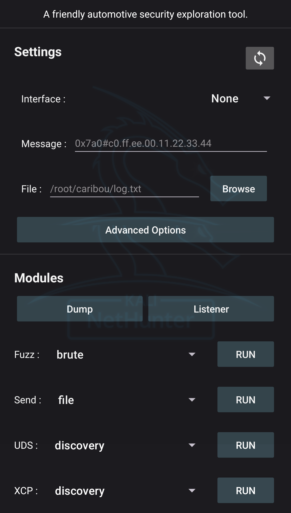
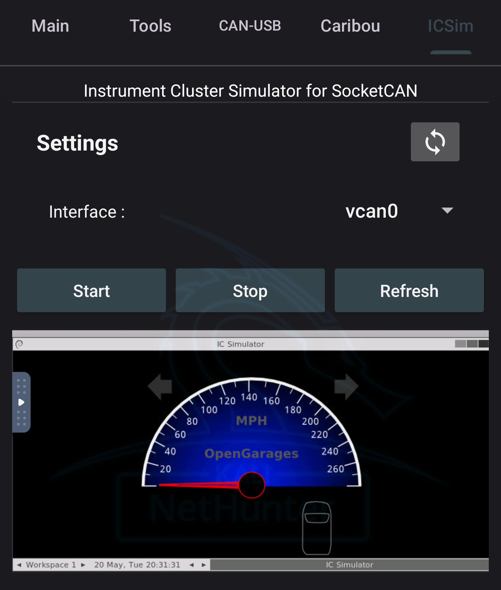

CARsenal은 자동차 해킹 도구 모음을 제공하는 데 사용돼요!

## 전제 조건 - 커널 수정

커널에서 CAN 지원이 활성화되어 있어야 해요. 자세한 정보는 <a href="https://www.kali.org/docs/nethunter/nethunter-kernel-9-config-8/">"커널 구성 - CARsenal"</a> 문서를 참조하세요.

## 메뉴



### 문서

이 버튼은 다음 문서로 리다이렉트해요.

### 설정

이 버튼은 필요한 CAN 도구와 패키지를 설치해요. CARsenal을 처음 실행할 때 자동으로 실행되므로 필요하지 않을 수도 있어요.

### 업데이트

이 버튼은 설치된 CAN 도구와 패키지를 업데이트해요.

### 정보

이 버튼은 CARsenal과 도구 작성자에 대한 크레딧 정보를 보여줘요.

## 메인

메인 탭은 CAN 인터페이스를 구성하는 데 사용돼요. 'VIN 식별자'를 사용하여 주어진 VIN을 디코딩할 수도 있어요.



## 인터페이스

인터페이스 섹션은 CAN 인터페이스를 구성하는 데 사용돼요. 설정에서 인터페이스 이름을 지정하고 선택적으로 사용자 지정 MTU 및 txqueuelen 값을 설정할 수 있어요.

아래에 설명된 대로 일부 데몬/서비스를 활성화할 수도 있어요.

> 주황색 버튼을 길게 눌러 사용자 지정할 수 있어요.

### slcand

시리얼 CAN 기기용 데몬이에요.

***slcand - 사용 명령어:***

```bash
slcand -s6 -t sw -S 200000 /dev/ttyUSB0
```

### hlcand

이 명령어는 버튼을 길게 눌러 편집할 수 있어요. 원하는 대로 수정할 수 있어요.

이것은 ELM327 마이크로컨트롤러를 위해 특별히 만들어진 slcand의 포크예요.

***hlcand - 사용 명령어:***

```bash
hlcand -F -S 500000 /dev/ttyUSB0
```

### socketcand

CAN 인터페이스를 브리지하는 데몬이에요.

***socketcand - 설정 전제 조건:***

설정에서 "CAN Interface"를 설정하세요.

***socketcand - 사용 명령어:***

```bash
socketcand -v -l wlan0 -i <CAN Interface>
```

### slcan_attach

시리얼 CAN 기기를 연결해요.

***slcan_attach - 사용 명령어:***

```bash
slcan_attach -s6 -o /dev/ttyUSB0
```

### ldattach

기기를 연결해요. /dev/rfcomm0 (블루투스)를 기본값으로 설정해요.

***ldattach - 사용 명령어:***

```bash
ldattach --debug --speed 38400 --eightbits --noparity --onestopbit --iflag -ICRNL,INLCR,-IXOFF 29 /dev/rfcomm0
```

### RFCOMM 바인드

블루투스 CAN 어댑터 사용을 위해서예요. 블루투스를 기기에 바인드하려면 실행하세요.

***RFCOMM 바인드 - 설정 전제 조건:***

설정에서 "Target" MAC 주소를 설정하세요.

> 참고: RFCOMM이 지원되어야 하며, 이것이 작동하려면 블루투스 아스날에서 서비스를 먼저 활성화해야 해요.
> 이것을 사용하기 전에 bluetoothctl로 블루투스 기기를 페어링하고 신뢰하세요.

***RFCOMM 바인드 - 사용 명령어:***

```bash
rfcomm bind <selected interface> <Target MAC Address>
```

### CAN 인터페이스


***CAN 인터페이스 시작 - 설정 전제 조건:***

인터페이스에서 "CAN Interface", "CAN Type"을 설정하세요. 그리고 선택적으로 'MTU'와 'txqueulen'을 활성화하여 사용자 지정 값을 설정할 수 있어요. 'VCAN'이 유형으로 선택된 경우 더 이상 필요하지 않아요.

> CAN 또는 SLCAN 인터페이스용 어댑터를 사용하는 경우 "ldattach", "slcand", "slcan_attach", "rfcomm bind" 또는 "socketcand"를 설정해야 할 수도 있어요.

***CAN 인터페이스 시작 - 사용 명령어:***

CAN 타입이 VCAN으로 설정된 경우 먼저 추가해요.

```bash
sudo ip link add dev <CAN Interface> type vcan
```

다음 명령어는 인터페이스를 시작하는 데 실행돼요.

```bash
sudo ip link set <CAN Interface> up 
```

사용자 지정 MTU와 txqueulen을 사용하려면 다음 명령어가 각각 실행돼요.

***MTU - 사용 명령어:***

```bash
sudo ip link set <CAN Inteface> MTU <MTU Value> 
```

***txqueuelen - 사용 명령어:***

```bash
sudo ip link set <CAN Inteface> txqueuelen <txqueuelen Value> 
```

***CAN 인터페이스 중지 - 설정 전제 조건:***

설정에서 "CAN Interface"를 설정하세요.

***CAN 인터페이스 중지 - 사용 명령어:***

```bash
sudo ip link set <CAN Interface> down
```

추가로 VCAN이 인터페이스 유형으로 사용된 경우:

```bash
sudo ip link delete <CAN Interface>
```

***인터페이스 재설정 - 사용 명령어:***

인터페이스를 재설정하기 위해 <a href="https://raw.githubusercontent.com/V0lk3n/NetHunter-CarArsenal/refs/heads/main/can_reset.sh">다음 스크립트</a>를 실행해요.

### VIN 정보

VIN 정보는 VIN 식별자를 디코딩하는 데 사용돼요.

***show 명령어 사용:***

```bash
vininfo show <vinNumber>
```



***check 명령어 사용:***

```bash
vininfo check <vinNumber>
```


## 도구



### Can-Utils: CanGen

CAN 버스 트래픽을 생성하는 데 사용돼요.

***CanGen - 설정 전제 조건:***

원하는 CAN 인터페이스가 시작되고 설정에서 설정되어야 해요.

***CanGen - 사용 명령어:***

```bash
cangen <CAN Interface> -v
```

### Can-Utils: CanSniffer

CAN 버스 트래픽을 스니핑(sniffing, 패킷 감청)하는 데 사용돼요.

***CanSniffer - 설정 전제 조건:***

원하는 CAN 인터페이스가 시작되고 설정에서 설정되어야 해요.

***CanSniffer - 사용 명령어:***

```bash
cansniffer <CAN Interface>
```

### Can-Utils: CanDump

CAN 버스 트래픽을 출력 파일로 덤프하는 데 사용돼요.

***CanDump - 설정 전제 조건:***

원하는 CAN 인터페이스가 시작되고 설정에서 "Output" 경로와 함께 설정되어야 해요.

***CanDump - 사용 명령어:***

```bash
candump <CAN Inteface> -f <Output Log>
```

### Can-Utils: CanSend

특정 시퀀스를 CAN 버스로 재생하는 데 사용돼요.

***CanSend - 설정 전제 조건:***

원하는 CAN 인터페이스가 시작되고 설정에서 "Sequence"와 함께 설정되어야 해요.

***CanSend - 사용 명령어:***

```bash
cansend <CAN Interface> <Sequence>
```

### Can-Utils: CanPlayer

로그 파일에서 덤프된 시퀀스를 CAN 버스로 재생하는 데 사용돼요.

***CanPlayer - 설정 전제 조건:***

원하는 CAN 인터페이스가 시작되고 설정에서 "Input" 경로와 함께 설정되어야 해요.

> CAN 인터페이스는 입력 로그에서 가져오므로 인터페이스가 동일한지 확인하세요. (vcan0로 덤프했다면 vcan0로 재생해야 해요)

***CanPlayer - 사용 명령어:***

```bash
canplayer -I <Input Log>
```

### Asc2Log

can-utils 모음에서 Asc2Log는 ASC 파일 형식을 클래식 LOG로 변환하는 데 사용돼요.

***Asc2Log - 설정 전제 조건:***

설정에서 "Input"과 "Output" 경로를 설정하세요.

***Asc2Log - 사용 명령어:***

```bash
asc2log -I <Input Log> -O <Output File>
```

### Log2Asc

can-utils 모음에서 Log2Asc는 덤프된 LOG 파일을 ASC 형식으로 변환하는 데 사용돼요.

***Log2Asc - 설정 전제 조건:***

원하는 CAN 인터페이스가 시작되고 설정에서 "Input", "Output" 경로와 함께 설정되어야 해요.

***Log2Asc - 사용 명령어:***

```bash
log2asc -I <Input Log> -O <Output File> <CAN Interface>
```

### Freediag

자동차를 진단하는 데 사용돼요.

***Freediag - 사용 명령어:***

```bash
sudo -u kali freediag
```

### Freediag: DiagTest

DiagTest는 코드 경로를 실행하는 데 사용되는 Freediag의 독립 실행형 프로그램이에요.

***DiagTest - 사용 명령어:***

```bash
sudo -u kali diag_test
```

### 커스텀 스크립트: SequenceFinder

<a href="https://raw.githubusercontent.com/V0lk3n/NetHunter-CarArsenal/refs/heads/main/sequence_finder.sh">여기서 소스 코드를 볼 수 있어요.</a>

로그 파일에서 원하는 동작의 정확한 시퀀스를 찾는 데 사용돼요.

>이 커스텀 스크립트는 head와 tail을 사용하여 로그 파일을 자동으로 분할해요. 원하는 동작의 정확한 시퀀스를 찾을 때까지 CanPlayer를 사용하여 사용자 입력과 함께 루프에서 재생해요. 마지막으로 CanSend를 사용하여 재생해요.

***SequenceFinder - 설정 전제 조건:***

원하는 CAN 인터페이스가 시작되고 설정에서 "Input" 경로와 함께 설정되어야 해요.

> CAN 인터페이스는 입력 로그에서 가져오므로 인터페이스가 동일한지 확인하세요. (vcan0로 덤프했다면 vcan0로 재생해야 해요)

***SequenceFinder - 사용 명령어:***

```bash
/opt/car_hacking/sequence_finder.sh <Input Log>
```

### Cannelloni

이더넷을 통해 CAN 버스에서 두 대의 머신과 통신하는 데 사용돼요.

***Cannelloni - 설정 전제 조건:***

원하는 CAN 인터페이스가 설정에서 설정되어야 해요.

Cannelloni에서 "RHOST", "RPORT" 및 "LPORT"를 설정해야 해요.

> 두 기기 모두 이더넷 케이블로 연결되어야 해요.

***Cannelloni - 사용 명령어:***

```bash
sudo cannelloni -I <CAN Interface> -R <RHOST> -r <RPORT> -l <LPORT>
```

### 고급 옵션

CanGen 및 CanPlayer의 경우 "verbose", "interactive mode" 및 "disable local loopback" 인수를 활성화/비활성화할 수 있어요.



### 커스텀 명령어

제공된 명령어와 일치하지 않는 특정 명령어를 실행해야 하는 경우에 사용돼요.


## CAN-USB

주로 'CAN USB 분석기'를 사용하여 시퀀스를 덤프하고 전송하는 데 사용돼요.



***CAN-USB - 설정 전제 조건:***

"USB Device", "CAN Speed", "Baudrate"를 설정하세요.

그런 다음 고급 옵션을 선택하고 설정하세요.

> CAN USB 어댑터가 기기에 연결되어 있어야 하고 새로고침 버튼을 눌러서 연결된 어댑터로 USB 기기를 설정하세요.

***CAN-USB - 사용 명령어:***

```bash
canusb -d <Selected USB> -s <CAN Speed> -b <Baudrate> debugEnabled + idValue + dataValue + sleepValue + countValue + modeValue
```

## Caribou

Caribou는 <a href="https://github.com/CaringCaribou/caringcaribou/blob/master/documentation/dump.md">Dump</a>, <a href="https://github.com/CaringCaribou/caringcaribou/blob/master/documentation/listener.md">Listener</a>, <a href="https://github.com/CaringCaribou/caringcaribou/blob/master/documentation/fuzzer.md">Fuzz</a>, <a href="https://github.com/CaringCaribou/caringcaribou/blob/master/documentation/send.md">Send</a>, <a href="https://github.com/CaringCaribou/caringcaribou/blob/master/documentation/uds.md">UDS</a>, <a href="https://github.com/CaringCaribou/caringcaribou/blob/master/documentation/xcp.md">XCP</a> 모듈을 제공해요.

각 모듈은 해당 문서로 리다이렉트돼요.

***모듈 기능***

* <a href="https://github.com/CaringCaribou/caringcaribou/blob/master/documentation/fuzzer.md">Fuzz 모듈</a>: brute, identify, mutate, random, replay
* <a href="https://github.com/CaringCaribou/caringcaribou/blob/master/documentation/send.md">Send 모듈</a>: file, message
* <a href="https://github.com/CaringCaribou/caringcaribou/blob/master/documentation/uds.md">UDS 모듈</a>: discovery, services
* <a href="https://github.com/CaringCaribou/caringcaribou/blob/master/documentation/xcp.md">XCP 모듈</a>: discovery, info, dump



## ICSim

여기서는 OpenGarage의 ICSim을 noVNC를 사용하여 넷헌터 앱에서 직접 실행할 수 있어요.

주로 VCAN 인터페이스를 사용하여 CARsenal 시뮬레이션을 만드는 데 사용돼요.



ICSim을 시작하기 위해 <a href="https://raw.githubusercontent.com/V0lk3n/NetHunter-CarArsenal/refs/heads/main/icsim_start.sh">다음 스크립트</a>를 실행해요.

ICSim을 중지하기 위해 <a href="https://raw.githubusercontent.com/V0lk3n/NetHunter-CarArsenal/refs/heads/main/icsim_stop.sh">다음 스크립트</a>를 실행해요.

시뮬레이터가 표시되지 않으면 웹뷰를 새로 고치기 위해 새로 고침 버튼을 사용할 수 있어요.

## 리소스

***도구 문서***
* <a href="https://github.com/linux-can/can-utils">can-utils</a>
* <a href="https://freediag.sourceforge.io/">freediag</a>
* <a href="https://github.com/kobolt/usb-can">usb-can</a>
* <a href="https://github.com/mguentner/cannelloni">cannelloni</a>
* <a href="https://github.com/idlesign/vininfo">VIN Info</a>
* <a href="https://github.com/CaringCaribou/caringcaribou">CaringCaribou</a>
* <a href="https://github.com/zombieCraig/ICSim">ICSim</a>

***가이드***
* <a href="https://www.offsec.com/blog/introduction-to-car-hacking-the-can-bus/?utm_source=kali&utm_medium=web&utm_campaign=docs">자동차 해킹 입문: CAN 버스</a>

## 크레딧

* <a href="https://github.com/alexmohr">Alexmohr</a> - can-usb 포크
* <a href="https://github.com/CaringCariboucaringcaribou">CaringCaribou</a> - 해당 도구
* <a href="https://github.com/fenugrec">Fenugrec</a> - freediag
* <a href="https://github.com/idlesign/vininfo">idlesign</a> - VIN Info
* <a href="https://gitlab.com/kimoc0der">Kimocoder</a> - 도움과 지원
* <a href="https://github.com/kobolt">Kobolt</a> - usb-can
* <a href="https://github.com/linux-can">Linux-Can</a> - can-utils와 socketcand
* <a href="https://github.com/mguentner">Mguentner</a> - cannelloni
* <a href="https://gitlab.com/V0lk3n">V0lk3n</a> - 넷헌터 CAN Arsenal 탭
* <a href="https://gitlab.com/yesimxev">Yesimxev</a> - 도움과 지원
* <a href="https://github.com/zombieCraig">zombieCraig</a> - ICSim
