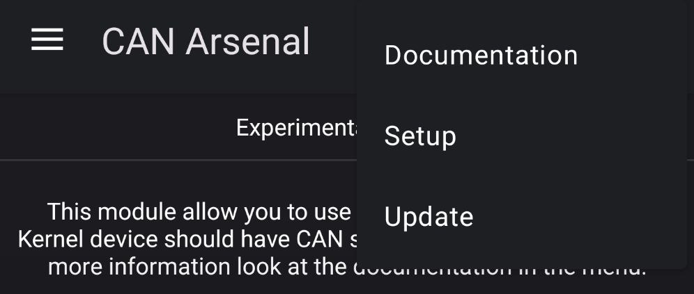
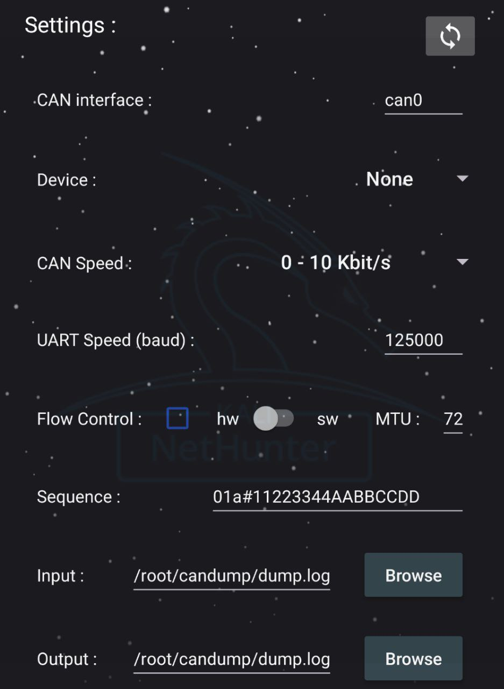
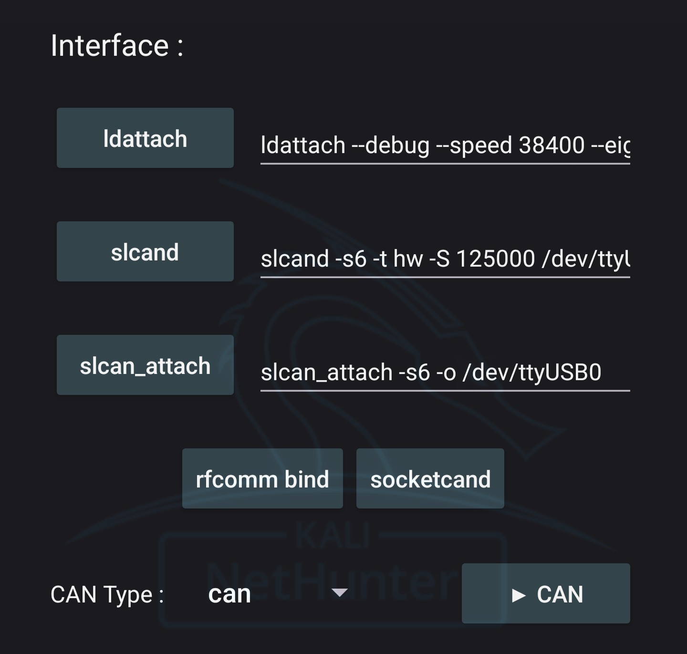
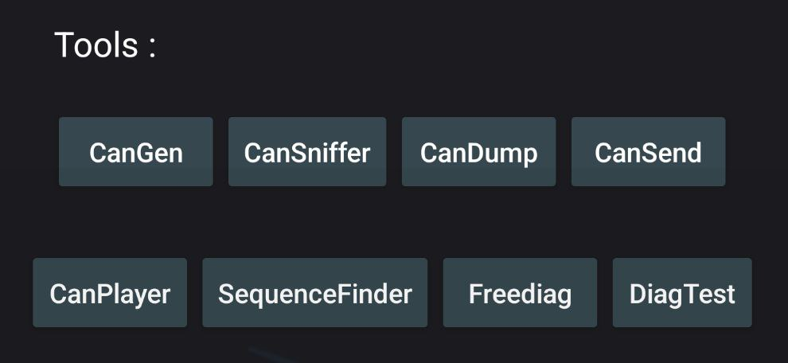
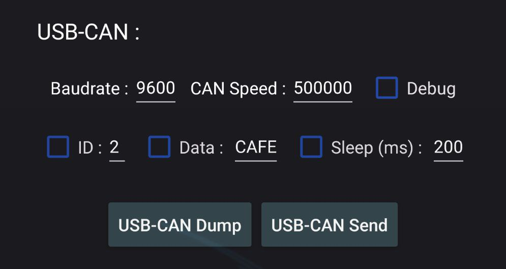
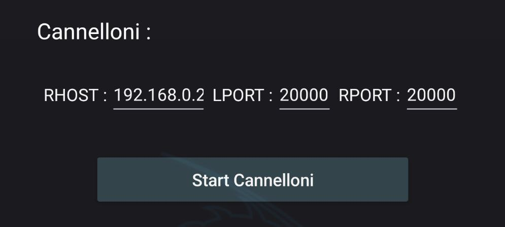
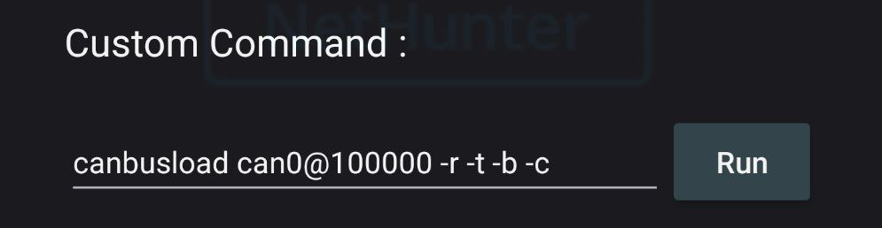

CAN-Arsenal is used to communicate with CAN Bus for testing, diagnostics or car hacking.

> Warning : Actually in Experimental Version

## Prerequisite - Kernel Modification

Your kernel should have CAN support enabled. For more informations, follow <a href="https://www.kali.org/docs/nethunter/nethunter-kernel-9-config-8/">"Configuring the Kernel - CAN Arsenal"</a> documentation.

## Menu



### Documentation

This button will redirect to the following documentation.

### Setup

This button will install needed CAN tools and packages. Note that it shouldn't be needed as it should be launched at first run of CAN Arsenal.

### Update

This button will update the installed CAN tools and packages.


## Settings



Settings are used to configure CAN Arsenal toolset.

## Interface



Interface section is used to Configure your CAN interfaces.

### ldattach

Attach your device. Set as default for /dev/rfcomm0 (Bluetooth)

***ldattach - Used command :***

You may modify this as your wish.

```bash
ldattach --debug --speed 38400 --eightbits --noparity --onestopbit --iflag -ICRNL,INLCR,-IXOFF 29 /dev/rfcomm0
```

### slcand

Daemon for Serial CAN devices.

***slcand - Used command :***

You may modify this as your wish.

```bash
slcand -s6 -t hw -S 125000 /dev/ttyUSB0 can0
```

### slcan_attach

Attach your serial CAN device.

***slcan_attach - Used command :***

```bash
slcan_attach -s6 -o /dev/ttyUSB0
```

### RFCOMM bind

For bluetooth CAN adapter usage. Run it to bind bluetooth to your device.

***Bind RFCOMM - Settings Prerequisite :*** 

Set "Target" MAC address in Settings.

> Note : RFCOMM should be supported, you need to enable services in bluetooth arsenal prior this to work.
> Pair and Trust your bluetooth device with bluetoothctl prior using this.

***Bind RFCOMM - Used command :***

```bash
rfcomm bind <Target MAC Address>
```

### socketcand

Daemon to bridge CAN interfaces.

***socketcand - Settings Prerequisite :*** 

Set "CAN Inteface" in Settings.

***socketcand - Used command :***

```bash
socketcand -i <CAN Interface>
```

### CAN Interfaces

***Start CAN Interface - Settings Prerequisite :*** 

Set "CAN Interface", "MTU" in Settings and "CAN Type" in Inteface.

> If you use adapter for CAN or SLCAN interfaces, you may need to setup "ldattach","slcand","slcan_attach","rfcomm bind" or "socketcand"

***Start CAN Interface - Used command :***

```bash
sudo ip link add dev <CAN Interface> type <CAN Type>
sudo ip link set <CAN Interface> mtu <MTU>
sudo ip link set <CAN Interface> up 
```


***Stop CAN Interface - Settings Prerequisite :*** 

Set "CAN Interface" in Settings

***Stop CAN Interface - Used command :***

```bash
sudo ip link set <CAN Interface> down && sudo ip link delete <CAN Interface>
```

## Tools




### Can-Utils : CanGen

Used to generate CAN Bus Traffic.


***CanGen - Settings Prerequisite :*** 

Your desired CAN Interface should be started and set in Settings.


***CanGen - Used command :***

```bash
cangen <CAN Interface> -v
```


### Can-Utils : CanSniffer

Used to sniff CAN Bus Traffic.


***CanSniffer - Settings Prerequisite :*** 

Your desired CAN Interface should be started and set in Settings.


***CanSniffer - Used command :***

```bash
cansniffer <CAN Interface>
```


### Can-Utils : CanDump

Used to dump CAN Bus traffic to an output file.


***CanDump - Settings Prerequisite :*** 

Your desired CAN Interface should be started and set with "Output" path in Settings. 


***CanDump - Used command :***

```bash
candump <CAN Inteface> -f <Output Log>
```


### Can-Utils : CanSend

Used to replay a specific sequence to CAN bus.


***CanSend - Settings Prerequisite :*** 

Your desired CAN Interface should be started and set with "Sequence" in Settings. 

***CanSend - Used command :***

```bash
cansend <CAN Interface> <Sequence>
```

### Can-Utils : CanPlayer

Used to replay dumped sequences from a log file to CAN bus.


***CanPlayer - Settings Prerequisite :*** 

Your desired CAN Interface should be started and set with "Input" path in Settings. 

> CAN Interface will be taken from the Input Log, check that your interface is the same one. (If you dump with vcan0, you should replay with vcan0)

***CanPlayer - Used command :***

```bash
canplayer -I <Input Log>
```

### Custom Script : SequenceFinder

<a href="https://raw.githubusercontent.com/V0lk3n/NetHunter-CANArsenal/refs/heads/main/sequence_finder.sh">You can see the source code here.</a>

Used to find the exact sequence of the desired action from a log file.

>This custom script will auto split a log files using head and tail. Replay theses with user input in loop using CanPlayer, until finding the exact sequence of the desired action. Finally it replay it using CanSend.


***SequenceFinder - Settings Prerequisite :*** 

Your desired CAN Interface should be started and set with "Input" path in Settings. 

> CAN Interface will be taken from the Input Log, check that your interface is the same one. (If you dump with vcan0, you should replay with vcan0)


***SequenceFinder - Used command :***

```bash
/opt/car_hacking/sequence_finder.sh <Input Log>
```


### Freediag

Used to diagnose your car.


***Freediag - Used command :***

```bash
sudo -u kali Freediag
```


### Freediag : DiagTest

DiagTest is a standalone program from Freediag, used to exercise code paths.


***DiagTest - Used command :***

```bash
sudo -u diag_test
```

## USB-CAN




Mainly used to Dump and Send sequence using CAN USB Analyser.


***USB-CAN Dump - Settings Prerequisite :*** 

Set "USB Device" in Settings.

In USB-CAN, set "CAN Speed" and "Baudrate". Optionally add debug parameter.

> CAN USB Adapter should be plugged in your device and hit refresh button to set USB Device with you'r plugged adapter.


***USB-CAN Dump - Used command :***

```bash
canusb -d <USB Device> -s <USB CAN Speed> -b <USB Baudrate> <Optional Debug Parameters>
```


***USB-CAN Send - Settings Prerequisite :*** 

Set "USB Device" in Settings.

In USB-CAN, set "CAN Speed" and "Baudrate". Set "ID" and "Data" as what you want to send to CAN bus. Optionally add debug and sleep parameter.

> CAN USB Adapter should be plugged in your device and hit refresh button to set USB Device with you'r plugged adapter.


***USB-CAN Send - Used command :***

```bash
canusb -d <USB Device> -s <USB CAN Speed> -b <USB Baudrate> <ID> <Data> <Optional Debug/Sleep Parameters>
```

## Cannelloni




Used to communicate with two machine on a CAN bus by Ethernet.


***Cannelloni - Settings Prerequisite :*** 

Your desired CAN Interface should be set in Settings.

In Cannelloni, "RHOST", "RPORT" and "LPORT" need to be set.

> Both device should be linked using an Ethernet Cable.


***Cannelloni - Used command :***

```bash
sudo cannelloni -I <CAN Interface> -R <RHOST> -r <RPORT> -l <LPORT>
```


## Logging


### Asc2Log

From can-utils suite, Asc2Log is used to convert ASC file format to the classic LOG.


***Asc2Log - Settings Prerequisite :*** 

Set "Input" and "Output" path in Settings. 


***Asc2Log - Used command :***

```bash
asc2log -I <Input Log> -O <Output File>
```


### Log2Asc

From can-utils suite, Log2Asc is used to convert dumped LOG file to the ASC format.


***Log2Asc - Settings Prerequisite :*** 

Your desired CAN Interface should be started and set with "Input", "Output" path in Settings. 


***Log2Asc - Used command :***

```bash
log2asc -I <Input Log> -O <Output File> <CAN Interface>
```


## Custom Command



Used in case you need to run a specific command which doesnt match the one provided.


## Resources

***Tools Documentations***
* <a href="https://github.com/linux-can/can-utils">can-utils</a>
* <a href="https://freediag.sourceforge.io/">freediag</a>
* <a href="https://github.com/kobolt/usb-can">usb-can</a>
* <a href="https://github.com/mguentner/cannelloni">cannelloni</a>


***Guide***
* <a href="https://www.offsec.com/blog/introduction-to-car-hacking-the-can-bus/">Introduction to Car Hacking: The CAN Bus</a>


## Credits

* <a href="https://github.com/fenugrec">Fenugrec</a> for freediag
* <a href="https://gitlab.com/kimoc0der">Kimocoder</a> for help and support
* <a href="https://github.com/kobolt">Kobolt</a> for usb-can
* <a href="https://github.com/linux-can">Linux-Can</a> for can-utils and socketcand
* <a href="https://github.com/mguentner">Mguentner</a> for cannelloni
* <a href="https://gitlab.com/V0lk3n">V0lk3n</a> for Nethunter CAN Arsenal tab
* <a href="https://gitlab.com/yesimxev">Yesimxev</a> for help and support
