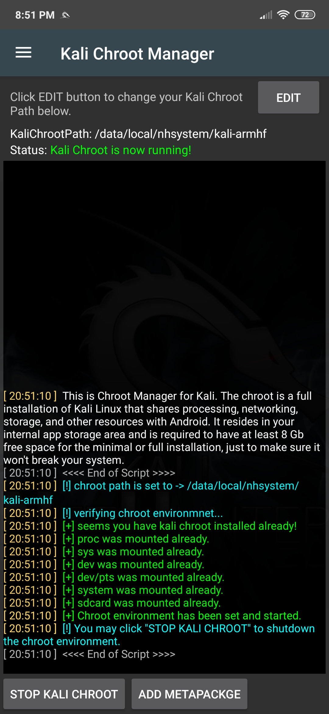

넷헌터 chroot 매니저를 사용하면 칼리 리눅스 chroot(격리된 루트 환경)를 다운로드하고 설치할 수 있어요(아직 존재하지 않는 경우). 또한 chroot를 백업하고 복원하거나 기존 chroot를 제거할 수도 있어요. 게다가 필요에 따라 다양한 칼리 리눅스 메타패키지(metapackage, 패키지 모음)를 설치할 수 있어요.

일반적으로 "kali-nethunter" 메타패키지에는 넷헌터를 실행하는 데 필요한 모든 것이 포함되어 있어요. 따라서 정말 필요한 경우가 아니라면 추가 메타패키지는 설치하지 마세요. 특히 디스크 공간이 부족한 경우에는 더욱 그래요. 각 메타패키지에 필요한 디스크 공간의 대략적인 아이디어를 얻으려면 [칼리 리눅스 메타패키지 블로그 포스트](https://kali.org/blog/kali-linux-metapackages/)를 참조하세요.

