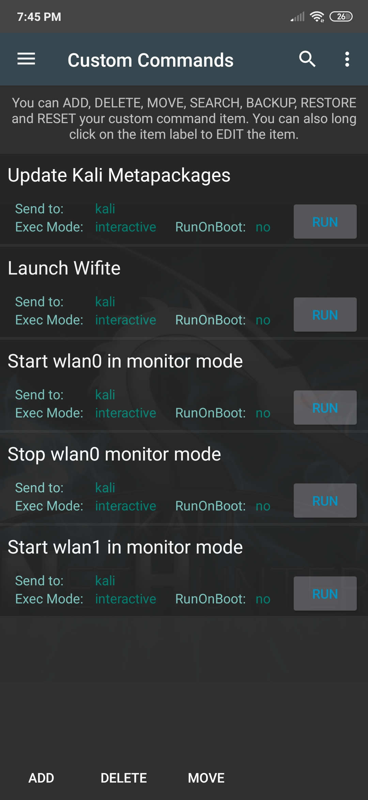

넷헌터 안드로이드 애플리케이션의 멋진 기능 중 하나는 자신만의 커스텀 명령어와 기능을 추가할 수 있다는 거예요. 예를 들어, Wi-Fi 작업을 많이 한다면 해당 스크립트를 실행하는 **Wifite**용 커스텀 버튼을 추가하는 것이 좋겠죠. 또는 mifare 카드를 빠르게 복제해야 하는 경우가 있다면 필요한 매개변수와 함께 **mfoc** 명령어를 실행하는 버튼을 만들 수 있어요.
이 탭에는 예시로 몇 가지 커스텀 명령어가 미리 구성되어 있어요.

