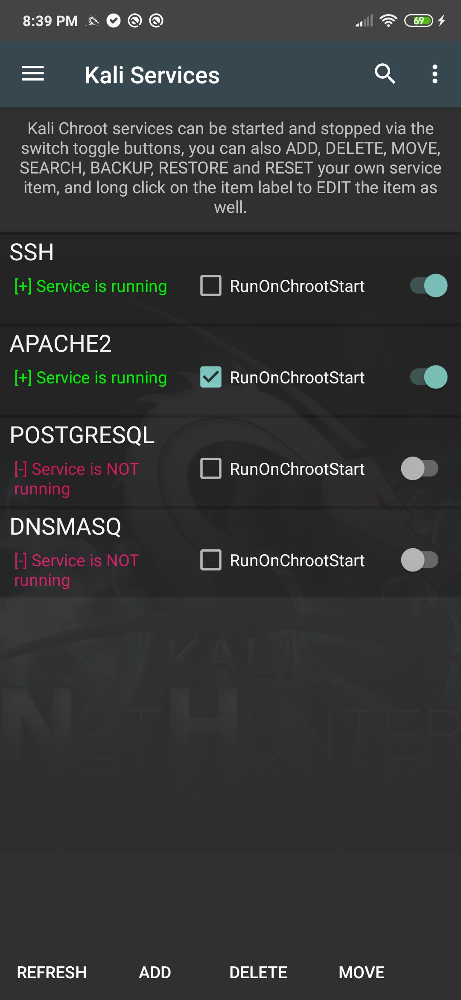

칼리 서비스 패널에서는 SSH, Apache, OpenVPN 등과 같은 다양한 chroot 서비스를 시작하고 중지할 수 있어요. 사용 가능한 네트워크 서비스를 시작하거나 중지하려면 사용 가능한 옵션에서 해당 버튼을 탭하기만 하면 돼요. 이 패널에서는 원한다면 부팅 시 이러한 서비스를 활성화할 수도 있어요. 이러한 서비스는 네이티브(native, 기본) 안드로이드 서비스가 아닌 chroot된 칼리 리눅스 서비스와 대응된다는 점을 유의하세요.

**경고:** 칼리 리눅스는 기본 "toor" 비밀번호가 설정되어 있으므로, 기기에 원격 접근을 활성화하기 전에 기본 비밀번호를 변경했는지 확인하세요.

