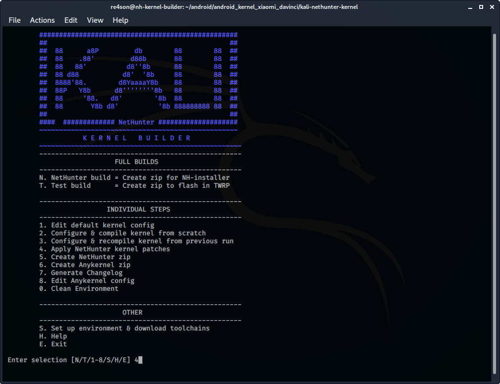
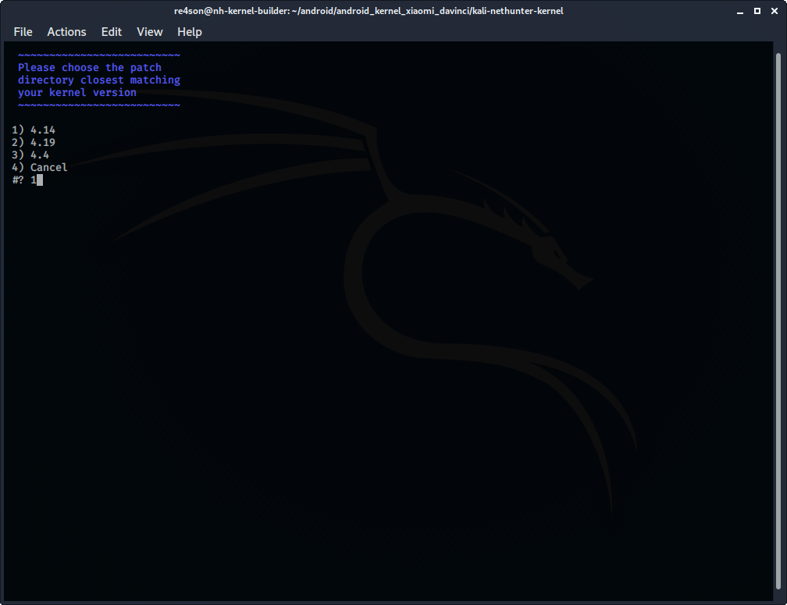
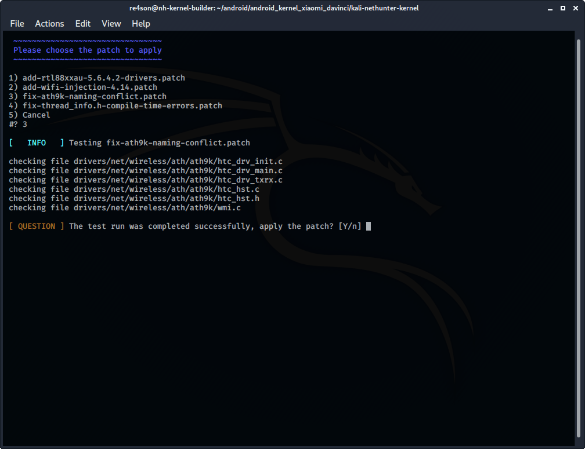

[넷헌터 포팅 페이지](/docs/nethunter/porting-nethunter/)에서 계속해서 구글 넥서스 6P 커널을 예시로 작업할 거예요. 하지만 아이디어는 동일해요.

## 패치하기

기본적으로 Wi-Fi 인젝션 패치와 Wi-Fi 드라이버를 추가하는 패치를 적용해요.
4.x 미만의 커널 버전에는 HID 키보드/마우스 패치가 필요해요. 일부 기기는 빌드 오류를 피하기 위해 추가 패치가 필요해요.
모든 최신 운영체제가 USB 저장 장치에서 설치를 지원하므로 더 이상 CD-ROM 패치는 필요하지 않아요. 따라서 넷헌터를 USB 드라이브로 마운트할 수 있어요.

커널 빌더에서 ***"Apply NetHunter kernel patches"***를 선택하세요:

커널 버전과 가장 유사한 디렉토리로 이동하세요:

그리고 적용 가능한 각 패치를 적용하세요:

병렬로 다른 터미널 창에서 작업하고 각 패치를 적용한 후 커널 소스에 변경 사항을 커밋하는 것을 권장해요.

**모든 기기의 커널은 다릅니다. 위의 패치가 실패하면 수동으로 패치를 시도해볼 수 있어요. 패치가 실패하더라도 소스는 꽤 유사할 수 있으므로 대부분의 경우 수동 패치가 가능해요. 성공하면 [커널 빌더의 저장소](https://gitlab.com/kalilinux/nethunter/build-scripts/kali-nethunter-kernel-builder)에 패치를 추가해주세요**.
