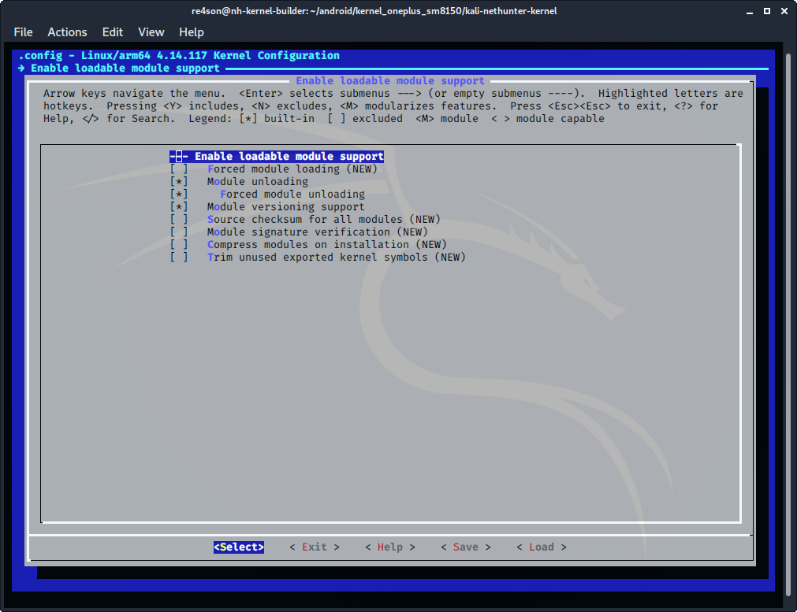
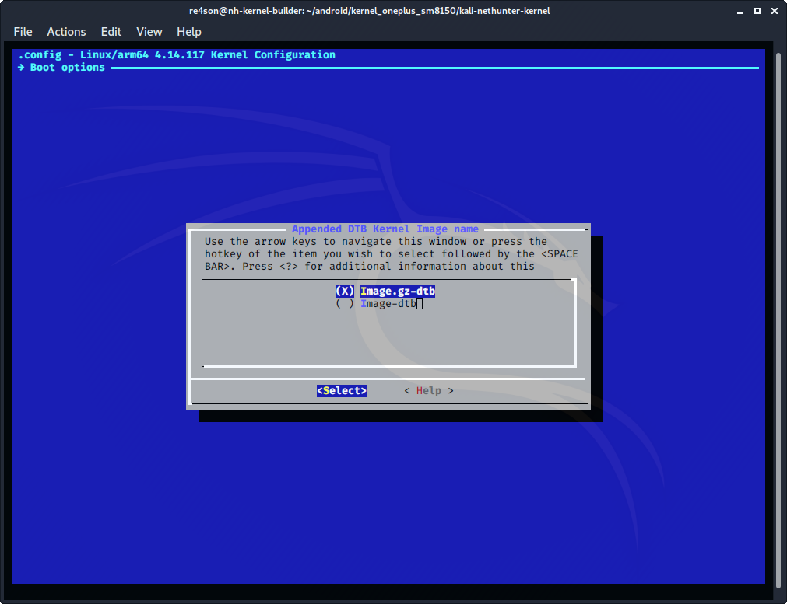

## 커널 구성

### 일반

"General Setup" 섹션에서:

- ***"Local version"*** 지우기
- ***"Default host name"***을 "kali"로 설정
- ***"System V IPC"*** 선택
  (CONFIG_SYSVIPC=y)

### 모듈

**modprobe**를 사용하여 명령줄을 통해 로드하려는 기기가 있을 경우를 대비해 _Enable Loadable Module Support_에서 모듈을 활성화하려고 해요. 자주 사용되는 드라이버를 모듈로 빌드하는 것은 권장하지 않아요:

- ***"loadable module support"*** 활성화
  (CONFIG_MODULES=y):

- ***"Module unloading"*** 선택
  (CONFIG_MODULE_UNLOAD=y)
- ***"Forced module unloading"*** 선택
  (CONFIG_MODULE_FORCE_UNLOAD=y)
- ***"Module versioning support"*** 선택
  (CONFIG_MODVERSIONS=y)

### 커널 이미지

커널 소스가 허용한다면 압축되고 연결된 이미지 파일이 우리가 선호하는 이미지 타입이에요:

- ***"Build a concatenated Image.gz/dtb by default"*** 선택
  (CONFIG_BUILD_ARM64_APPENDED_DTB_IMAGE=y)
- ***"Boot options ->"*** 아래에서
- ***"Appended DTB Kernel Image name (Image.gz-dtb)"*** 선택
  (IMG_GZ_DTB=y)

