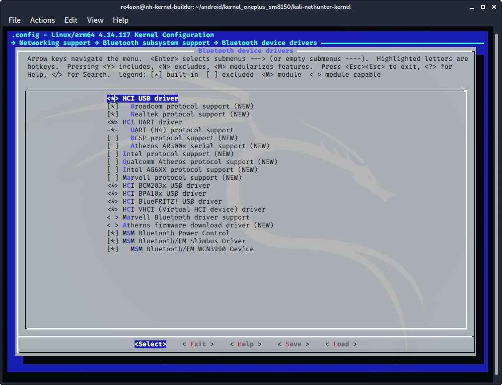

## 커널 구성 계속

### 블루투스

***"Networking support → Bluetooth subsystem support → Bluetooth device drivers"***로 이동하세요

- ***"HCI USB driver"*** 선택
  (CONFIG_BT_HCIBTUSB=y)
- ***"Broadcom protocol support"*** 선택
  (CONFIG_BT_HCIBTUSB_BCM=y)
- ***"Realtek protocol support"*** 선택
  (CONFIG_BT_HCIBTUSB_RTL=y)
- ***"HCI UART driver"*** 선택
  (CONFIG_BT_HCIUART=y)
- ***"UART (H4) protocol support"*** 선택
  (CONFIG_BT_HCIUART_H4=y)
- ***"HCI BCM203x USB driver"*** 선택
  (CONFIG_BT_HCIBCM203X=y)
- ***"HCI BPA10x USB driver"*** 선택
  (CONFIG_BT_HCIBPA10X=y)
- ***"HCI BlueFRITZ! USB driver"*** 선택
  CONFIG_BT_HCIBFUSB=y)
- ***"HCI VHCI (Virtual HCI device) driver"*** 선택
  (CONFIG_BT_HCIVHCI=y)

***"Device Drivers → Staging -> Android "***로 이동하여 다음 항목을 구성하세요:

- ***"Android Binder IPC Driver"*** 선택
  (CONFIG_ANDROID_BINDER_IPC=y)

### MAC80211

***"Networking support → Wireless"***로 이동하여 다음 항목을 구성하세요:

- ***"cfg80211 wireless extensions compatibility"*** 선택
  (CONFIG_CFG80211_WEXT=y)
- ***"Generic IEEE 802.11 Networking Stack (mac80211)"*** 선택
  (CONFIG_MAC80211=y)
- ***"Enable mac80211 mesh networking (pre-802.11s) support"*** 선택
  (CONFIG_MAC80211_MESH=y)

### 이더넷

***"Device Drivers_ -> _Network Device Support_ ->  _USB Network Adapters"***로 이동하여 다음 옵션을 구성하세요:

- ***"USB RTL8150 based ethernet device support"*** 선택
  (CONFIG_USB_RTL8150=y)
- ***"Realtek RTL8152/RTL8153 Based USB Ethernet Adapters"*** 선택
  (CONFIG_USB_RTL8152=y)

