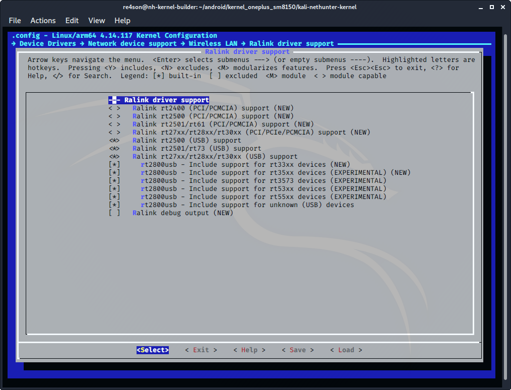

## 커널 구성 계속

### 무선 LAN

_Device Drivers_ -> _Network Device Support_ ->  _Wireless LAN_으로 이동하여 다음 항목을 선택하세요:

- ***"Atheros/Qualcomm devices"*** 선택
  (CONFIG_WLAN_VENDOR_ATH=y)
- ***"Atheros HTC based wireless cards support"*** 선택
  (CONFIG_ATH9K_HTC=y)
- ***"Linux Community AR9170 802.11n USB support"*** 선택
  (CONFIG_CARL9170=y)
- ***"Atheros mobile chipsets support"*** 선택
  (CONFIG_ATH6KL=y)
- ***"Atheros ath6kl USB support"*** 선택
  (CONFIG_ATH6KL_USB=y)

- ***"MediaTek devices"*** 선택
  (CONFIG_WLAN_VENDOR_MEDIATEK=y)
- ***"MediaTek MT7601U (USB) support"*** 선택
  (CONFIG_MT7601U=y)
- ***"Ralink devices"*** 선택
  (CONFIG_WLAN_VENDOR_RALINK=y)
- ***"Ralink driver support"*** 선택
  (CONFIG_RT2X00=y)

Ralink 드라이버 지원을 열고 다음 드라이버를 구성하세요:

- ***"Ralink rt2500 (USB) support"*** 선택
   (CONFIG_RT2500USB=y)
- ***"Ralink rt2501/rt73 (USB)"*** 선택
  (CONFIG_RT73USB=y)
- ***"Ralink rt27xx/rt28xx/rt30xx (USB)"*** 선택
  (CONFIG_RT2800USB=y)
- ***"rt2800usb - Include support for rt33xx devices"*** 선택
  (CONFIG_RT2800USB_RT33XX=y)
- ***"rt2800usb - Include support for rt35xx devices"*** 선택
  (CONFIG_RT2800USB_RT35XX=y)
- ***"rt2800usb - Include support for rt3573 devices"*** 선택
  (CONFIG_RT2800USB_RT3573=y)
- ***"rt2800usb - Include support for rt53xx devices"*** 선택
  (CONFIG_RT2800USB_RT53XX=y)
- ***"rt2800usb - Include support for rt55xx devices"*** 선택
  (CONFIG_RT2800USB_RT55XX=y)
- ***"rt2800usb - Include support for unknown (USB)"*** 선택
  (CONFIG_RT2800USB_UNKNOWN=y)

페이지를 계속 내려가서 다음 드라이버를 활성화하세요:

- ***"Realtek devices"*** 선택
  (CONFIG_WLAN_VENDOR_REALTEK=y)
- ***"Realtek 8187 and 8187B USB support"*** 선택
  (CONFIG_RTL8187=y)
- ***"Realtek rtlwifi family of devices"*** 선택
  (CONFIG_RTL_CARDS=y)
- ***"RTL8723AU/RTL8188[CR]U/RTL819[12]CU (mac80211) support"*** 선택
  (CONFIG_RTL8192CU=y)
- ***"Include support for untested Realtek 8xxx USB devices"*** 선택
  (CONFIG_RTL8XXXU_UNTESTED=y)
- ***"ZyDAS devices"*** 선택
  (CONFIG_WLAN_VENDOR_ZYDAS=y)
- ***"USB ZD1201 based Wireless device support"*** 선택
  (CONFIG_USB_ZD1201=y)
- ***"ZyDAS ZD1211/ZD1211B USB-wireless support"*** 선택
  (CONFIG_ZD1211RW=y)
- ***"Wireless RNDIS USB support"*** 선택
  (CONFIG_USB_NET_RNDIS_WLAN=y)

