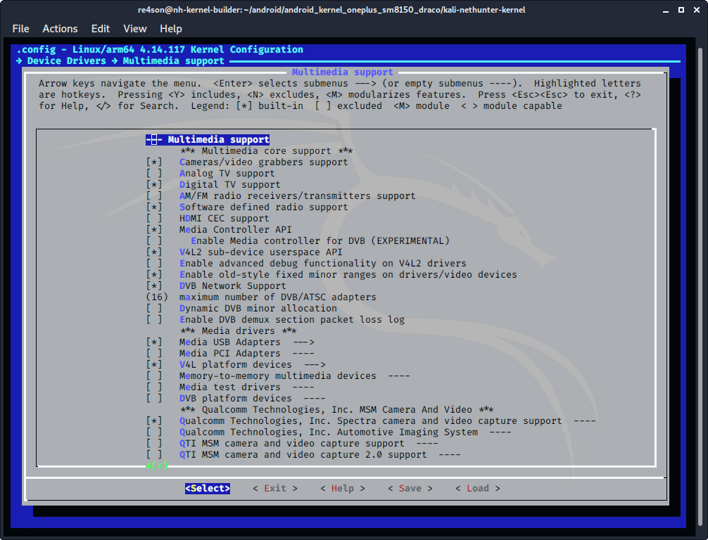
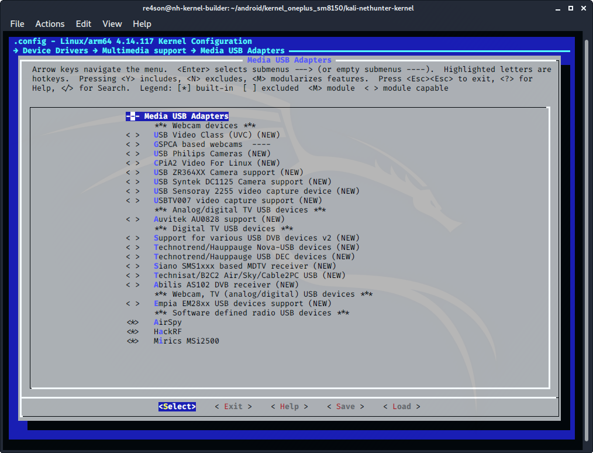
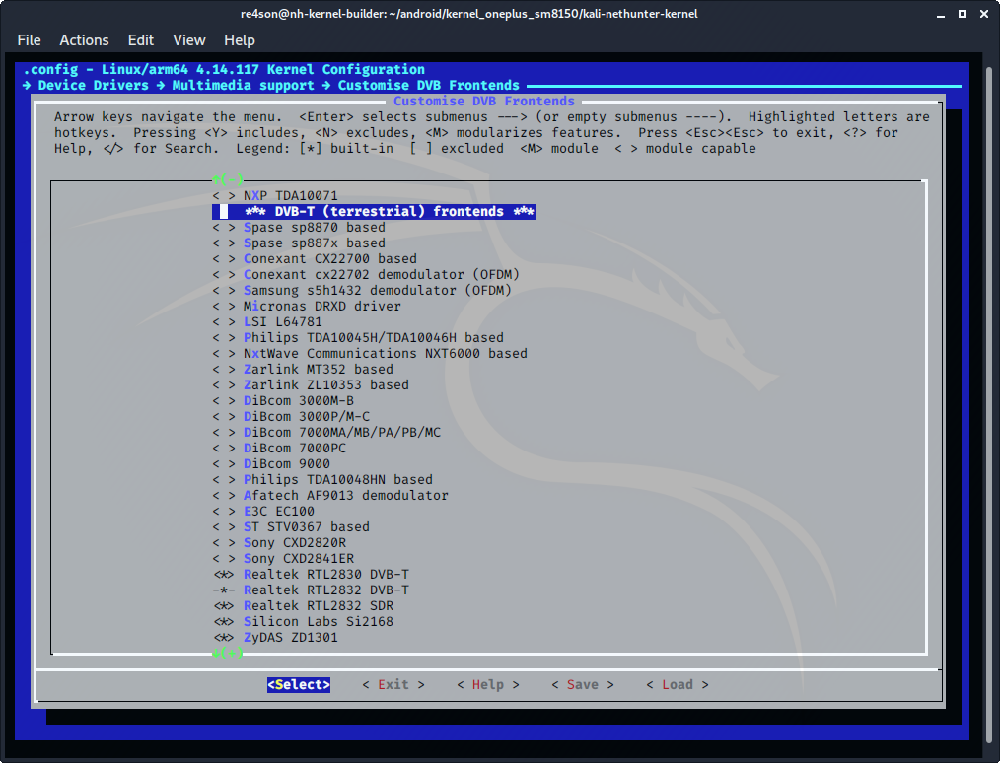

## 커널 구성

### SDR

**일부 기기는 Digital TV 지원이 서브메뉴에 있고, 일부 커널 3.x 버전은 기본적으로 RF 하드웨어를 지원하지 않는다는 점을 유의하세요**.

***"Device Drivers -> Multimedia support"***로 이동하여 다음 항목을 구성하세요:

- ***"Digital TV support"*** 선택
  (CONFIG_MEDIA_DIGITAL_TV_SUPPORT=y)
- ***"Software defined radio support"*** 선택
  (CONFIG_MEDIA_SDR_SUPPORT=y)

**_→ Device Drivers → Multimedia support → Media USB Adapters_ (CONFIG_MEDIA_USB_SUPPORT=y)**로 이동하여 다음 항목을 활성화하세요:

- ***"AirSpy"*** 선택
  (CONFIG_USB_AIRSPY=y)
- ***"HackRF"*** 선택
  (CONFIG_USB_HACKRF=y)
- ***"Mirics MSi2500"*** 선택
  (USB_MSI2500=y)

***"Device Drivers -> Multimedia support"***로 돌아가서 다음 선택을 해제하세요:

- ***"Autoselect ancillary drivers (tuners, sensors, i2c, spi, frontends)"*** 해제
  (CONFIG_MEDIA_SUBDRV_AUTOSELECT=n)

그 다음 ***"Device Drivers -> Multimedia support->Customize TV tuners"***를 열고 **모두 선택 해제**하세요

***"DVB-T (terrestrial) frontends"*** 섹션에서 다음 몇 개로 선택을 줄일 수 있어요:

- ***"Realtek RTL2830 DVB-T"*** 선택
  (CONFIG_DVB_RTL2830=y)
- ***"Realtek RTL2832 DVB-T"*** 선택
  (CONFIG_DVB_RTL2832=y)
- ***"Realtek RTL2832 SDR"*** 선택
  (CONFIG_DVB_RTL2832_SDR=y)
- ***"Silicon Labs Si2168"*** 선택
  (CONFIG_DVB_SI2168=y)
- ***"ZyDAS ZD1301"*** 선택
  (CONFIG_DVB_ZD1301_DEMOD=y)

