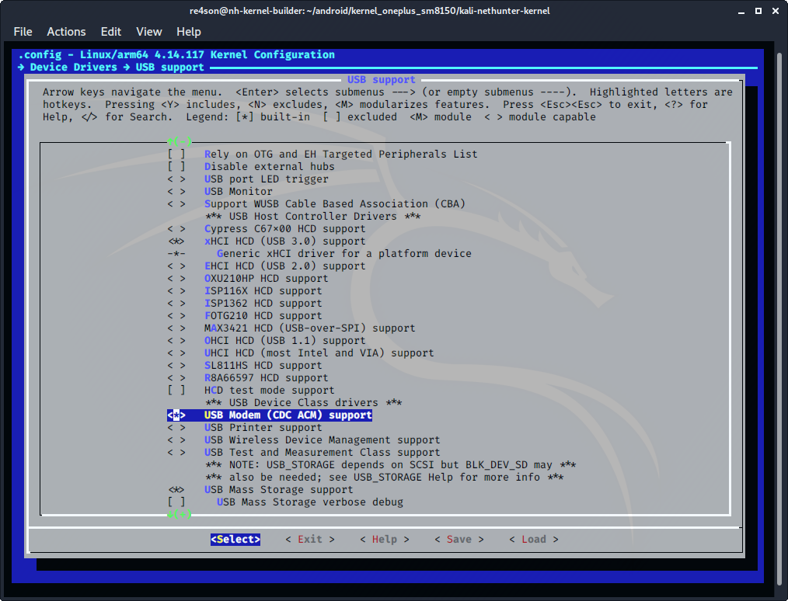
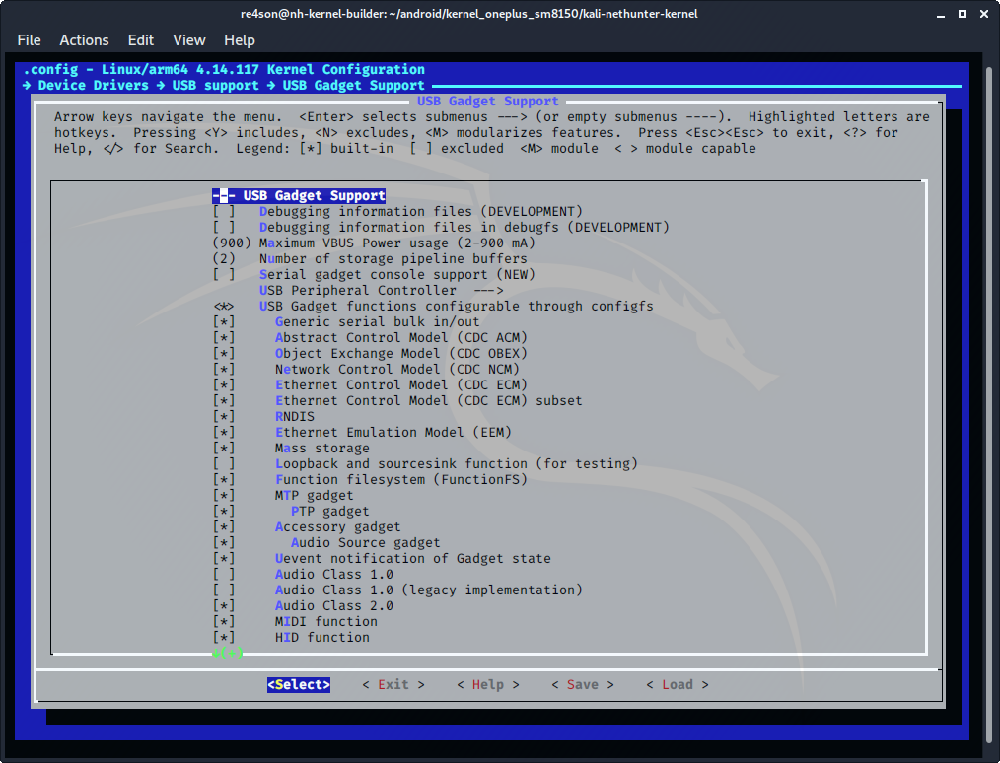

## Kernel Configuration cont.

### USB Modem

CDC ACM support is required for Proxmark and similar devices

Navigate to ***Device Drivers -> USB support*** and select the following option:

- select ***"USB Modem (CDC ACM) support"***
  (CONFIG_USB_ACM=y)

&nbsp;

### USB Gadget support

Generic serial, CDC ACM, CDC ECM, and HID are required for various USB based attacks.

Navigate to ***Device Drivers -> USB support -> USB Gadget Support*** and choose:

- select ***"Generic serial bulk in/out"***
  (CONFIG_USB_CONFIGFS_SERIAL=y)
- select ***"Abstract Control Model (CDC ACM)"***
  (CONFIG_USB_CONFIGFS_ACM=y)
- select ***"Object Exchange Model (CDC OBEX)"***
  (CONFIG_USB_CONFIGFS_OBEX=y)
- select ***"Network Control Model (CDC NCM)"***
  (CONFIG_USB_CONFIGFS_NCM=y)
- select ***"Ethernet Control Model (CDC ECM)"***
  (CONFIG_USB_CONFIGFS_ECM=y)
- select ***"Ethernet Control Model (CDC ECM) subset"***
  (CONFIG_USB_CONFIGFS_ECM_SUBSET=y)
- select ***"RNDIS"***
  (CONFIG_USB_CONFIGFS_RNDIS=y)
- select ***"Ethernet Emulation Model (EEM)"***
  (CONFIG_USB_CONFIGFS_EEM=y)
- select ***"Mass Storage"***
  (CONFIG_USB_CONFIGFS_MASS_STORAGE=y)

&nbsp;

## Exit, save, and build

