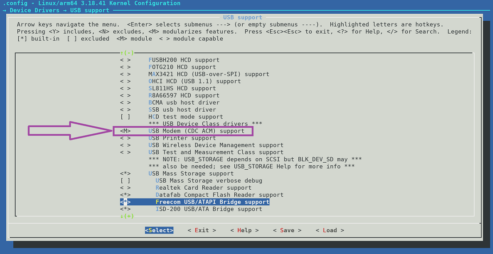

## 커널 구성 계속

**커널이 4.x 이상인 경우 [다음 페이지](/docs/nethunter/nethunter-kernel-7-config-6/)로 건너뛰세요**

### USB 모뎀

CDC ACM 지원은 Proxmark와 유사한 기기에 필요해요

***Device Drivers -> USB support***로 이동하여 다음 옵션을 선택하세요:

- ***"USB Modem (CDC ACM) support"*** 선택
  (CONFIG_USB_ACM=y)

### USB 가젯 지원

USB 가젯 지원은 3.x 커널에서는 패치를 통해서만 가능해요.

[커널 패치하기](/docs/nethunter/nethunter-kernel-1-patching/) 페이지를 참조하세요.

## 종료, 저장 및 빌드
