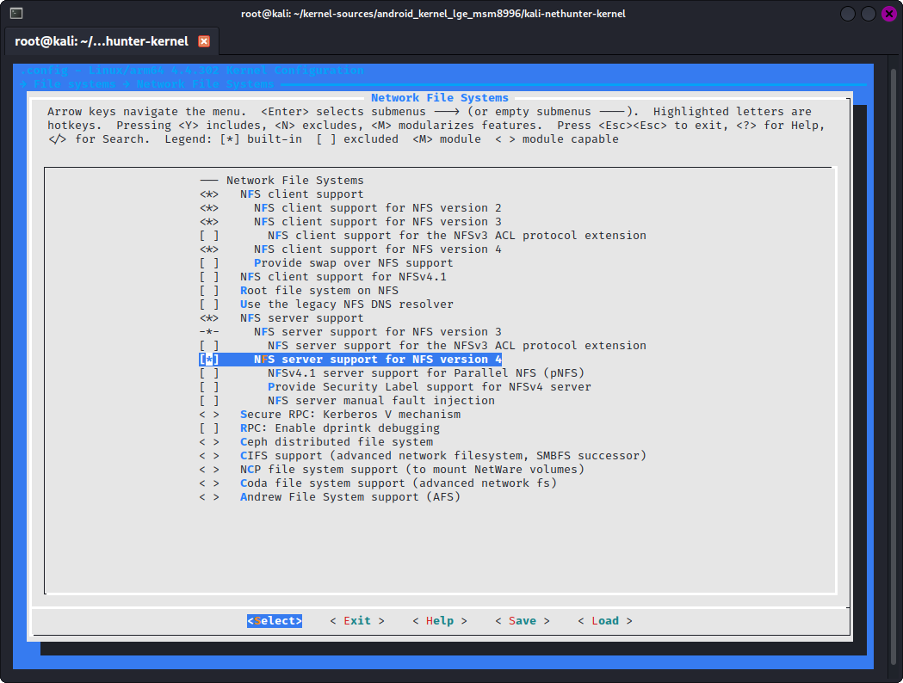

### NFS 지원

기본적으로 비활성화된 경우를 대비해 NFS 클라이언트와 서버 지원이 필요해요.

***File Systems -> Network File Systems***로 이동하여 다음 옵션을 선택하세요:

- ***"Network File Systems"*** 선택
  (CONFIG_NETWORK_FILESYSTEMS=y)
- ***"NFS client support for NFS version 2"*** 선택
  (CONFIG_NFS_V2=y)
- ***"NFS client support for NFS version 3"*** 선택
  (CONFIG_NFS_V3=y)
- ***"NFS client support for NFS version 4"*** 선택
  (CONFIG_NFS_V4=y)
- ***"NFS server support"*** 선택
  (CONFIG_NFSD=y)
- ***"NFS server support for NFS version 3"*** 선택
  (CONFIG_NFSD_V3=y)
- ***"NFS server support for NFS version 4"*** 선택
  (CONFIG_NFSD_V4=y)

