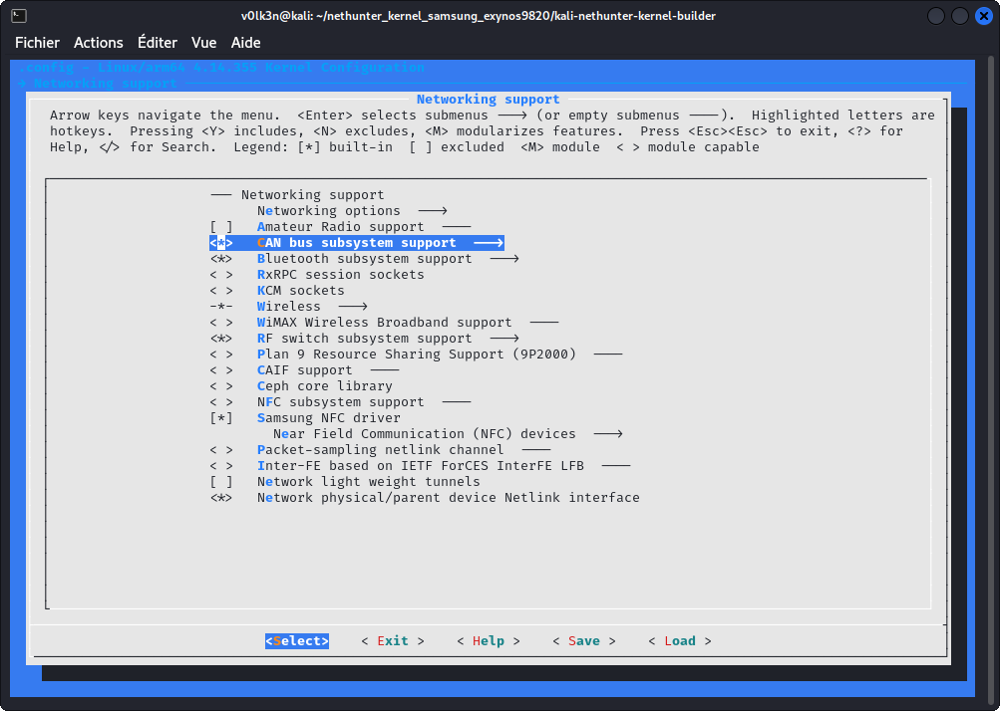
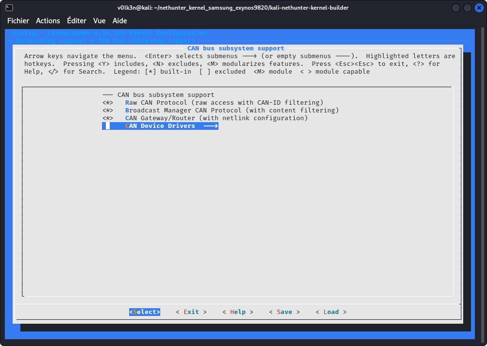
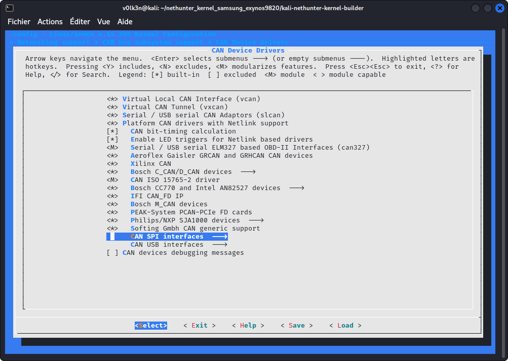
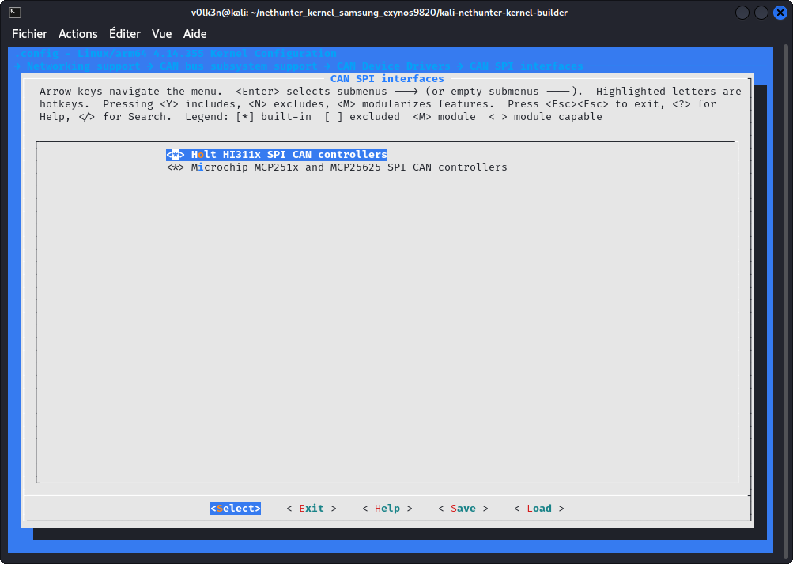
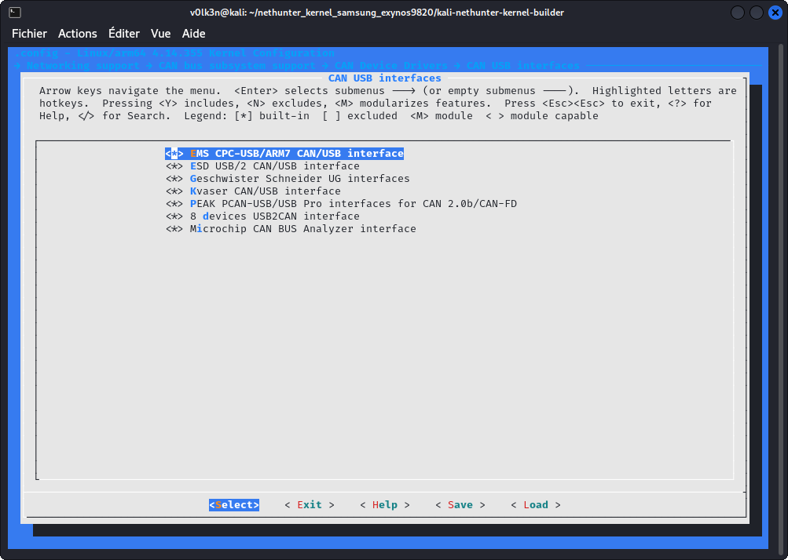
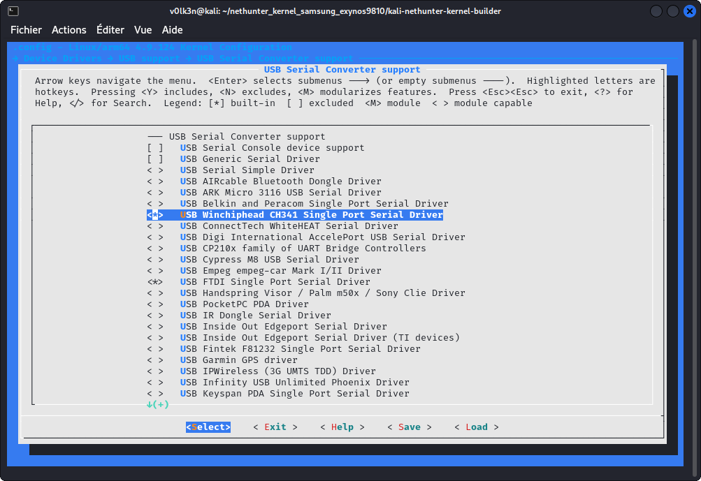

### CAN support

CAN support will be needed for CAN Arsenal usage.

In section ***“Networking support”***:

- Select ***"CAN bus subsystem support"***



Under ***"CAN bus subsystem support --->"***

- Select ***"Raw CAN Protocol (raw access with CAN-ID filtering)"***
- Select ***"Broadcast Manager CAN Protocol (with content filtering)"***
- Select ***"CAN Gateway/Router (with netlink configuration)"***



Under ***"CAN Device Drivers --->"***

- Select ***"Virtual Local CAN Interface (vcan)"***
- Select ***"Serial / USB serial CAN Adaptors (slcan)"***
- Select ***"Platform CAN drivers with Netlink support"***
- Select ***"CAN bit-timing calculation"***
- Select ***"Enable LED triggers for Netlink based drivers"***
- Select ***"CAN devices debuging messages"***



Under ***"CAN SPI interfaces --->"***

- Select ***"Microchip MCP251x SPI CAN controllers"***



Under ***"CAN USB interfaces --->"***

- Select ***"EMS CPC-USB/ARM7 CAN/USB interface"***
- Select ***"ESD USB/2 CAN/USB interface"***
- Select ***"Geschwister Schneider UG interfaces"***
- Select ***"Kvaser CAN/USB interface"***
- Select ***"PEAK PCAN-USB/USB Pro interfaces for CAN 2.0b/CAN-FD"***
- Select ***"8 devices USB2CAN interface"***



In section ***"Device Drivers ---> USB support ---> USB Serial Converter support --->"*** :

- Select ***"USB Winchiphead CH341 Single Port Serial Driver"***
- Select ***"USB FTDI Single Port Serial Driver"***
- Select ***"USB Prolific 2303 Single Port Serial Driver"***



Save, Exit, then build!

#### Kernel 4.11 or Higher : ELM327 Driver

For Kernel 4.11 or higher. You can add ELM327 driver by following these step :

- Go to root of your Kernel repository and run these commands

```
git submodule add https://github.com/V0lk3n/elmcan drivers/net/can/elmcan
cp drivers/net/can/elmcan/can327.c drivers/net/can/
```

- Edit ***drivers/net/can/Makefile*** and add the following line.

```
obj-$(CONFIG_CAN_CAN327)	+= can327.o
```

- Edit ***drivers/net/can/Kconfig*** and add the following config.

```
config CAN_CAN327
	tristate "Serial / USB serial ELM327 based OBD-II Interfaces (can327)"
	depends on TTY
	select CAN_RX_OFFLOAD
	help
	  CAN driver for several 'low cost' OBD-II interfaces based on the
	  ELM327 OBD-II interpreter chip.

	  This is a best effort driver - the ELM327 interface was never
	  designed to be used as a standalone CAN interface. However, it can
	  still be used for simple request-response protocols (such as OBD II),
	  and to monitor broadcast messages on a bus (such as in a vehicle).

	  Please refer to the documentation for information on how to use it:
	  Documentation/networking/device_drivers/can/can327.rst

	  If this driver is built as a module, it will be called can327.
```

Finally, build the kernel again, and under ***"Networking support > CAN bus subsystem support >  CAN Device Drivers --->***

- Select as module (\<M\>) ***Serial / USB serial ELM327 based OBD-II Interfaces (can327)***

Save, Exit, then build!
