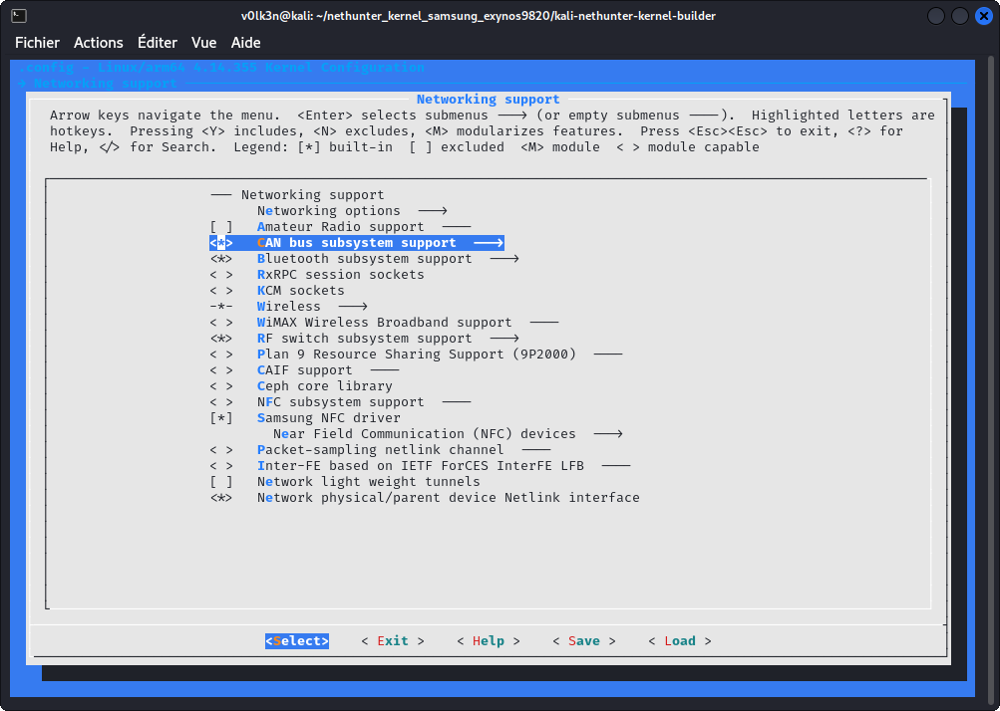
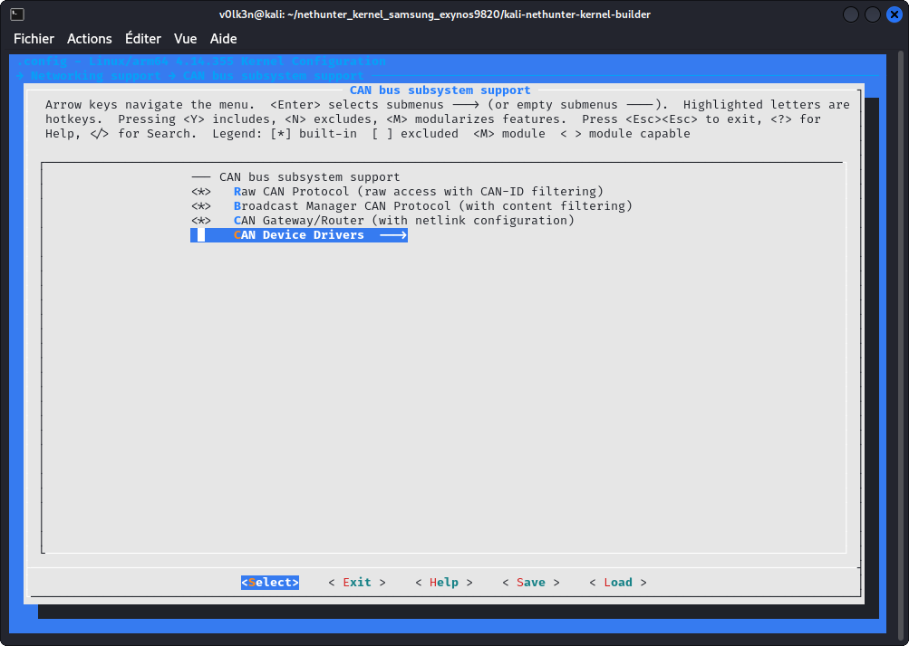
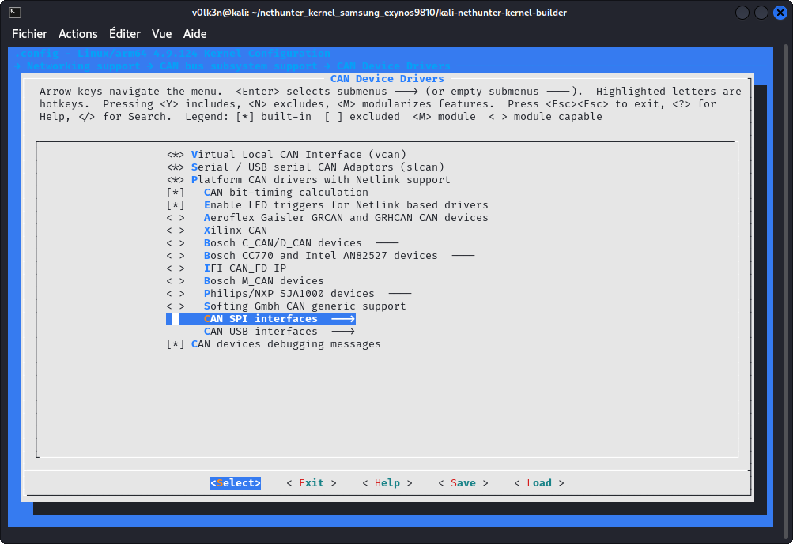
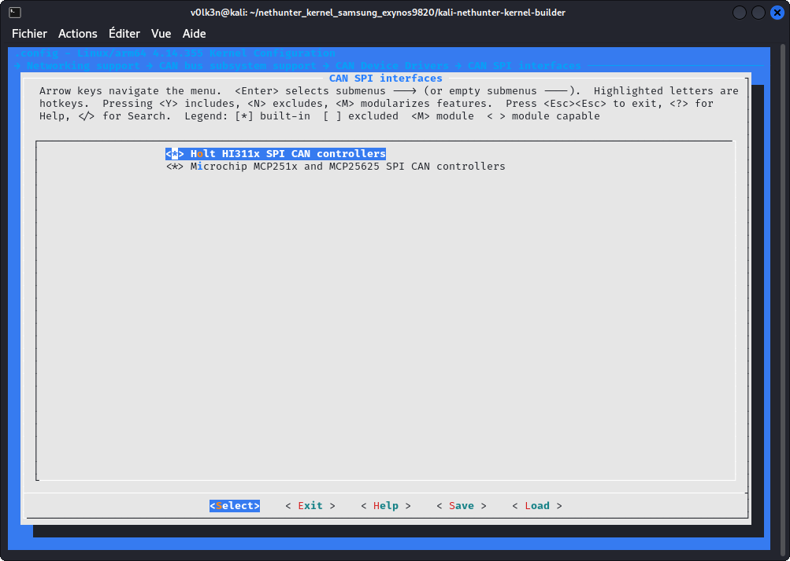
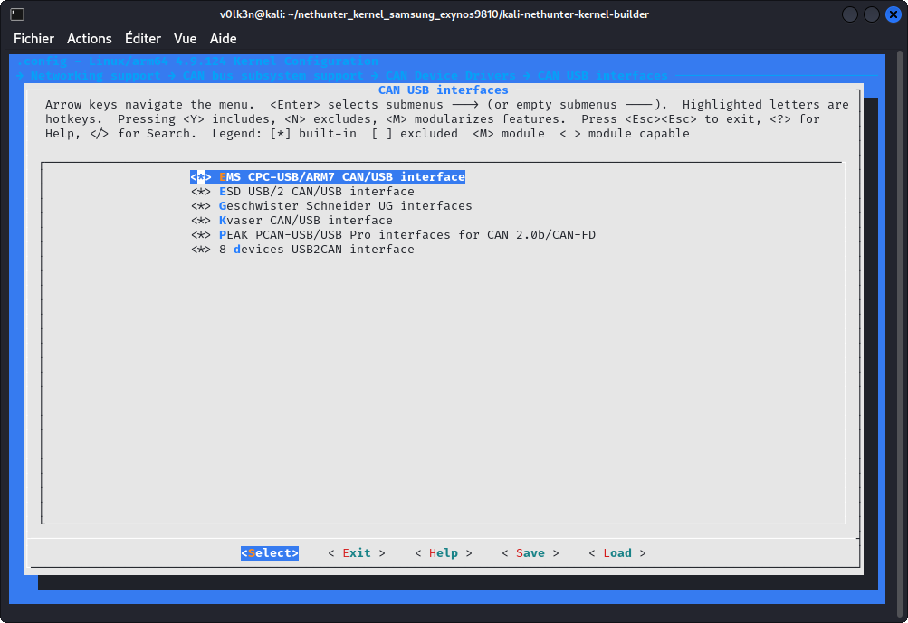
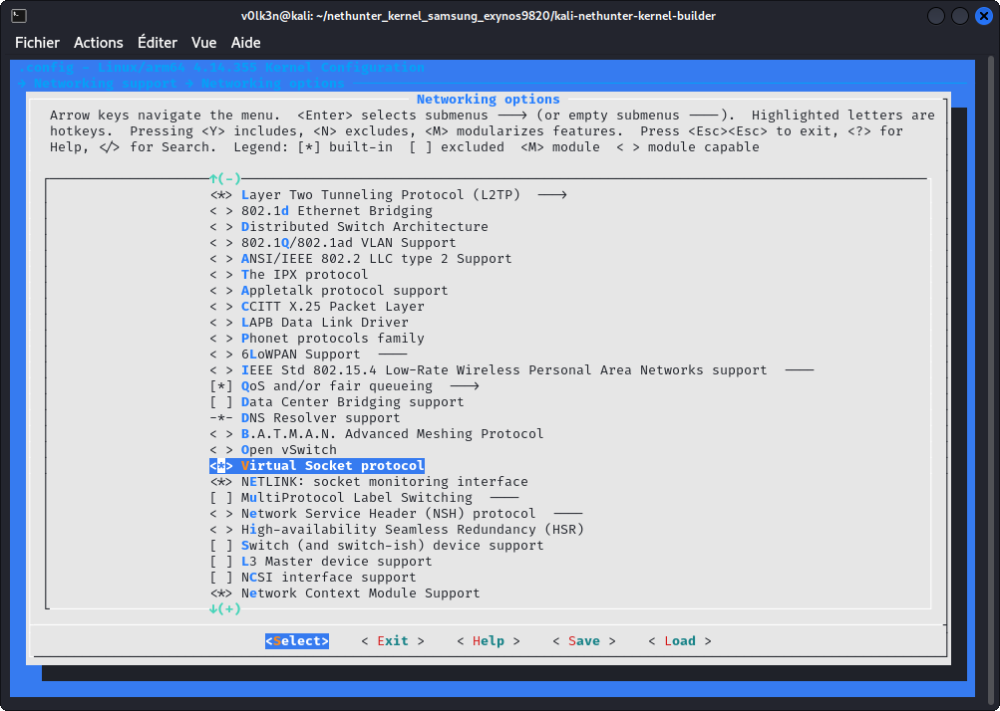
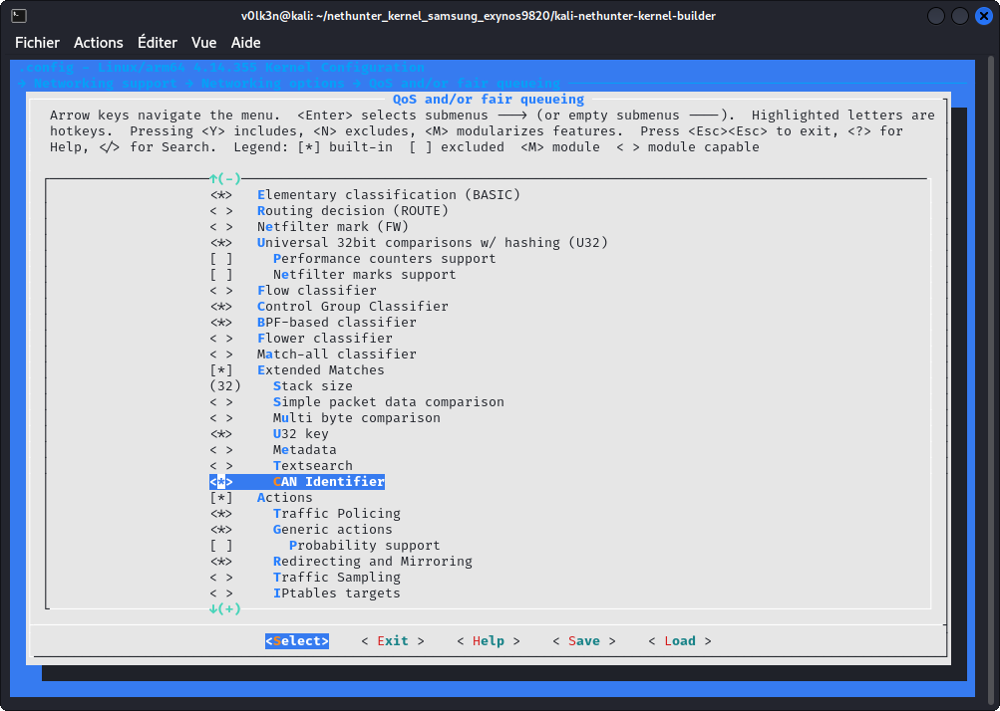
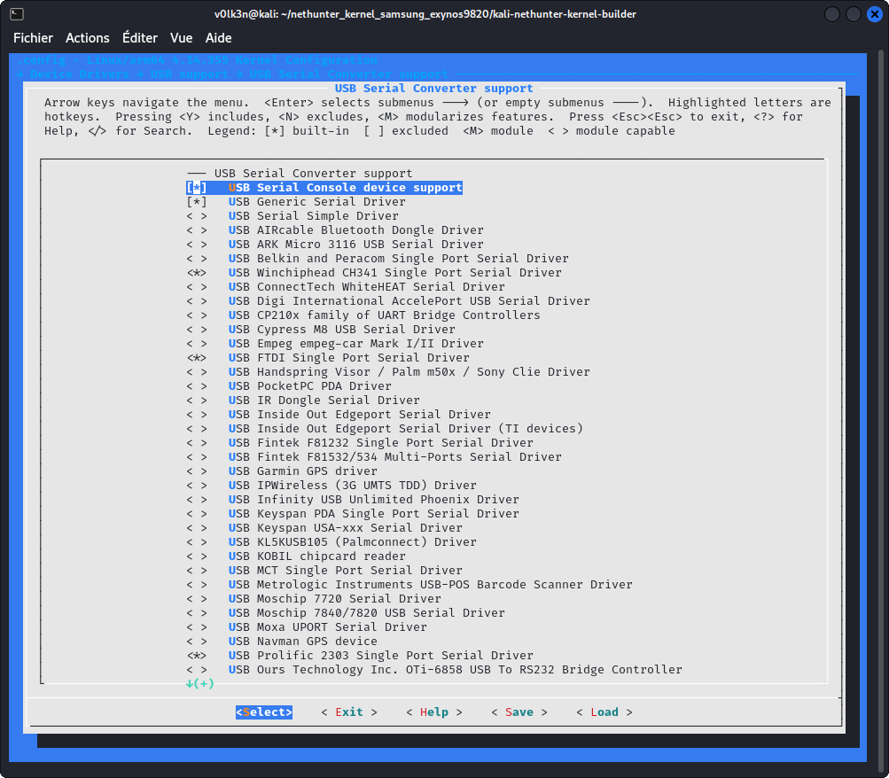

### CAN 지원

CAN 아스날 사용을 위해 CAN 지원이 필요해요. CAN 아스날이 실험 버전이므로 이 문서는 많이 업데이트될 수 있다는 점을 유의하세요.

***"Networking support"*** 섹션에서:

- ***"CAN bus subsystem support"*** 선택
- ***"Network physical/parent device Netlink interface"*** 선택



***"CAN bus subsystem support --->"*** 아래에서

- ***"Raw CAN Protocol (raw access with CAN-ID filtering)"*** 선택
- ***"Broadcast Manager CAN Protocol (with content filtering)"*** 선택
- ***"CAN Gateway/Router (with netlink configuration)"*** 선택



***"CAN Device Drivers --->"*** 아래에서

- ***"Virtual Local CAN Interface (vcan)"*** 선택
- ***"Serial / USB serial CAN Adaptors (slcan)"*** 모듈(M)로 선택
- ***"Platform CAN drivers with Netlink support"*** 선택
- ***"CAN bit-timing calculation"*** 선택
- ***"Enable LED triggers for Netlink based drivers"*** 선택

선택적으로 다음도 선택할 수 있어요:
- ***"Aeroflex Gaisler GRCAN and GRHCAN CAN devices"*** 선택
- ***"Xilinx CAN"*** 선택
- ***"Bosch C_CAN/D_CAN devices"*** 선택
- ***"Bosch CC770 and Intel AN82527 devices"*** 선택
- ***"IFI CAN_FD IP"*** 선택
- ***"Bosch M_CAN devices"*** 선택
- ***"Philips/NXP SJA1000 devices"*** 선택
- ***"Softing Gmbh CAN generic support"*** 선택



***"CAN SPI interfaces --->"*** 아래에서

- ***"Holt HI311x SPI CAN controllers"*** 선택
- ***"Microchip MCP251x SPI CAN controllers"*** 선택



***"CAN USB interfaces --->"*** 아래에서

- ***"EMS CPC-USB/ARM7 CAN/USB interface"*** 선택
- ***"ESD USB/2 CAN/USB interface"*** 선택
- ***"Geschwister Schneider UG interfaces"*** 선택
- ***"Kvaser CAN/USB interface"*** 선택
- ***"PEAK PCAN-USB/USB Pro interfaces for CAN 2.0b/CAN-FD"*** 선택
- ***"8 devices USB2CAN interface"*** 선택



***"Networking Support"*** 섹션에서

***"Networking options"*** 아래에서

- ***"Virtual Socket protocol"*** 선택
- ***"NETLINK: socket monitoring interface"*** 선택



***"QoS and/or fair queueing"*** 아래에서

- ***"CAN Identifier"*** 선택



***"Device Drivers ---> USB support ---> USB Serial Converter support --->"*** 섹션에서:

- ***"USB Serial Console device support"*** 선택
- ***"USB Generic Serial Driver"*** 선택
- ***"USB Winchiphead CH341 Single Port Serial Driver"*** 선택
- ***"USB FTDI Single Port Serial Driver"*** 선택



### Hlcan 드라이버

이것은 중국산 CAN 분석기 USB가 can-utils 모음과 함께 작동하도록 하는 데 사용돼요.

커널 소스 폴더로 이동하여 서브모듈로 can-isotp 드라이버를 복제하세요.

```
git submodule add https://github.com/V0lk3n/usb-can-2-module drivers/net/can/usb-can-2-module
```

drivers/net/can/Kconfig를 편집하고 다음 줄을 추가하세요:

```
source "drivers/net/can/usb-can-2-module/Kconfig"
```

drivers/net/can/Makefile을 편집하고 다음 줄을 추가하세요:

```
obj-y				+= usb-can-2-module/
```

***"Networking Support"*** 섹션에서

***"CAN bus subsystem support ---> CAN Device Drivers"*** 아래에서

- ***"hlcan module for usb-can"*** 모듈로 선택

### ISO 15765-2 드라이버 CAN-ISOTP (선택사항)

커널 소스 폴더로 이동하여 서브모듈로 can-isotp 드라이버를 복제하세요.

```
git submodule add https://github.com/V0lk3n/can-isotp drivers/net/can/can-isotp
```

***"isotp.h"***를 ***"include/uapi/linux/can"***에 다운로드하세요

```
cd include/uapi/linux/can
wget https://raw.githubusercontent.com/v0lk3n/can-isotp/refs/heads/master/include/uapi/linux/can/isotp.h
```

drivers/net/can/Kconfig를 편집하고 다음 줄을 추가하세요:

```
source "drivers/net/can/can-isotp/Kconfig"
```

drivers/net/can/Makefile을 편집하고 다음 줄을 추가하세요:

```
obj-y				+= can-isotp/
```

***"Networking Support"*** 섹션에서

***"CAN bus subsystem support ---> CAN Device Drivers"*** 아래에서

- ***"CAN ISO 15765-2 driver"*** 모듈로 선택

저장하고, 나가서, 빌드하세요!