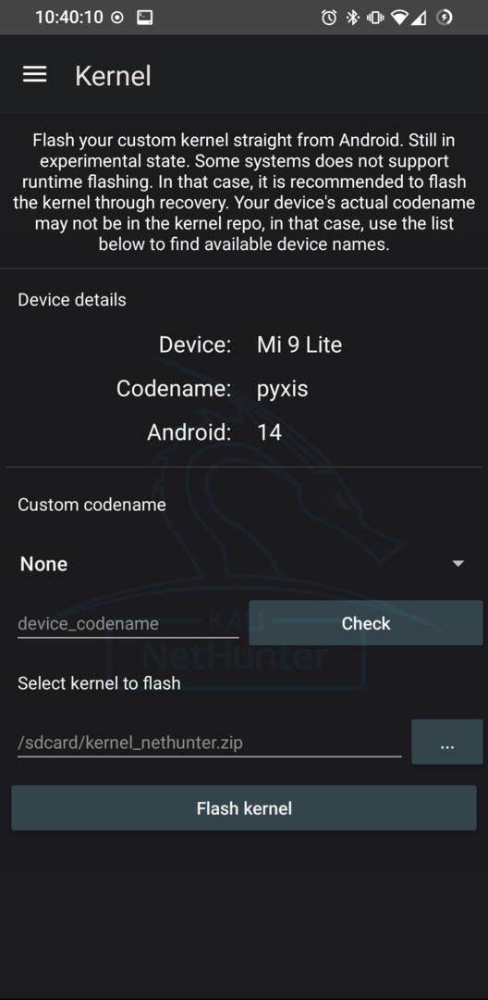

여기서 기기용 커널이 사용 가능한지 확인하고, 다운로드하고, 플래시할 수 있어요. 기기가 런타임 플래시(runtime flashing, 실행 중 설치)를 지원하지 않는 경우, 리커버리에서 동일한 zip 파일을 사용할 수 있어요. [magic-flash](https://github.com/Magisk-Modules-Alt-Repo/magic-flash)로 이를 가능하게 해준 [HuskyDG](https://github.com/HuskyDG)에게 감사드려요.

