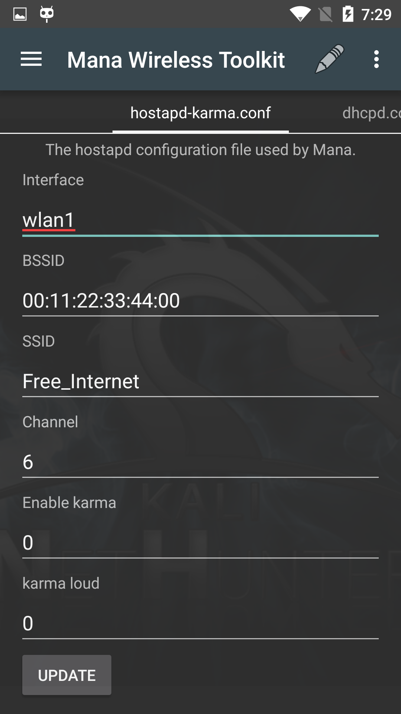

[MANA 툴킷](https://github.com/sensepost/mana)은 불량 Wi-Fi AP와 MitM 공격을 수행하는 [SensePost](https://www.sensepost.com/)의 악성 액세스 포인트 구현이에요. MitM 로그는 칼리 chroot의 /var/lib/mana-toolkit/에 기록돼요.

기본 MANA 구성은 그대로 작동해야 하지만, ssid, 채널 번호 등과 같이 대상 환경에 맞게 사용 가능한 설정을 조정할 수 있어요.

모든 설정이 만족스럽게 구성되면 **Update** 버튼을 탭하여 구성을 저장하세요.

