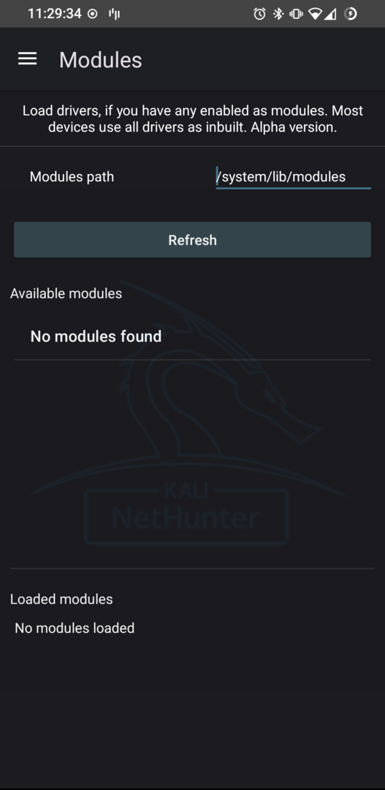

Load modules, if you have any. Most kernels come with all drivers as builtin, then this tab won't be needed. However some kernels doesn't build successfully, therefore those drivers have to be enabled as modules.

