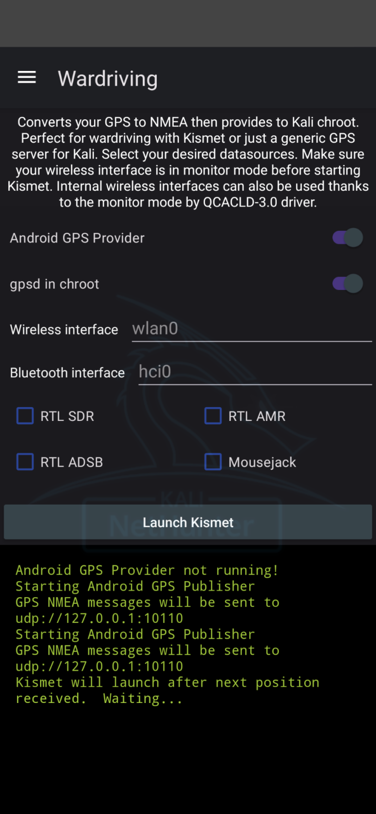

# 워드라이빙

넷헌터의 워드라이빙 패널은 안드로이드 기기의 GPS와 외부 라디오를 Kismet에 병합하여 실시간 지리 태그가 지정된 RF 히트맵을 생성해요. 토글을 사용해서 Kismet에 실시간 위치와 Wi-Fi, 블루투스, RTL-SDR, 취약점 스캐너로부터의 캡처 스트림을 제공할 수 있어요.

## 옵션

### GPS

- **Android GPS Provider**  
  UDP 포트 10110에서 Android GPS Publisher 서비스를 시작하여 NMEA 문장을 Kismet으로 스트리밍해요.

- **gpsd in chroot**  
  Kali chroot 내에서 `gpsd`를 실행하고(TCP 2947) Kismet의 `--use-gpsd-gps` 지원을 활성화해요.

### Kismet

#### 인터페이스

- **무선 인터페이스**  
  이미 모니터 모드에 있어야 하는 wifi 기기예요 (예: `wlan0`).  
  *`airmon-ng start wlan0` 또는 커스텀 명령어 ▶ Start wlan0 in Monitor Mode를 통해 모니터 모드를 활성화하세요.*

- **블루투스 인터페이스**  
  BLE/클래식 스니핑을 위한 HCI 기기예요 (예: `hci0`).  

#### 추가 옵션

- **RTL SDR**  
  광대역 스펙트럼 스캐닝을 위한 일반 RTL-SDR 플러그인을 활성화해요.  

- **RTL AMR**  
  유틸리티 미터의 자동 미터 판독(Automatic Meter Reading) 텔레메트리를 디코딩해요.  

- **RTL ADSB**  
  ADS-B 항공기 브로드캐스트를 디코딩해요.  

#### 공격

- **Mousejack**  
  취약한 2.4 GHz 마우스와 키보드로부터 암호화되지 않은 HID 프레임을 캡처해요.  

## 워크플로우

1. **(선택사항, GPS가 필요한 경우)** **Android GPS Provider**를 활성화한 다음 **gpsd in chroot**를 활성화해요 (`--use-gpsd-gps`)  
2. Wi-Fi 라디오를 모니터 모드로 설정하고 **무선 인터페이스**를 설정해요
3. **선택사항**: **블루투스 인터페이스**를 선택해요
4. **선택사항**: RTL-SDR 옵션을 활성화해요: 광대역 스펙트럼, AMR 또는 ADSB
5. **선택사항**: **Mousejack** 공격을 활성화해요
6. **Launch Kismet**을 탭해서 선택된 모든 소스로 `kismet_server`를 시작해요. 워드라이빙 앱은 첫 번째 GPS 수신과 성공적인 Kismet 실행을 기다린 후 브라우저 UI를 열어줄 거예요.

## 로깅

상태 및 디버그 메시지는 패널 하단의 **로깅 영역**에 표시돼요. 

