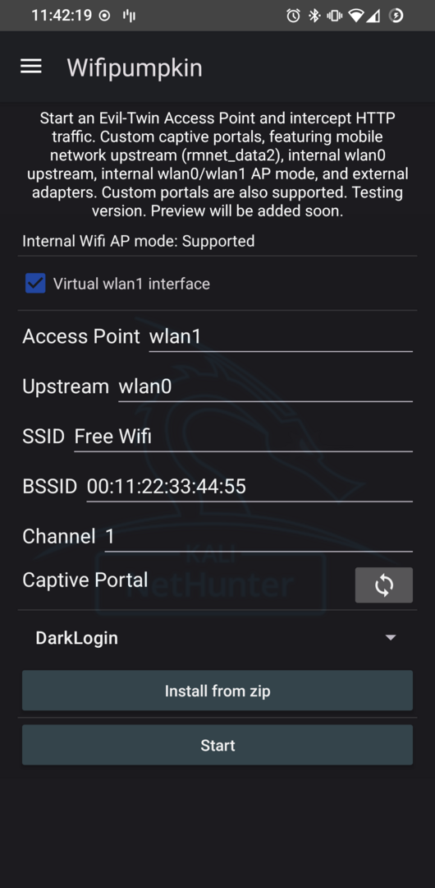

[The WifiPumpkin3](https://github.com/P0cL4bs/wifipumpkin3) is an evil access-point implementation by [P0cL4bs](https://github.com/P0cL4bs) that performs rogue Wi-Fi AP and MitM attacks.

You can run a fake Access Point with or without a captive portal. Customise the settings such as the ssid, channel number, etc. Some devices support virtual wlan1, which is may be created by Android at boot. If not, the script will try to create it for you. wlan0 can also be used, as older devices doesn't have wlan1 virtual AP. Otherwise, use an external adapter. Upstream can be either wlan0 (eg. if you have wlan1 as AP), or even mobile network (rmnet_data1/2/3) - Use the one with the IPv4 address.

Once everything is configured to your satisfaction, tap the **Start** button to start the attack.

