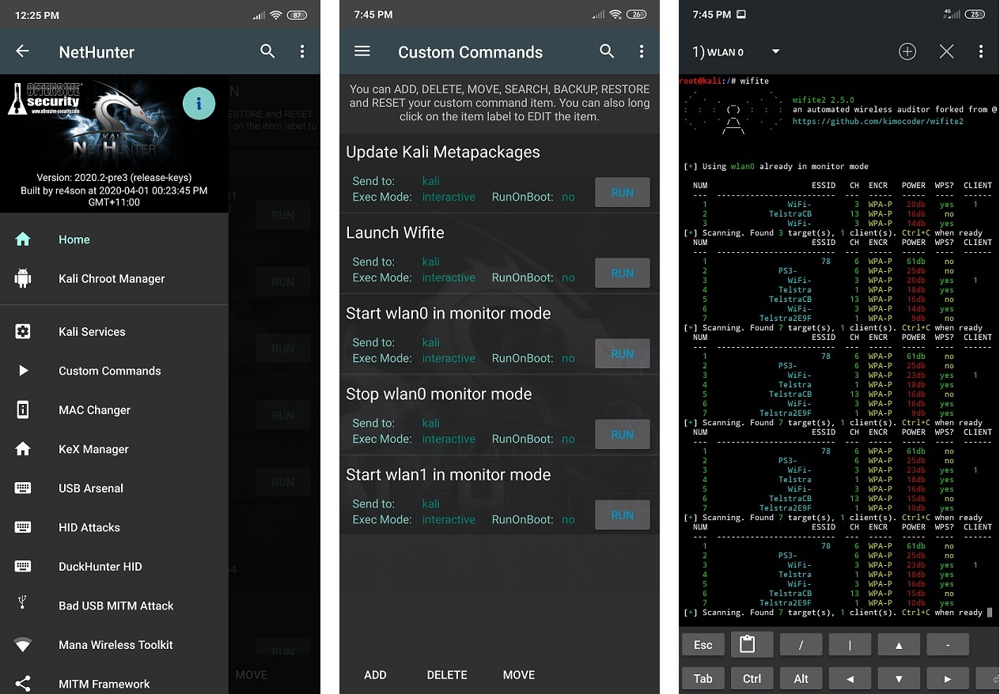

외부 무선 카드가 필요한 이유는 안드로이드 기기가 최신 스냅드래곤 SOC에 사용되는 일부 퀄컴 칩을 제외하고는 대부분의 기기에서 모니터 모드를 지원하지 않기 때문이에요. Nexus 5, 7(2012), Nexus 6P와 같이 수정된 펌웨어와 커널로 모니터 모드를 지원할 수 있는 기기들이 있어요. 현재는 특별히 수정된 버전의 Nexus 5만이 넷헌터에서 모니터 모드를 지원해요.

몇 가지 제한사항은 안드로이드 기기가 USB-OTG 케이블을 필요로 하고 전력 출력이 제한된다는 점이에요. 이러한 제한 때문에 모든 무선 카드가 필요한 전력 출력을 받을 수 있는 것은 아니며 외부 전원(y-케이블) 지원이 없을 수도 있어요.

"넷헌터와 함께 사용하기에 가장 좋은 카드는 무엇인가?"라는 질문을 할 때, 자신의 사용 사례가 무엇인지 스스로에게 물어봐야 해요.
모든 카드가 가까운 거리에서는 비슷하게 작동하겠지만, 일부는 전송 전력이 증가되고 안테나 연결이 가능해서 소형 폼 팩터 카드보다 더 먼 거리에서 작동할 수 있어요.
또한 기기가 전체 USB 500mA 규격이 아닌 OTG를 통해 450mA 이하의 전력만 제공할 가능성도 있어요. 이런 경우라면 전송 전력이 낮은 기기를 고려하는 것이 좋아요.

**다음 칩셋들은 대부분의, 아니면 모든 넷헌터 커널에서 기본적으로 지원돼요:**

Atheros
- ATH9K_HTC (AR9271, AR7010)
- ATH10K

Ralink
- RT73
- RT2800USB
- RT3070

Realtek
- RTL8188EUS
- RTL8188CU
- RTL8188RU
- RTL8192CU
- RTL8192EU
- RTL8723AU
- RTL8811AU
- RTL8812AU
- RTL8814AU
- RTL8821AU
- RTW88-USB

MediaTek
- MT7601U (제품이 Ralink Technology Corp.에서 나올 수 있음)
- MT7610U
- MT7612U

퀄컴 내장 wifi 칩셋 (wlan0)
- QCACLD-2.0 (완전 지원✅)
- QCACLD-3.0 (모니터 모드만)

**다음 기기들은 넷헌터 빌드에서 작동이 확인되었어요:**
- TP-Link TL-WN722N v1 (v2와 v3는 지원되지 않는 칩셋이라는 점을 유의하세요)
  하지만 v2와 v3는 RTL8188EUS/RTL8XXXU 드라이버를 사용하여 지원될 수 있어요.)

- TP-Link TL-WN822N v1 - v4
- Alfa Networks AWUS036ACH
- Alfa Networks AWUS036NEH (@jcadduono 추천)
- Alfa Networks AWUS036NHA
- Alfa Networks AWUSO36NH
- Panda PAU05 Nano

**다음 기기들은 넷헌터 빌드에서 부분적으로 작동이 확인되었어요:**
- Alfa Networks AWUS051NH (듀얼 밴드 5GHz 지원이 불안정할 수 있음)

