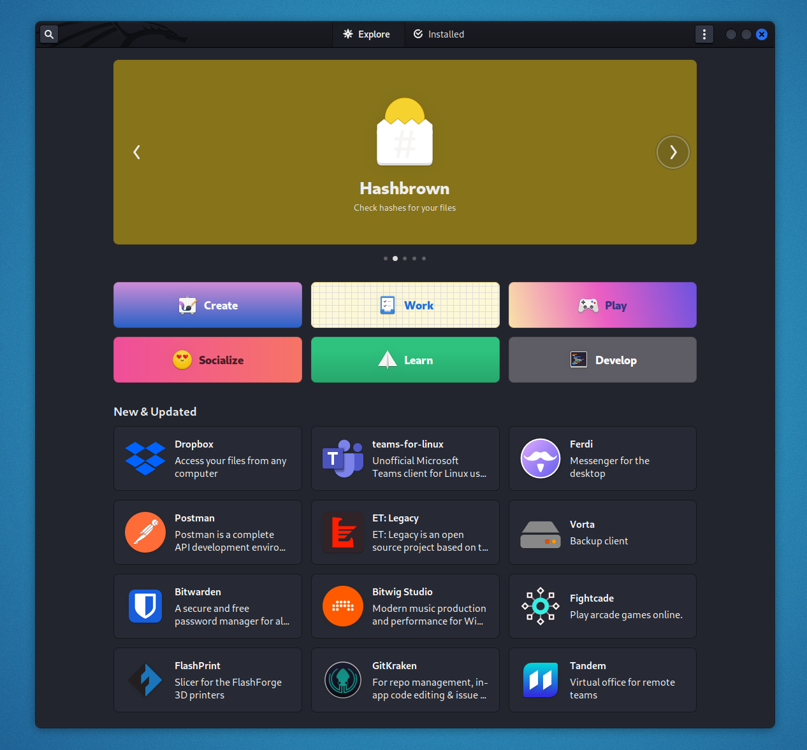

#### 설치 방법

칼리 리눅스 에선, `flatpak` 은 다음을 통해 설치할수 있습니다.:

```console
kali@kali:~$ sudo apt update
kali@kali:~$
kali@kali:~$ sudo apt install -y flatpak
kali@kali:~$
kali@kali:~$ sudo flatpak remote-add --if-not-exists flathub https://flathub.org/repo/flathub.flatpakrepo
```

#### GUI 소프트웨어 스토어

GNOME 소프트웨어용 Flatpak 플러그인을 설치하는 것도 좋습니다. 이것을 하기 위해선 아래의 명령어를 실행하세요.:

```console
kali@kali:~$ sudo apt install gnome-software-plugin-flatpak
```

이제 소프트웨어 센터에서 flatpak 앱을 설치할수 있습니다.



#### 테마

Flatpak 앱이 시스템과 더 일관되게 보이도록 하려면 로컬 테마를 사용하도록 강제할 수 있습니다:

```console
kali@kali:~$ mkdir -p ~/.themes
kali@kali:~$ cp -a /usr/share/themes/* ~/.themes/
kali@kali:~$ sudo flatpak override --filesystem=~/.themes/
```

###### 참고

- [Flatpak](https://flatpak.org/)
- [Debian Quick Setup](https://flatpak.org/setup/Debian/)
