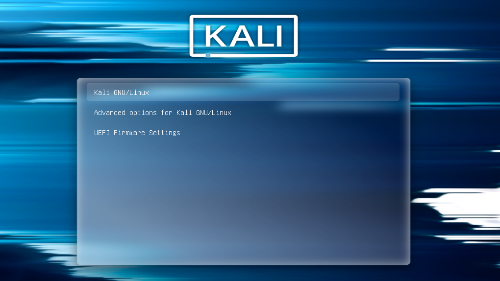
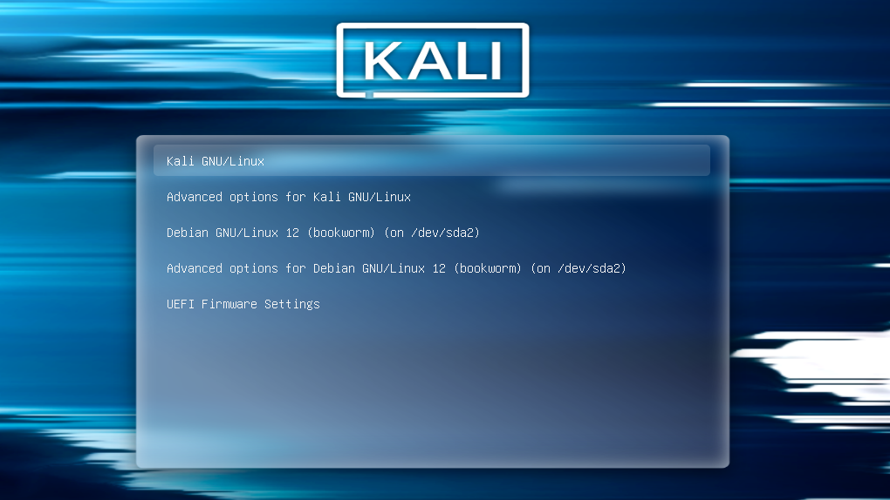

이 페이지에서는 듀얼 부팅 환경에서 GRUB(부트로더) 메뉴에 칼리 리눅스만 보이고, 다른 운영체제 항목이 안 나올 때 어떻게 해결하는지 알려드려요.

## 전제 조건

이 가이드는 칼리 리눅스와 다른 운영체제를 함께 설치한 상황을 가정해요. 이런 환경에서는 컴퓨터를 켜면 GRUB(칼리에서 설치된 부트로더) 메뉴가 보여야 해요. 이 메뉴에는 설치된 여러 운영체제가 나와서 원하는 걸 선택해 부팅할 수 있어요.

또한, GRUB 부트로더가 칼리 리눅스에서 설치된 경우를 기준으로 해요. 쉽게 확인하는 방법은 GRUB 메뉴에 칼리 리눅스 테마가 적용되어 있으면 맞아요. 만약 Kali가 아닌 다른 리눅스에서 GRUB을 설치했다면, 이 가이드로는 해결이 어려울 수 있어요.

그리고 예시와 스크린샷에서는 _다른 운영체제_ 를 Debian(데비안)으로 가정할게요. 실제로는 어떤 운영체제든 상관없지만, 설명을 위해 하나를 정했어요.

## 문제 상황과 해결 방법

어느 날 컴퓨터를 켰는데, GRUB 부트 메뉴에 칼리 리눅스만 보이고 다른 운영체제(여기선 Debian)는 안 보인다고 해볼게요. 예전엔 잘 나왔는데, 어느 순간 항목이 사라져서 Kali만 부팅할 수 있는 상황이에요.

GRUB 부트 메뉴는 아래 스크린샷처럼 나올 거예요:



이럴 땐 칼리 리눅스로 부팅한 뒤, 루트 터미널(관리자 권한 터미널)을 열고 `/etc/default/grub` 파일을 수정해야 해요. `GRUB_DISABLE_OS_PROBER=false`라는 줄을 찾아서, 주석(맨 앞에 #)이 없는 상태로 만들어주세요:

```console
kali@kali:~$ cat /etc/default/grub | grep GRUB_DISABLE_OS_PROBER
#GRUB_DISABLE_OS_PROBER=false
kali@kali:~$
kali@kali:~$ sudo sed -i 's/#GRUB_DISABLE_OS_PROBER=false/GRUB_DISABLE_OS_PROBER=false/' /etc/default/grub
kali@kali:~$
kali@kali:~$ cat /etc/default/grub | grep GRUB_DISABLE_OS_PROBER
GRUB_DISABLE_OS_PROBER=false
kali@kali:~$
```

이제 `update-grub` 명령어를 실행해 주세요. 결과는 아래처럼 나올 거예요:

```console
kali@kali:~$ sudo update-grub
Generating grub configuration file ...
Found theme: /boot/grub/themes/kali/theme.txt
Found background image: /usr/share/images/desktop-base/desktop-grub.png
Found linux image: /boot/vmlinuz-6.6.9-amd64
Found initrd image: /boot/initrd.img-6.6.9-amd64
Warning: os-prober will be executed to detect other bootable partitions.
Its output will be used to detect bootable binaries on them and create new boot entries.
Found Debian GNU/Linux 12 (bookworm) on /dev/sda2
Adding boot menu entry for UEFI Firmware Settings ...
done
kali@kali:~$
```

여기서 중요한 부분은 아래 두 줄이에요:
- « _os-prober will be executed to detect other bootable partitions_ » (os-prober가 다른 부팅 가능한 파티션을 찾으려고 실행된다는 뜻이에요)
- « _Found Debian GNU/Linux 12 (bookworm) on ..._ » (다른 운영체제, 여기선 데비안이 정상적으로 발견됐다는 뜻이에요)

여기까지 잘 따라왔다면 문제는 해결된 거예요! 이제 컴퓨터를 재부팅하면 GRUB 부트 메뉴에 칼리 리눅스와 데비안 둘 다 나올 거예요:


