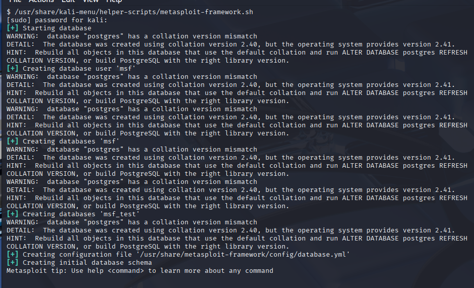

시스템 업그레이드 후에 Metasploit(메타스플로잇), GVM(그린본 취약점 관리자), Bloodhound(블러드하운드) 같은 도구를 실행할 때 PostgreSQL(포스트그레SQL) 오류 메시지가 나타날 수 있어요. 이 오류들은 도구가 제대로 작동하는 것을 방해하는데, 다음과 같은 **"collation version mismatch"(콜레이션 버전 불일치)** 오류를 표시해요:

```plain
WARNING:  database "postgres" has a collation version mismatch
DETAIL:  The database was created using collation version 2.40, but the operating system provides version 2.41.
HINT:  Rebuild all objects in this database that use the default collation and run ALTER DATABASE postgres REFRESH COLLATION VERSION, or build PostgreSQL with the right library version.

```



이 오류는 Kali의 터미널에서 다음 명령어를 실행하여 해결할 수 있어요:

```console
┌──(kali㉿kali)-[~]
└─$ sudo runuser -u postgres -- psql -c 'ALTER DATABASE postgres REFRESH COLLATION VERSION; ALTER DATABASE template1 REFRESH COLLATION VERSION;'
```
