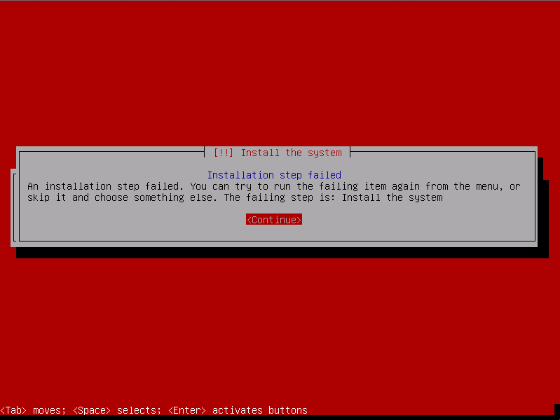

칼리 리눅스 설치가 실패하는 이유는 매우 다양해요. ISO 다운로드가 손상되었거나 불완전한 경우, 대상 기기에 디스크 공간이 부족한 경우 등이 포함될 수 있어요. 이 글에서는 칼리 리눅스 설치가 실패했을 때 무엇을 확인해야 하는지 알려드릴게요. 아래는 설치 도중 문제가 발생했음을 알리는 무서운 "빨간 화면"의 예시예요.



**계속** 버튼을 누르면 **데비안 설치 프로그램 메인 메뉴**로 이동해요. 이 메인 메뉴에서 "**디버그 로그 저장**"으로 이동하세요:


디버그 로그로 들어가면, 실패한 설치에서 설치 로그 파일을 전송하는 여러 방법이 표시돼요. 보통은 설치 중인 기기에서 웹 서버를 시작하는 것이 가장 편리한 방법이에요.


이 옵션을 선택하면 웹 서버가 시작되고, 여러 설치 로그 파일을 다운로드하거나 볼 수 있어요.


로그 파일을 살펴보며 이상한 점이나 설치 실패의 원인으로 보이는 오류 메시지를 찾아보세요. 이 경우에는 대상 기기에 칼리 리눅스를 설치할 디스크 공간이 부족했어요. 이는 **syslinux** 로그 파일의 끝부분에서 확인할 수 있었어요.

```plaintext
Aug 19 23:45:05 base-installer: error: The tar process copying the live system failed (only 152937 out of 286496 files have been copied, last file was ).
Aug 19 23:45:05 main-menu[927]: (process:7553): tar: write error: No space left on device
Aug 19 23:45:05 main-menu[927]: WARNING **: Configuring 'live-installer' failed with error code 1
Aug 19 23:45:05 main-menu[927]: WARNING **: Menu item 'live-installer' failed.
Aug 19 23:50:23 main-menu[927]: INFO: Modifying debconf priority limit from 'high' to 'medium'
Aug 19 23:50:23 debconf: Setting debconf/priority to medium
Aug 19 23:56:49 main-menu[927]: INFO: Menu item 'save-logs' selected
```
