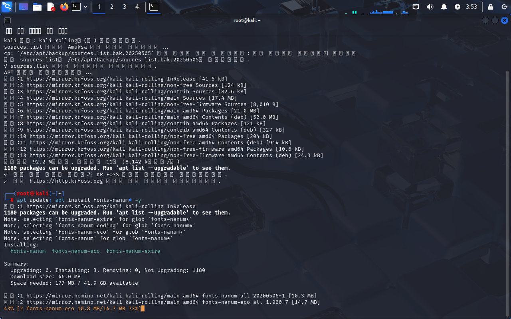
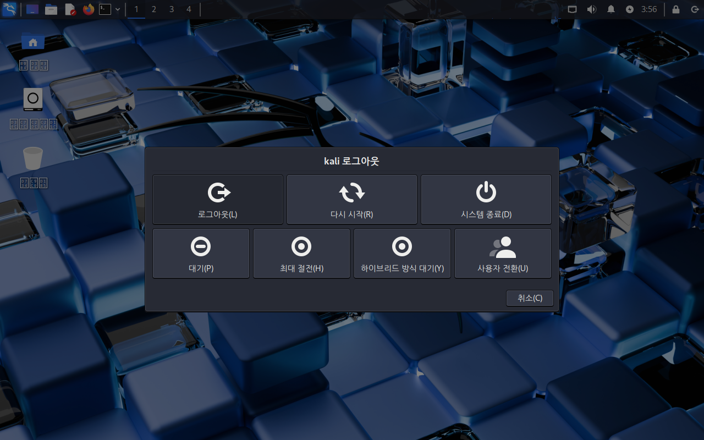
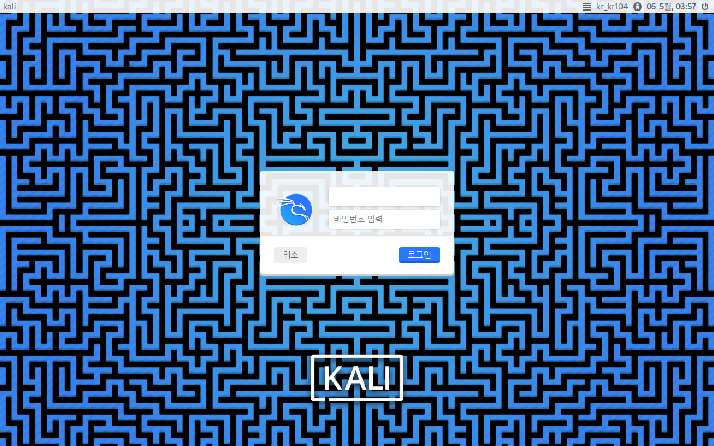

으악! 한국어로 칼리를 설치했더니 도저히 알아 볼 수 없는 내용들로 가득하네요! 그치만 이 문제는 쉽게 해결할 수 있어요. 잘 따라오세요!

로그인은 쉬워요. 아이디와 비밀번호를 입력한 뒤에 엔터를 누르면 로그인 완료!

## nanum 폰트 설치

한글을 보기 위해서는 일단 먼저 바탕화면에서 우클릭을 하고 이걸 클릭해주세요. (파란색으로 된 것)


### root 계정으로 전환하기

그런 다음 터미널이 열리면 루트 계정으로 전환하기 위해 아래 명령어를 입력하고 기존 계정의 비밀번호를 입력해주세요.

``` console
┌──(kali㉿kali)-[~]
└─$ sudo -i 
[sudo] kali ?? : 
```


{}
[ROKFOSS 프로젝트](https://http.krfoss.org)에서 제공하는 분산 미러로 바꾸고 싶다면 이 명령어를 root로 전환된 뒤에 입력해서 바꿀 수 있어요.
``` console
┌──(root㉿kali)-[~]
└─# curl -sSL https://http.krfoss.org/pack/cm.sh | bash
```
{}

### 폰트 설치 시작하기

이제 아래 명령어를 입력하고 설치를 시작해주세요.
``` console
┌──(root㉿kali)-[~]
└─# apt update; apt install fonts-nanum* -y
```


그럼 이 사진처럼 설치가 진행될 거에요! 아무런 문제가 없다면 오류 없이 잘 끝날 거예요. 바로 아래 사진처럼 말이죠.


### 로그아웃하고 다시 로그인하기

이제 한글을 보기 위해서 우측 상단에 _동그란 버튼을_ 눌러서 로그아웃을 진행해주세요.



## 한글 패치 완료

**짠~!** 이제 한글이 잘 보이네요! 다시 로그인을 해서 내부적으로도 한글이 잘 표시가 되는지 확인해볼까요?


정상적으로 잘 되었다면 지금 이 사진처럼 한글이 잘 보여야 해요. 만약 보이지 않는다면 **재부팅**을 시도해볼 수 있어요. 혹은 처음부터 다시 한글 폰트 설치를 진행해볼 수도 있어요.


한글 깨짐 문제를 성공적으로 해결하였네요! 이제 한국어로 칼리 리눅스를 쓸 수 있어요. 