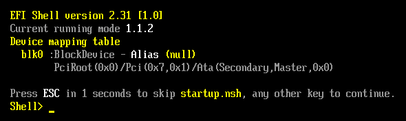

몇 년 전에 [VMware Fusion에서 칼리 USB 부팅하기](https://kali.org/blog/vmware-fusion-kali-usb-boot/)라는 블로그 글을 발표했어요. USB가 제대로 작동하지 않을 때 재부팅하거나 다른 기기로 옮기는 시간을 줄일 수 있어서 유용할 수 있죠. 그 이후로 VMware Fusion이 업데이트되면서 이 과정이 조금 더 쉬워졌어요.

요약하자면, 하드 드라이브 없이 EFI를 통해 USB로 부팅하는 가상머신(VM)을 만들 거예요.

### 과정

새로운 커스텀 VM 만들기

"Linux"를 선택하고 최신 데비안(Debian) 64비트 버전을 선택하세요

부팅 옵션으로 "UEFI"를 선택하세요.

새 가상 디스크 만들기 (나중에 제거할 거예요)

"설정 사용자 지정"을 클릭하세요

기억하기 쉬운 이름을 지정하세요

설정에서 프로세서와 메모리를 클릭하세요. 최소 2048MB 메모리와 최소 2개 코어가 할당되었는지 확인하세요.

다음으로, "디스플레이"에서 "3D 그래픽 가속화"를 체크하세요. 이건 선택 사항이지만 성능을 향상시켜요. 원한다면 "레티나 디스플레이에 전체 해상도 사용"도 체크할 수 있어요.

이제 USB 섹션으로 가서 모든 것이 실제 시스템처럼 작동하도록 할게요. "USB 장치"에서 호환되는 설정이라면 "USB 호환성"을 "USB 3.0"으로 설정하세요. USB-C를 사용하고 있다면 USB 3.0을 선택했는지 확인하세요. "연결 동작"은 "Linux에 연결"로 설정해야 해요.

하드 디스크를 제거하려면 "디스크"로 가서 "고급 옵션"을 확장한 다음 "하드 디스크 제거"를 클릭하세요. 휴지통으로 보내도 돼요.

이제 VM의 전원을 켜면 칼리로 부팅될 거예요.

### USB 연결 문제 해결하기

문제가 생긴다면 몇 가지 옵션이 있어요. 먼저, VM의 전원을 끄세요. "설정" -> "USB 장치"로 가서 전원이 꺼진 VM 옆에 이 설정 화면을 띄워두세요. (도구 모음을 확장해서 USB 아이콘을 확인할 수도 있어요). 이제 VM의 전원을 켜세요. 바로 USB 설정 화면에 USB 장치 옆에 체크 표시가 생기는 것을 볼 수 있을 거예요:

체크 표시가 없다면 Mac이 USB 드라이브를 잡고 있다는 뜻이에요. VM의 전원을 끄고, Mac에서 드라이브를 꺼낸 다음, USB 설정 화면을 띄운 상태로 VM의 전원을 다시 켜세요. 체크 표시가 보이고 칼리 부팅 화면이 나타날 거예요.

### EFI 문제 해결하기

{}
EFI(Extensible Firmware Interface)는 BIOS를 대체하는 현대적인 펌웨어 인터페이스로, 컴퓨터 하드웨어와 운영체제 간의 통신을 담당합니다. 여기서는 가상환경에서 USB 장치를 인식하고 부팅하기 위해 사용됩니다.
{}

EFI로 부팅할 때 부팅 화면은 이렇게 보여야 해요:

이것은 EFI가 활성화되었다는 표시예요. 그렇지 않다면 설정의 "고급" 섹션에서 펌웨어 라인이 제대로 입력되었는지 다시 확인해보세요. 경우에 따라 이 EFI 네트워크 확인이 멈출 수도 있어요. VM 내에서 ESC를 누르면 프로세스가 진행돼요.

부팅 관리자에 접근하려면 상단의 Apple 창 표시줄에서 "가상 머신"을 클릭한 다음 "펌웨어로 전원 켜기"를 클릭하세요.

여기서 "EFI 내부 쉘"을 선택해서 쉘로 들어갈 수 있어요. fs0 맵이 없는 이런 상황이 나타난다면, EFI가 USB 드라이브를 인식하지 못한 거예요. 이 경우, 가상 머신의 전원을 끄고 USB를 뽑은 다음 VM을 시작하고 시작 버튼을 누른 직후에 드라이브를 삽입하며 설정에서 체크 표시를 확인해보세요.

모든 것이 잘 되면 칼리 리눅스로 부팅됩니다. 그렇지 않으면 ESC를 누르고 "EFI 내부 쉘"로 EFI 쉘에 접근할 수 있어요. "행복한" EFI 쉘은 이렇게 생겼어요:

fs0 맵을 확인하세요. 다음으로 'fs0:'을 입력하고 'ls'를 입력해서 둘러볼 수 있어요.

'cd efi\boot'를 입력하고(슬래시가 아닌 백슬래시를 사용한다는 점 주의!) 'bootx64.efi'로 장치를 수동으로 부팅할 수 있어요.

이렇게 하면 정상적인 EFI 부팅이 이루어져요:

일부 설치에서는 종료 후 드라이브를 제거하고 VM의 전원을 켠 다음 드라이브를 삽입하는 과정이 필요할 수 있어요. 이는 Mac이 USB 드라이브를 잡거나 반만 잡은 경우(마운트 없이)와 관련이 있을 수 있어요.

### 마지막 방법

앞의 두 방법이 칼리로 직접 부팅하는 문제를 해결하지 못했지만 EFI 문제 해결에서 본 것처럼 부팅할 _수_ 있다면, 부팅 관리자를 사용해 칼리 리눅스로 부팅할 수 있어요. 상단의 Apple 창 표시줄에서 "가상 머신"을 클릭한 다음 "펌웨어로 전원 켜기"를 클릭해서 부팅 관리자에 접근하세요. "EFI USB 장치" 옵션을 선택하고 엔터를 누르세요.

이렇게 하면 정상적인 EFI 부팅이 이루어져요:

