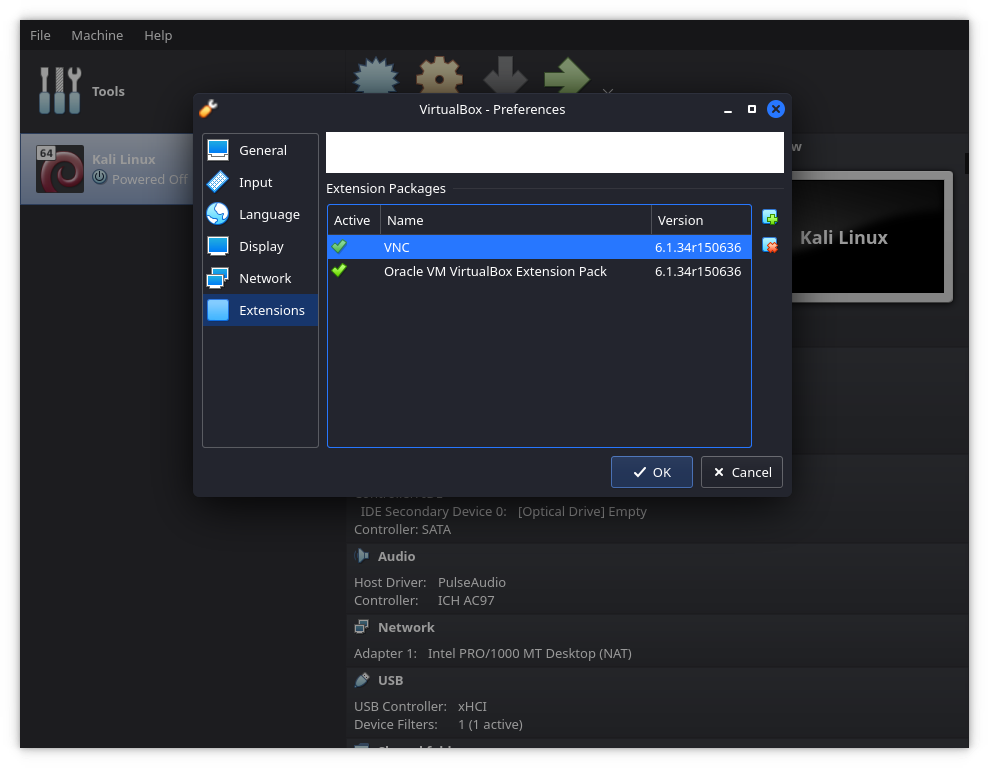
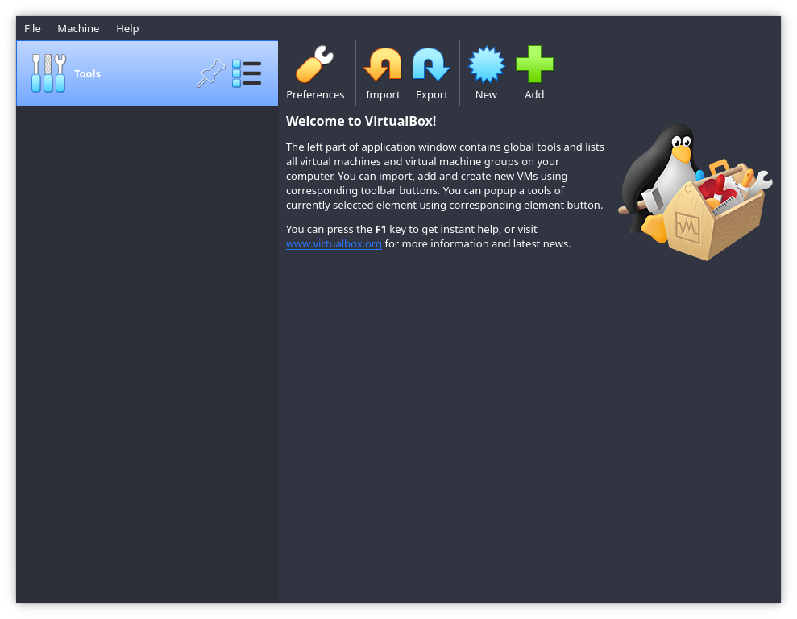
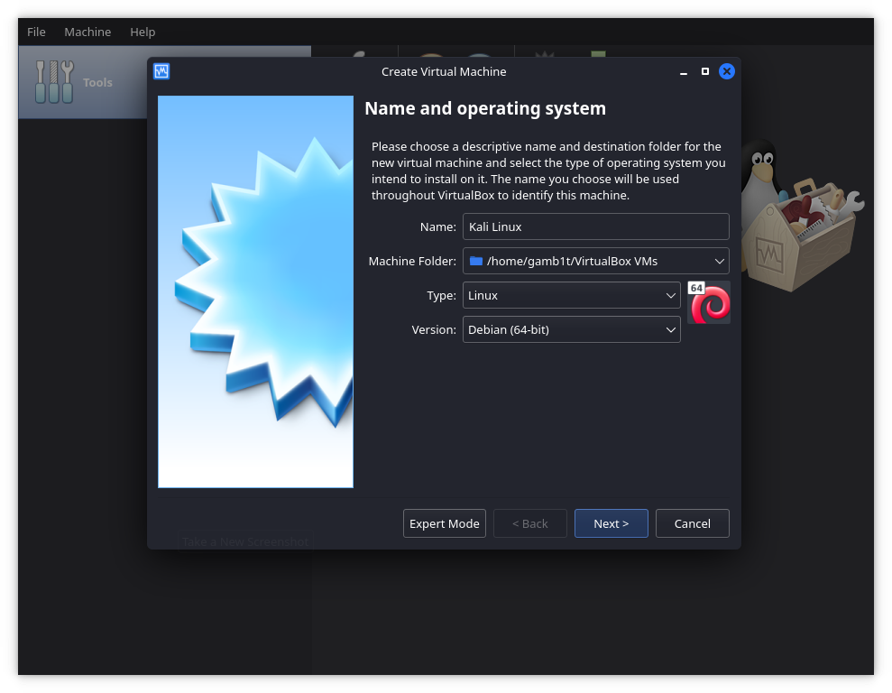
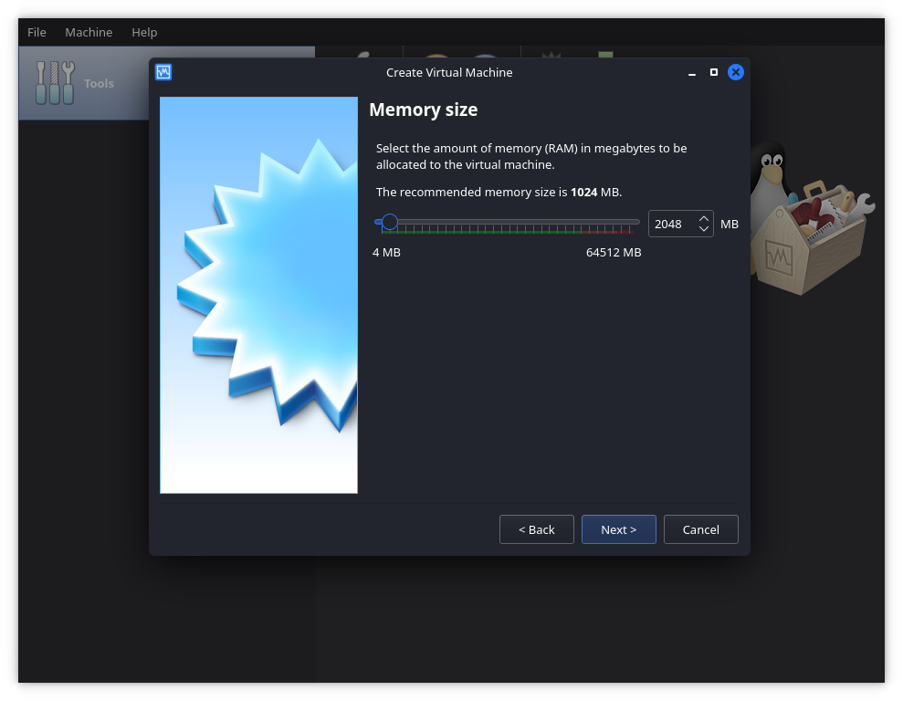
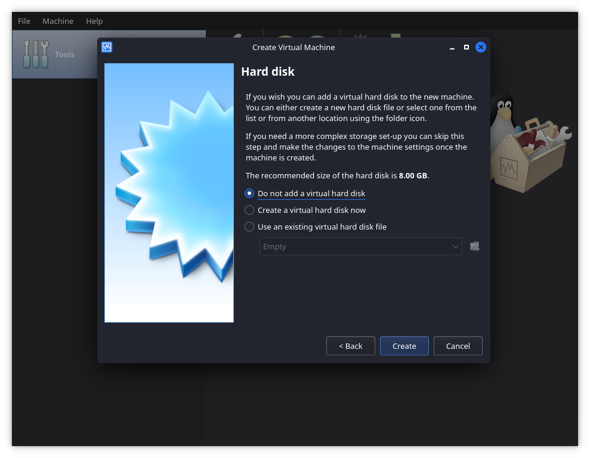
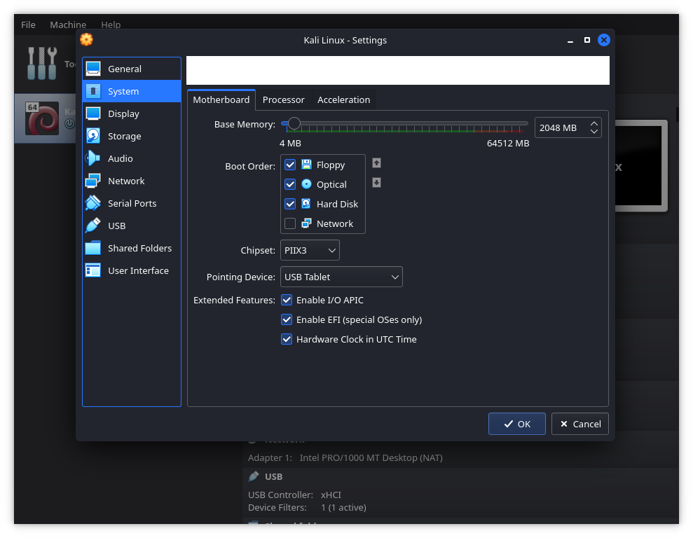
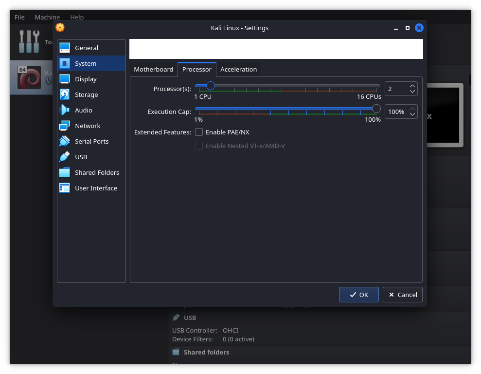
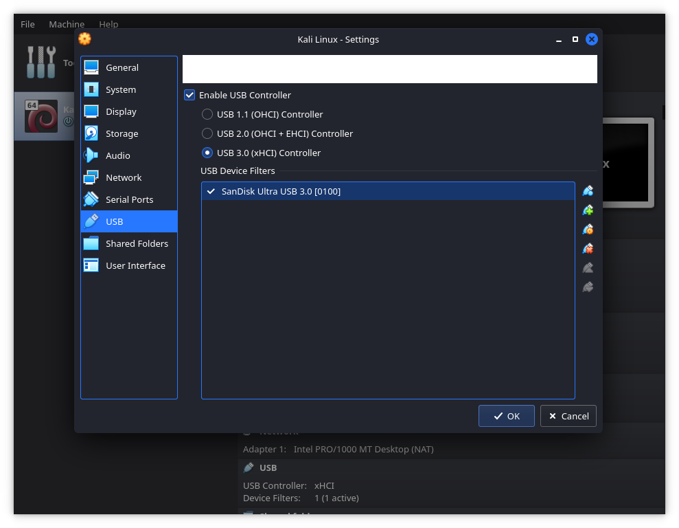

시작하려면 먼저 [Oracle VM VirtualBox 확장 팩](https://www.virtualbox.org/wiki/Downloads)을 다운로드해야 해요. 이 팩을 다운로드한 후 VirtualBox를 실행하고 '파일' 탭에서 '환경설정'을 선택해요. 여기서 '확장'으로 이동한 다음 초록색 플러스가 있는 상자를 선택하고 팩을 추가해요.



그런 다음 Linux를 사용 중이라면 계정을 `vboxusers` 그룹에 추가해야 해요:

```console
kali@kali:~$ sudo usermod -aG vboxusers $USER
kali@kali:~$
```

이후 로그아웃하고 다시 로그인해야 해요. 이제 USB 2.0/3.0 액세스를 계속할 수 있어요. VirtualBox를 새로 열어볼게요.



여기서 새 가상머신(VM)을 만들 거예요. 원하는 이름을 지정하고 유형으로 'Linux'를, 버전으로 'Debian (64-bit)'을 선택해요.



메모리는 2GB를 선택하고 계속 진행해요.



가상 하드 디스크를 생성하지 않도록 주의해야 해요. 확인을 요청할 텐데, 확인하고 계속해요.



이제 설정을 편집할 수 있어요. '시스템'의 '마더보드'에서 EFI를 활성화할 거예요.



다음으로 '시스템'의 '프로세서'에서 프로세서 수를 2개로 늘려요.



이제 'USB'로 이동해서 초록색 플러스가 있는 USB 아이콘을 선택해요. Kali Live USB 드라이브를 추가하고 USB 3.0으로 설정되어 있는지 확인해요.



이제 설정을 완료하고 VM을 부팅할 수 있어요. 모든 것이 제대로 되었다면 Live 부팅 메뉴가 나타날 거예요.
