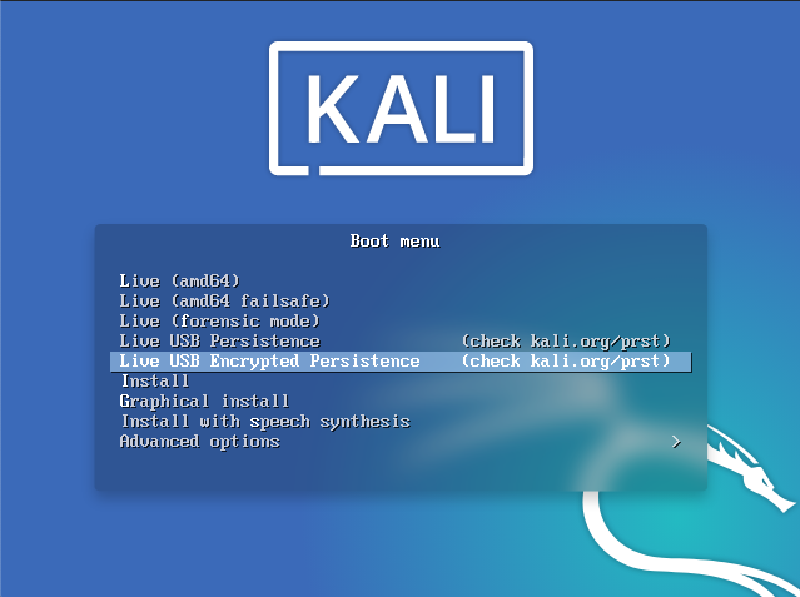

Kali Linux "Live" has two options in the default boot menu which enable persistence — the preservation of data on the "Kali Live" USB drive — across reboots of "Kali Live". This can be an extremely useful enhancement, and enables you to retain documents, collected testing results, configurations, etc., when running Kali Linux "Live" from the USB drive, even across different systems. The persistent data is stored in its own partition on the USB drive, which can also be optionally LUKS-encrypted.

To make use of the USB persistence options at boot time, you'll need to do some additional setup on your "Kali Linux Live" USB drive; this article will show you how.

This guide assumes that you have already created a Kali Linux "Live" USB drive as described in [the doc page for that subject](/docs/usb/kali-linux-live-usb-install/). For the purposes of this article, we'll assume you're working on a Linux-based system.



{}
You'll need to have root privileges to do this procedure, or the ability to escalate your privileges with the command "sudo su".
{}

In this example, we assume:

* you are running as the **root user**. Latest Kali 2020.1 does not has root user by default. You can switch to root using the command "sudo bash".
* your USB drive is `/dev/sdb`
* your USB drive has a capacity of **at least 8GB** — the Kali Linux image takes over 3GB, and for this guide, we'll be creating a new partition of about 4GB to store our persistent data in.
* you are running on a separate Linux system (cannot be Live Boot Kali)

In this example, we'll create a new partition to store our persistent data into, starting right above the second Kali Live partition and ending at 7GB, put an ext3 file system onto it, and create a `persistence.conf` file on the new partition.

1. First, begin by imaging the latest Kali Linux ISO (currently [2020.1](https://www.kali.org/downloads/)) to your USB drive as described in [this article](/docs/usb/kali-linux-live-usb-install/). We're going to assume that the two partitions created by the imaging are `/dev/sdb1` and `/dev/sdb2`. This can be verified with the command `fdisk -l`.

2. Create and format an additional partition on the USB drive.
First, let's create the new partition in the empty space above our Kali Live partitions. We have to do this from the command line as gparted will read the imaged ISO as a large block. The following command will, as a short explanation, shrink that block to only be the Kali Live partition.

```plaintext
end=7gb
read start _ < <(du -bcm kali-linux-2020.1b-live-amd64.iso | tail -1); echo $start
parted /dev/sdb mkpart primary $start $end
```

The **[parted](https://packages.debian.org/testing/parted)** command may advise you that it can't use the exact start values you specified; if so, accept the suggested value instead. If advised that the partition isn't placed at an optimal location, "ignore" it. When parted completes, the new partition should have been created at `/dev/sdb3`; again, this can be verified with the command `fdisk -l`.

3. Next, create an **ext3** file system in the partition and label it `persistence`.

```markdown
mkfs.ext3 -L persistence /dev/sdb3
e2label /dev/sdb3 persistence
```

4. Create a mount point, mount the new partition there, and then create the configuration file to enable persistence. Finally, unmount the partition.

```markdown
mkdir -p /mnt/my_usb
mount /dev/sdb3 /mnt/my_usb
echo "/ union" > /mnt/my_usb/persistence.conf
umount /dev/sdb3
```

## Adding USB Persistence with LUKS Encryption

Alternatively, you can create a LUKS-encrypted persistent storage area. This adds an extra layer of security to your sensitive files when traveling with Kali Live on USB devices. In the following example, we'll create a new partition to store our persistent data into, starting right above the second Kali Live partition and ending at 7GB, set up LUKS encryption on the new partition, put an ext3 file system onto it, and create a `persistence.conf` file on it.

1. Image the latest Kali Linux ISO (currently 2020.1) to your USB drive as described in [this article](/docs/usb/kali-linux-live-usb-install/).
2. Create the new partition in the empty space above our Kali Live partitions.

```plaintext
end=7gb
read start _ < <(du -bcm kali-linux-2020.1-live-amd64.iso | tail -1); echo $start
parted /dev/sdb mkpart primary $start $end
```

The parted command may advise you that it can't use the exact start value you specified; if so, accept the suggested value instead. If advised that the partition isn't placed at an optimal location, "ignore" it. When parted completes, the new partition should have been created at `/dev/sdb3`; again, this can be verified with the command `fdisk -l`.

3. Initialize the LUKS encryption on the newly-created partition. You'll be warned that this will overwrite any data on the partition. When prompted whether you want to proceed, type "YES" (all upper case). Enter your selected passphrase twice when asked to do so, and be sure to pick a passphrase you're going to remember: if you forget it, your data will still be persistent, just irretrievable (and unusable).

```
cryptsetup --verbose --verify-passphrase luksFormat /dev/sdb3
cryptsetup luksOpen /dev/sdb3 my_usb
```

4. Create the ext3 filesystem, and label it "persistence".

```
mkfs.ext3 -L persistence /dev/mapper/my_usb
e2label /dev/mapper/my_usb persistence
```

5. Create a mount point, mount our new encrypted partition there, set up the `persistence.conf` file, and unmount the partition.

```markdown
mkdir -p /mnt/my_usb/
mount /dev/mapper/my_usb /mnt/my_usb
echo "/ union" > /mnt/my_usb/persistence.conf
umount /dev/mapper/my_usb
```

6. Close the encrypted channel to our persistence partition.

```
cryptsetup luksClose /dev/mapper/my_usb
```

That's really all there is to it! To use the persistent data features, simply plug your USB drive into the computer you want to boot up Kali Live on — make sure your BIOS is set to boot from your USB device — and fire it up. When the Kali Linux boot screen is displayed, choose the persistent option you set up on your USB drive, either normal or encrypted.
