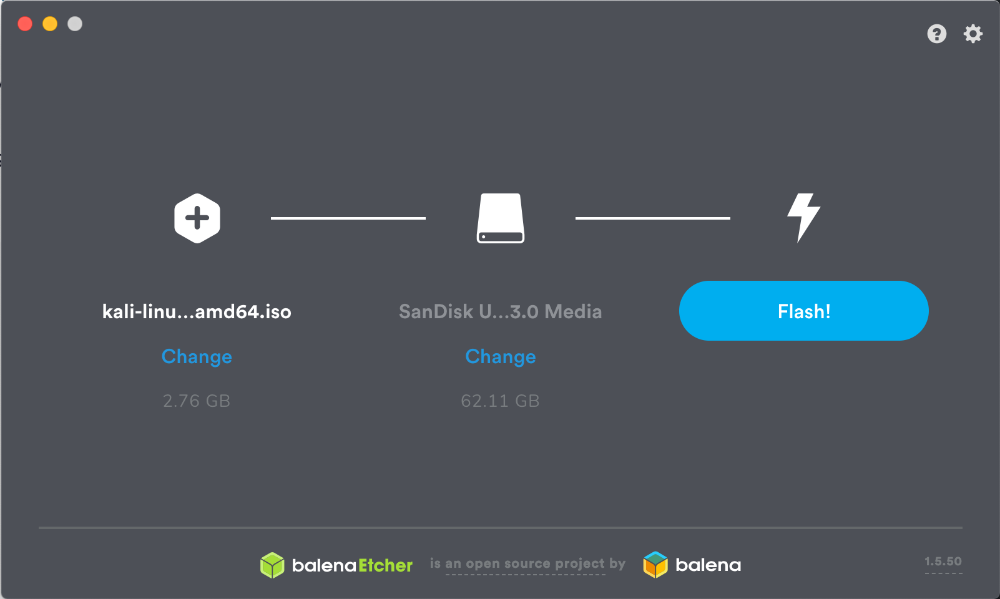

칼리 리눅스를 시작하는 가장 빠른 방법이자 저희가 가장 좋아하는 방법은 USB 드라이브에서 "라이브"로 실행하는 거예요. 이 방법에는 여러 장점이 있어요:

- 비파괴적이에요 - 호스트 시스템의 하드 드라이브나 설치된 OS를 전혀 변경하지 않고, 다시 일반 모드로 돌아가려면 "칼리 라이브" USB 드라이브를 제거하고 시스템을 재시작하면 돼요.
- 휴대성이 좋아요 - 칼리 리눅스를 주머니에 넣고 다니다가 사용 가능한 시스템에서 몇 분 안에 실행할 수 있어요.
- 맞춤 설정이 가능해요 - [자신만의 맞춤형 칼리 리눅스 ISO 이미지](https://kali.org/docs/development/live-build-a-custom-kali-iso/)를 만들고 같은 방법으로 USB 드라이브에 넣을 수 있어요.
- 영구 저장이 가능해요 - 약간의 추가 작업으로 칼리 리눅스 "라이브" USB 드라이브에 [영구 저장소](https://kali.org/docs/usb/usb-persistence/)를 설정하면 수집한 데이터가 재부팅 후에도 저장돼요.

이를 위해서는 먼저 칼리 리눅스의 ISO 이미지로 설정된 부팅 가능한 USB 드라이브를 만들어야 해요.

## 필요한 것들

1. 실행할 시스템에 맞는 최신 칼리 빌드 이미지의 _검증된_ ISO 이미지 복사본: [공식 칼리 리눅스 이미지 다운로드](https://kali.org/docs/introduction/download-official-kali-linux-images/) 자세한 내용을 확인하세요.

2. macOS/OS X를 사용 중이라면 미리 설치된 `dd` 명령어를 사용하거나 [Etcher](https://www.balena.io/etcher/)를 사용할 수 있어요.

3. 4GB 이상의 USB 메모리. (SD 카드 슬롯이 있는 시스템은 비슷한 용량의 SD 카드를 사용할 수 있어요. 절차는 동일해요.)

## 칼리 리눅스 라이브 USB 설치 절차

이 절차의 세부 사항은 [Windows](https://kali.org/docs/usb/live-usb-install-with-windows/), [Linux](https://kali.org/docs/usb/live-usb-install-with-linux/), 또는 [macOS/OS X](https://kali.org/docs/usb/live-usb-install-with-mac/) 시스템에서 하는지에 따라 달라져요.

#### macOS/OS X에서 부팅 가능한 칼리 USB 드라이브 만들기 (DD)

{}
macOS는 UNIX 기반 시스템이기 때문에 Linux와 비슷한 명령어를 사용합니다. 하지만 디스크 경로 표기 방식과 일부 옵션이 다르므로 아래 안내를 정확히 따라주세요.
{}

macOS/OS X는 UNIX를 기반으로 하기 때문에, macOS/OS X 환경에서 부팅 가능한 칼리 리눅스 USB 드라이브를 만드는 것은 Linux에서 하는 것과 비슷해요. 원하는 칼리 ISO 파일을 다운로드하고 확인한 후, `dd` 명령어를 사용해서 USB 드라이브로 복사해요. Etcher를 사용하고 싶다면 Windows 사용자와 같은 방법을 따르면 돼요. USB 드라이브는 /dev/disk2와 같은 경로를 가질 거예요.

{}
경고: 칼리 리눅스를 USB 드라이브로 이미징하는 과정은 매우 쉽지만, 무엇을 하는지 이해하지 못하거나 잘못된 출력 경로를 지정하면 의도하지 않은 디스크 드라이브를 dd로 덮어쓸 수 있어요. 실행하기 전에 다시 한 번 확인하세요.

복수난수(覆水難收) "엎질러진 물은 다시 담을 수 없다"
{}

1. USB 드라이브를 시스템에 꽂지 **_않은 상태_**에서 터미널 창을 열고 명령 프롬프트에 `diskutil list` 명령어를 입력하세요.

2. 시스템에 마운트된 디스크의 장치 경로(**/dev/disk0**, **/dev/disk1** 등과 같은)와 각 디스크의 파티션에 대한 정보가 함께 나열된 목록이 나타날 거예요.


3. USB 장치를 Mac 컴퓨터의 USB 포트에 꽂고 `diskutil list` 명령어를 다시 실행하세요. USB 드라이브의 경로는 대체로 목록의 마지막에 있을 거예요. 어쨌든, 이전에 없던 것 중 하나일 거예요. 이 예시에서는 이전에 없었던 **/dev/disk6**이 새로 생긴 것을 볼 수 있어요.


4. 드라이브를 언마운트하세요 (이 예시에서 USB 드라이브는 **/dev/disk6**로 가정해요 - _이것을 **단순히** 복사하지 마시고, 여러분 시스템에서 올바른 경로를 직접 확인하세요!_):

```console
$ diskutil unmountDisk /dev/disk6
```

5. (조심스럽게!) USB 장치에 칼리 ISO 파일을 이미징하세요. 다음 명령어는 USB 드라이브가 /dev/disk6 경로에 있고, "kali-linux-2025.1-live-amd64.iso"라는 이름의 칼리 리눅스 ISO가 있는 디렉토리에 있다고 가정해요. 쓰기 속도를 향상시키기 위해 /dev/disk6을 /dev/rdisk6으로 변경할 거예요:

```console
$ sudo dd if=kali-linux-2025.1-live-amd64.iso of=/dev/rdisk6 bs=4M status=progress
```

{}
위 명령어를 실행할 때 다음과 같은 오류가 나타날 수 있어요:

```plaintext
dd: invalid number: '4M'
```

이 경우, `4M`을 `4m`으로 변경하세요. 또한 블록 크기(bs)를 증가시키면 쓰기 진행 속도가 빨라지지만, 불량 USB 드라이브가 생길 가능성도 높아져요. macOS/OS X에서 주어진 값을 사용하면 일관되게 신뢰할 수 있는 이미지가 만들어져요.

또 다른 잠재적 오류는 `status=progress`가 macOS 버전에서 작동하지 않는 경우예요. 이 경우, 이 부분을 제거하고 대신 `CTRL+T`를 사용하여 상태를 측정하세요.
{}

USB 드라이브 이미징은 시간이 꽤 걸릴 수 있어요. 아래 샘플 출력에서 볼 수 있듯이, 30분 이상 걸리는 것도 드문 일이 아니니 참을성을 가지세요!

dd 명령어는 완료될 때까지 피드백을 제공하지 않지만, 드라이브에 접근 표시기가 있다면 가끔 깜박이는 것을 볼 수 있을 거예요. 이미지를 `dd`로 복사하는 시간은 사용된 시스템의 속도, USB 드라이브 자체, 그리고 삽입된 USB 포트에 따라 달라져요. dd가 드라이브 이미징을 마치면, 다음과 같은 출력이 나타날 거예요:

```plaintext
893+1 records in
893+1 records out
3748147200 bytes transferred in 915.043994 secs (4096139 bytes/sec)
```

끝났어요!

- - -

#### macOS/OS X에서 부팅 가능한 칼리 USB 드라이브 만들기 (Etcher)

또는 [Etcher](https://www.balena.io/etcher/)를 사용할 수도 있어요.

1. Etcher를 다운로드하고 실행하세요.

2. "이미지 선택"으로 이미징할 칼리 리눅스 ISO 파일을 선택하고 덮어쓸 USB 드라이브가 올바른 것인지 확인하세요. 준비되면 "Flash!" 버튼을 클릭하세요.


3. Etcher가 이미지가 플래시되었다고 알리면 USB 드라이브를 안전하게 제거할 수 있어요.

이제 USB 장치를 사용하여 칼리 라이브/설치 환경으로 부팅할 수 있어요.

macOS/OS X 시스템에서 다른 드라이브로 부팅하려면, 기기 전원을 켠 직후 **Option** 키를 눌러 부팅 메뉴를 불러오고 사용하려는 드라이브를 선택하세요.

자세한 내용은 [Apple의 지식 베이스](https://support.apple.com/kb/ht1310)를 참조하세요.
