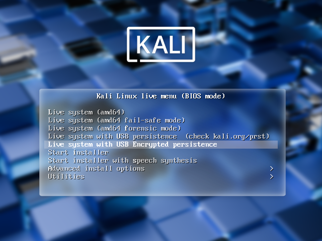

<!--
이것은 이전에 열렸던 칼리 도고 워크숍이에요

이 워크숍에서는 USB 장치에서 칼리 리눅스를 부팅할 때 사용할 수 있는 다양한 기능을 살펴볼 거예요. 영구 저장소, LUKS 암호화된 영구 저장소 생성, 그리고 USB 드라이브의 "LUKS 날리기" 기능까지 알아볼 거예요. 기본 칼리 리눅스 ISO(1.0.7 버전 이상)는 USB 암호화된 영구 저장소를 지원해요.

-->

칼리 리눅스 "라이브"의 기본 부트 메뉴에는 두 가지 영구 저장소 옵션이 있어요. 이를 통해 "Kali Live" USB 드라이브에서 재부팅해도 데이터가 보존되며 다음 중 하나를 사용할 수 있어요:

- [USB 영구 저장소](/docs/usb/usb-persistence/)
- [USB 암호화 영구 저장소](/docs/usb/usb-persistence-encryption/) (이 가이드)

이 기능은 매우 유용하며, USB 드라이브에서 칼리 리눅스 "라이브"를 실행할 때 문서, 수집한 테스트 결과, 설정 등을 여러 시스템에서 재부팅해도 유지할 수 있어요. 영구 데이터는 USB 드라이브의 별도 파티션에 저장되며, 이 파티션은 LUKS로 암호화돼요.

부팅 시 USB 영구 저장소 옵션을 사용하려면 "Kali Linux Live" USB 드라이브에 추가 설정이 필요해요. 이 문서에서는 그 방법을 안내해요.

이 가이드는 이미 [해당 문서](/docs/usb/live-usb-install-with-windows/)에 따라 칼리 리눅스 "라이브" USB 드라이브를 만든 상태를 전제로 할 거에요. 여기서는 리눅스 기반 시스템에서 작업한다고 가정해요.

{}
이 작업을 수행하려면 root 권한이 필요하거나, `sudo`로 권한 상승이 가능해야 해요.
{}

---

{}
이 문서 전체에서 '/dev/sdX'는 실제 장치 라벨로 대체해야 해요. '/dev/sdX'는 문서에서 실수로 덮어쓰는 것을 방지하기 위해 사용되며, 실제 작업 시에는 올바른 장치명을 사용해야 해요.
{}

---

**0x01 - Kali ISO 이미지를 USB 드라이브(예: /dev/sdX)에 기록하세요.**

```console
kali@kali:~$ sudo dd if=kali-linux-2025.1-live-amd64.iso of=/dev/sdX conv=fsync bs=4M
```

작업이 끝나면 `parted /dev/sdX print` 명령으로 USB 파티션 구조를 확인할 수 있어요.

```console
kali@kali:~$ sudo parted /dev/sdX print
Model: SanDisk Extreme (scsi)
Disk /dev/sdX: 62.7GB
Sector size (logical/physical): 512B/512B
Partition Table: msdos
Disk Flags:

Number  Start   End     Size    Type     File system  Flags
 1      32.8kB  4927MB  4927MB  primary               boot, hidden
 2      4927MB  4932MB  4194kB  primary

kali@kali:~$
```

---

**0x02 - USB 드라이브에 추가 파티션을 만들고 포맷하세요.**

이 예제에서는 Kali Live 파티션 위의 빈 공간에 영구 저장소 파티션을 만들어요.

```console
kali@kali:~$ sudo fdisk /dev/sdX <<< $(printf "p\nn\np\n\n\n\np\nw")
```

fdisk가 완료되면 새 파티션이 `/dev/sdX3`에 생성되어 있을 거에요. `lsblk /dev/sdX` 명령으로 확인할 수 있어요.

```console
kali@kali:~$ lsblk /dev/sdX
NAME   MAJ:MIN RM  SIZE RO TYPE MOUNTPOINTS
sdc      8:32   1 58.4G  0 disk
├─sdc1   8:33   1  4.6G  0 part
├─sdc2   8:34   1    4M  0 part
└─sdc3   8:35   1 53.8G  0 part
kali@kali:~$
```

---

**0x03 - LUKS로 파티션을 암호화하세요.**

```console
kali@kali:~$ sudo cryptsetup --verbose --verify-passphrase luksFormat /dev/sdX3
WARNING!
========
This will overwrite data on /dev/sdX3 irrevocably.

Are you sure? (Type 'yes' in capital letters): YES
Enter passphrase for /dev/sdX3:
Verify passphrase:
Existing 'ext4' superblock signature on device /dev/sdX3 will be wiped.
Key slot 0 created.
Command successful.
kali@kali:~$
```

---

**0x04 - 암호화된 파티션을 엽니다.**

```console
kali@kali:~$ sudo cryptsetup luksOpen /dev/sdX3 my_usb
Enter passphrase for /dev/sdX3:
kali@kali:~$
```

---

**0x05 - ext4 파일시스템을 생성하고 라벨을 지정하세요.**

```console
kali@kali:~$ sudo mkfs.ext4 -L persistence /dev/mapper/my_usb
mke2fs 1.47.2 (1-Jan-2025)
Creating filesystem with 14110720 4k blocks and 3530752 inodes
Filesystem UUID: aca1783a-4665-4077-b555-c748e391def1
Superblock backups stored on blocks:
	32768, 98304, 163840, 229376, 294912, 819200, 884736, 1605632, 2654208,
	4096000, 7962624, 11239424

Allocating group tables: done
Writing inode tables: done
Creating journal (65536 blocks): done
Writing superblocks and filesystem accounting information: done

kali@kali:~$
kali@kali:~$ sudo e2label /dev/mapper/my_usb persistence
kali@kali:~$
```

---

**0x06 - 파티션을 마운트하고 persistence.conf 파일을 생성해 재부팅 후에도 변경사항이 유지되도록 합니다.**

```console
kali@kali:~$ sudo mkdir -pv /mnt/my_usb
mkdir: created directory '/mnt/my_usb'
kali@kali:~$
kali@kali:~$ sudo mount -v /dev/mapper/my_usb /mnt/my_usb
mount: /dev/mapper/my_usb mounted on /mnt/my_usb.
kali@kali:~$
kali@kali:~$ echo "/ union" | sudo tee /mnt/my_usb/persistence.conf
/ union
kali@kali:~$
kali@kali:~$ sudo umount -v /mnt/my_usb
umount: /mnt/my_usb unmounted
kali@kali:~$
```

---

**0x07 - 암호화된 파티션을 닫으세요.**

```console
kali@kali:~$ sudo cryptsetup luksClose /dev/mapper/my_usb
kali@kali:~$
```

이제 USB 드라이브를 꽂고 라이브 USB 암호화 영구 저장소 모드로 재부팅할 준비가 되었어요.

```console
kali@kali:~$ reboot
```



## 칼리에서 데이터 긴급 자체 파괴

침투 테스터로서 우리는 종종 노트북에 민감한 데이터를 저장하고 이동해야 해요. 물론 가능한 모든 곳에서 전체 디스크 암호화(FDE)를 사용하며, 칼리 리눅스 기기에도 적용해요. 안전 조치로 [파괴용 비밀번호](/blog/nuke-kali-linux-luks/)를 설정해봅시다:

```console
kali@kali:~$ sudo apt install -y cryptsetup-nuke-password
[...]
kali@kali:~$
kali@kali:~$ sudo dpkg-reconfigure cryptsetup-nuke-password
INFO: Storing the nuke password's crypted hash in /etc/cryptsetup-nuke-password/password_hash
Processing triggers for initramfs-tools (0.145) ...
update-initramfs: Generating /boot/initrd.img-6.11.2-amd64
kali@kali:~$
```

설정된 파괴용 비밀번호는 initrd에 저장되며, 부팅 시 잠금 해제할 수 있는 모든 암호화 파티션에서 사용할 수 있어요.

---

**LUKS 키 슬롯을 백업하고 암호화하세요**

```console
kali@kali:~$ sudo cryptsetup luksHeaderBackup --header-backup-file luksheader.back /dev/sdX3
kali@kali:~$
kali@kali:~$ sudo openssl enc -e -aes-256-cbc -in luksheader.back -out luksheader.back.enc
enter AES-256-CBC encryption password:
Verifying - enter AES-256-CBC encryption password:
*** WARNING : deprecated key derivation used.
Using -iter or -pbkdf2 would be better.
kali@kali:~$
kali@kali:~$ ls -lh luksheader.back*
-r-------- 1 root root 16M Jun  6 07:28 luksheader.back
-rw-r--r-- 1 root root 17M Jun  6 07:29 luksheader.back.enc
kali@kali:~$
kali@kali:~$ file luksheader.back*
luksheader.back:     regular file, no read permission
luksheader.back.enc: openssl enc'd data with salted password
kali@kali:~$
kali@kali:~$ sudo shred -v luksheader.back
shred: luksheader.back: pass 1/3 (random)...
shred: luksheader.back: pass 2/3 (random)...
shred: luksheader.back: pass 3/3 (random)...
kali@kali:~$
```

이제 암호화된 저장소로 부팅한 뒤, 실제 암호 해제 비밀번호 대신 파괴용 비밀번호를 입력하세요. 이렇게 하면 저장소의 모든 정보가 쓸모없게 됩니다. 완료 후 데이터에 접근할 수 없는지 확인하세요.

---

**이제 데이터를 복원해봅시다.** 백업한 LUKS 키 슬롯을 복호화하여 암호화된 파티션에 복원해요:

```console
kali@kali:~$ sudo openssl enc -d -aes-256-cbc -in luksheader.back.enc -out luksheader.back
enter AES-256-CBC decryption password:
*** WARNING : deprecated key derivation used.
Using -iter or -pbkdf2 would be better.
kali@kali:~$
kali@kali:~$ sudo cryptsetup luksHeaderRestore --header-backup-file luksheader.back /dev/sdc3

WARNING!
========
Device /dev/sdc3 already contains LUKS2 header. Replacing header will destroy existing keyslots.

Are you sure? (Type 'yes' in capital letters): YES
kali@kali:~$
```

이제 슬롯이 복원되었어요. 재부팅 후 일반 LUKS 비밀번호를 입력하면 시스템이 원래 상태로 돌아와요.
