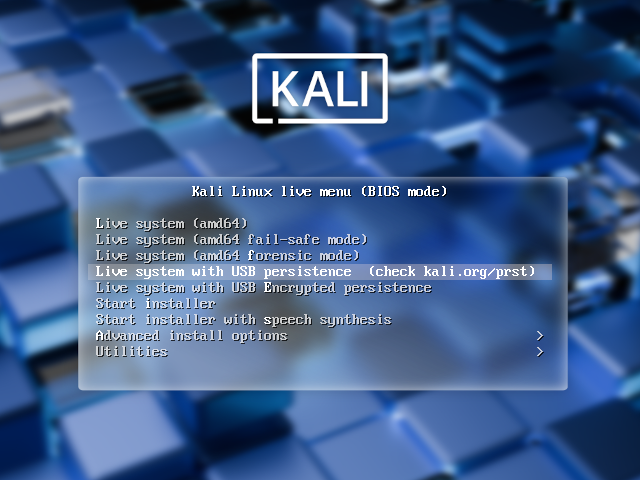

칼리 리눅스 "라이브"에는 기본 부팅 메뉴에 영구 저장소(persistence) - "칼리 라이브" USB 드라이브에서 재부팅해도 데이터가 유지되는 기능 - 를 활성화하는 두 가지 옵션이 있어요. 다음 중 하나를 선택할 수 있어요:

- [USB 영구 저장소](/docs/usb/usb-persistence/) (이 가이드)
- [USB 암호화 영구 저장소](/docs/usb/usb-persistence-encryption/)

이는 매우 유용한 기능이며, USB 드라이브에서 칼리 리눅스 "라이브"를 실행할 때 문서, 수집된 테스트 결과, 설정 등을 유지할 수 있으며, 다른 시스템 간에도 가능해요. 영구 저장 데이터는 USB 드라이브의 별도 파티션에 저장되며, 선택적으로 LUKS 암호화할 수도 있어요.

부팅 시 USB 영구 저장소 옵션을 사용하려면 "칼리 리눅스 라이브" USB 드라이브에 추가 설정이 필요해요. 이 글에서는 그 방법을 알려드릴게요.

이 가이드는 [해당 주제에 대한 문서 페이지](/docs/usb/live-usb-install-with-windows/)에 설명된 대로 이미 칼리 리눅스 "라이브" USB 드라이브를 만들었다고 가정해요. 이 글의 목적을 위해, 리눅스 기반 시스템에서 작업하고 있다고 가정할게요.

- - -

{}
이 절차를 수행하려면 root 권한이 있거나 `sudo`로 권한을 상승시킬 수 있어야 해요.
{}

이 예제에서는 다음을 가정해요:

- USB 드라이브가 `/dev/sdX`임 (마지막 글자는 아마 다를 거예요). 연결된 USB 드라이브를 `lsblk` 명령으로 확인하고 명령을 실행하기 전에 `usb` 변수에서 장치 이름을 수정하세요.
- USB 드라이브 용량이 **최소 8GB**임 - 칼리 리눅스 이미지는 4GB 이상을 차지하며, 이 가이드에서는 USB 드라이브를 채우기 위해 영구 저장 데이터를 저장할 새 파티션을 만들 거예요.

이 예제에서는 두 번째 칼리 라이브 파티션 바로 위에서 시작하여 영구 데이터를 저장할 새 파티션을 만들고, ext4 파일 시스템을 넣고, 새 파티션에 `persistence.conf` 파일을 만들 거예요.

- - -

1. 먼저 [이 글](/docs/usb/live-usb-install-with-linux/)에 설명된 대로 최신 칼리 리눅스 라이브 ISO(현재 [2025.2](/get-kali/))를 USB 드라이브에 이미징하는 것으로 시작해요.

{}
이 페이지 전체에서 '/dev/sdX'를 사용하고 있지만, '/dev/sdX'는 적절한 장치 라벨로 대체되어야 해요. '/dev/sdX'는 실수로 덮어쓰는 것을 방지하기 위해 문서에 안전하게 사용될 수 있어요. 올바른 장치 라벨을 사용하세요.
{}

이미징으로 생성된 두 파티션이 `/dev/sdX1`과 `/dev/sdX2`라고 가정할게요. 이는 `lsblk` 명령으로 확인할 수 있어요:

```console
kali@kali:~$ lsblk
NAME   MAJ:MIN RM   SIZE RO TYPE MOUNTPOINTS
sda      8:16   0   2.7T  0 disk
├─sda1   8:17   0   512M  0 part /boot/efi
├─sda2   8:18   0   2.7T  0 part /
└─sda3   8:19   0   977M  0 part [SWAP]
sdX      8:32   1  58.4G  0 disk
├─sdX1   8:33   1   4.6G  0 part
└─sdX2   8:34   1     4M  0 part
kali@kali:~$
kali@kali:~$ usb=/dev/sdX
```

- - -

2. USB 드라이브에 추가 파티션을 만들고 포맷하세요.

먼저 칼리 라이브 파티션 위의 빈 공간에 새 파티션을 만들어봐요. gparted는 이미징된 ISO를 큰 블록으로 읽기 때문에 명령줄에서 이 작업을 해야 해요:

```console
kali@kali:~$ usb=/dev/sdX
kali@kali:~$
kali@kali:~$ sudo fdisk $usb <<< $(printf "p\nn\np\n\n\n\np\nw")
[...]
kali@kali:~$
```

fdisk가 완료되면 새 파티션이 `/dev/sdX3`에 생성되었을 거예요; 이것도 `lsblk` 명령으로 확인할 수 있어요:

```console
kali@kali:~$ lsblk
NAME   MAJ:MIN RM   SIZE RO TYPE MOUNTPOINTS
[...]
sdb      8:48   1  58.4G  0 disk
├─sdb1   8:49   1   4.6G  0 part
├─sdb2   8:50   1     4M  0 part
└─sdb3   8:51   1  53.8G  0 part
kali@kali:~$
```

- - -

3. 다음으로, 파티션에 **ext4** 파일 시스템을 만들고 `persistence`로 라벨을 지정하세요:

```console
kali@kali:~$ usb=/dev/sdX
kali@kali:~$
kali@kali:~$ sudo mkfs.ext4 -L persistence ${usb}3
[...]
kali@kali:~$
```

- - -

4. 마운트 포인트를 만들고, 새 파티션을 그곳에 마운트한 다음, 영구 저장소를 활성화하기 위한 구성 파일을 만드세요. 마지막으로 파티션을 언마운트하세요:

```console
kali@kali:~$ usb=/dev/sdX
kali@kali:~$
kali@kali:~$ sudo mkdir -pv /mnt/my_usb
mkdir: created directory '/mnt/my_usb'
kali@kali:~$ sudo mount ${usb}3 /mnt/my_usb
kali@kali:~$ echo "/ union" | sudo tee /mnt/my_usb/persistence.conf
/ union
kali@kali:~$ sudo umount ${usb}3
```

- - -

이제 기기를 재부팅하고, USB에서 부팅을 선택한 다음 "Live USB Persistence"를 사용할 수 있어요.
작업을 저장하려면 매번 이 USB 부팅 옵션을 선택해야 한다는 점을 기억하세요.

```console
kali@kali:~$ reboot
```


