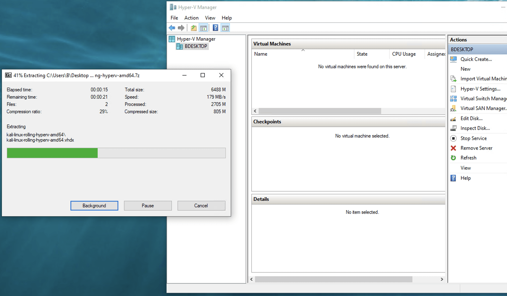
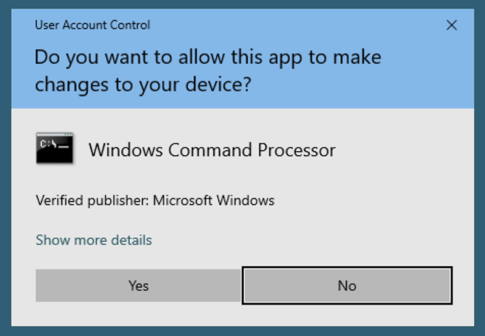
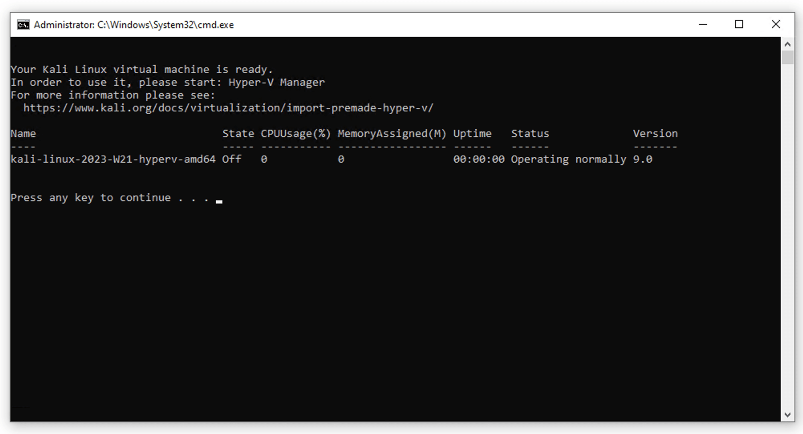
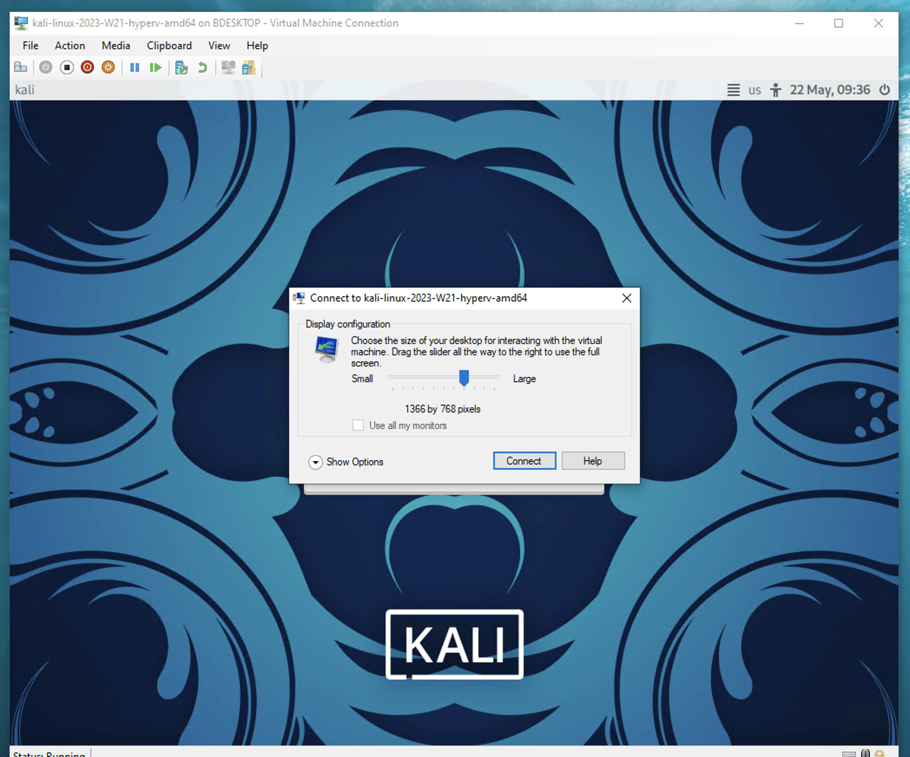
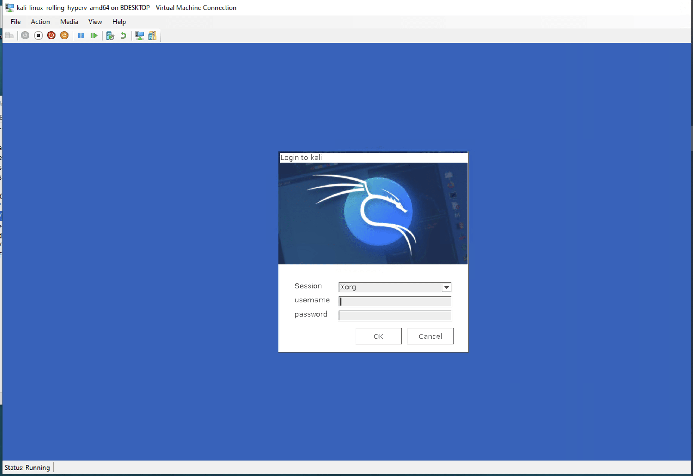
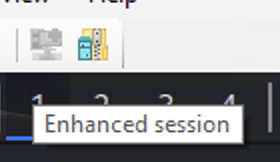

[칼리 리눅스 Hyper-V 이미지](/get-kali/#kali-virtual-machines)를 가져오는 과정은 매우 간단해요.

먼저 Hyper-V 이미지를 추출해야 해요. 이를 위해 [공식 7z 앱](https://www.7-zip.org/)을 사용해야 해요. 

{}
참고로 Windows 11을 사용 중이라면 "추가 옵션 표시" 컨텍스트 메뉴에 이 옵션이 숨겨져 있어요.
{}



---

`kali-linux-<버전>-hyperv-amd64`라는 이름의 디렉토리를 압축 해제했어요. 그런 다음 `install-vm.bat` 파일을 더블클릭해요. 관리자 권한이 없다면 승인을 요청하는 팝업 창이 나타날 거예요. 여기서 '예'를 클릭해요:



---

팝업을 승인한 후 콘솔이 나타나고, 스크립트는 칼리 리눅스 가상 머신을 설정하기 위한 일련의 단계를 실행해요. 모든 것이 잘 진행되면 다음과 같은 화면이 보여요:



---

그런 다음 Hyper-V 관리자를 실행하고, 칼리 VM에서 마우스 오른쪽 버튼을 클릭한 후 '시작'을 클릭해요. 그런 다음 다시 마우스 오른쪽 버튼을 클릭하고 '연결'을 클릭해요. 일반적인 칼리 로그인 화면이 보이거나, 전면에 팝업 창이 나타나기 전에 잠깐 보일 거예요:



---

'연결'을 클릭하면 새로운 로그인 화면이 나타나요. 기본 사용자 이름과 비밀번호는 평소와 같이 `kali`와 `kali`예요:



---

이게 다예요! 이제 칼리 VM에 로그인했어요!

간단한 기술적 참고 사항: XRDP를 통해 연결되어 있어요. 이는 소위 _향상된 세션 모드_라고 해요. 상단의 일부 버튼 위에 마우스를 올려놓으면 확인할 수 있어요:



호스트에서 게스트로, 또 그 반대로 복사 및 붙여넣기가 기본적으로 작동해야 해요. 파일 공유도 마찬가지예요. 하지만 드래그 앤 드롭과 화면 크기 조정은 작동하지 않아요. 자세한 내용은 아래 섹션을 참조해주세요.

## 문제 해결 및 추가 팁

**가상 하드 디스크 이동하기**

이 시점에서 칼리 리눅스 VM이 실행 중이에요. 하지만 가상 하드 디스크(즉, `kali-linux-<버전>-hyperv-amd64.vhdx`라는 파일)는 가상 머신에 연결되어 있기 때문에 더 이상 이동할 수 없어요. 또는 적어도 그렇게 할 수 없다고 강하게 추측해요...

Hyper-V는 일반적으로 가상 하드 디스크를 `C:\ProgramData\Microsoft\Windows\Virtual Hard Disks\`에 저장하는 것 같아요. 따라서 컴퓨터를 깔끔하게 정리하고 싶다면, 위의 절차를 다시 시작할 수 있지만, 스크립트 `install-vm.bat`를 실행하기 *전에* 압축을 푼 파일을 이 위치로 이동해야 해요.

**화면 해상도 변경하기**

현재 화면 해상도는 부팅 시 설정되어야 하므로 커널 명령줄에서 구성해야 해요. 이를 위해 터미널을 열고 다음 명령을 실행해요:

```console
kali@kali:~$ sudoedit /etc/default/grub 
```

이 파일에서, `GRUB_CMDLINE_LINUX_DEFAULT` 변수의 값을 아래와 같이 업데이트해요:

```console
GRUB_CMDLINE_LINUX_DEFAULT="quiet video=hyperv_fb:1920x1080"
```

여기서 `1920x1080`은 호스트 머신의 화면 해상도예요. 호스트 머신 해상도에 맞게 이 값을 변경해야 해요.

마지막으로, GRUB 구성 파일을 다시 빌드해요:

```console
kali@kali:~$ sudo update-grub
```

그런 다음 VM을 재부팅하여 테스트해요.

