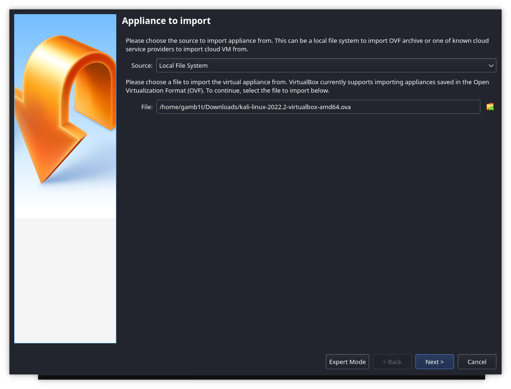

**이 페이지는 오래되었습니다**. **최신 버전**은 여기에서 찾을 수 있어요: [미리 만들어진 칼리 VirtualBox VM 가져오기](/docs/virtualization/import-premade-virtualbox/).

- - -

[칼리 VirtualBox 이미지](/get-kali/#kali-virtual-machines)를 가져오는 건 다운로드 후 네 단계로 이루어져요.

먼저 VirtualBox를 실행해요:

여기서 '가져오기(import)'를 선택해야 해요:

이전에 다운로드한 파일을 선택하면 계속 진행할 수 있어요:

여기서 설정될 내용을 확인할 수 있고, 필요한 경우 변경할 수도 있어요. 모든 설정이 마음에 들면 '가져오기'를 선택할 수 있어요:

이제 라이선스 계약에 동의하기만 하면 모든 과정이 끝나요. 여기서 VM을 부팅하고 평소처럼 사용할 수 있어요. 기본 로그인 사용자 이름과 비밀번호는 모두 `kali`라는 점을 기억하세요!
