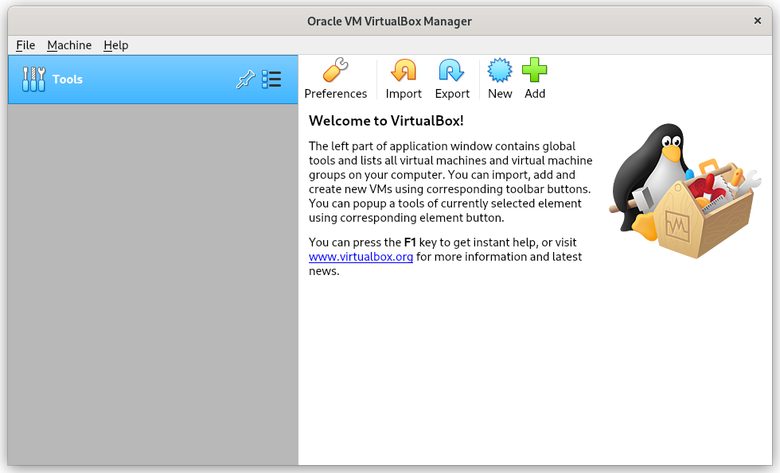
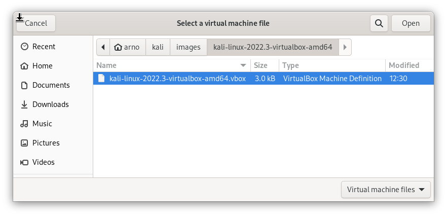

 ---
title: 미리 만들어진 칼리 VirtualBox VM 가져오기
description:
icon:
weight: 211
author: ["gamb1t", "arnaudr"]
번역: ["xenix4845"]
---

[칼리 VirtualBox 이미지](/get-kali/#kali-virtual-machines)를 가져오는 과정은 매우 쉬워요.

먼저 VirtualBox 이미지를 추출해야 해요:

```console
kali@kali:~$ 7z x kali-linux-2025.2-virtualbox-amd64.7z
[...]
kali@kali:~$
```

Windows를 사용하고 있다면 대신 [공식 7z 앱](https://www.7-zip.org/)을 사용할 수 있어요.

그런 다음 VirtualBox를 실행해요:



여기서 '추가'를 선택하고 싶을 거예요. 그런 다음 VM이 다운로드된 위치로 이동하여 `.vbox` 파일을 찾아요:



이것을 선택하면 계속 진행할 수 있어요:


여기서 설정될 내용을 확인할 수 있으며, 필요한 경우 변경할 수도 있어요. 모든 설정이 마음에 들면 VM을 부팅하고 평소처럼 사용할 수 있어요. 기본 로그인 사용자 이름과 비밀번호는 모두 `kali`라는 점을 기억하세요!
