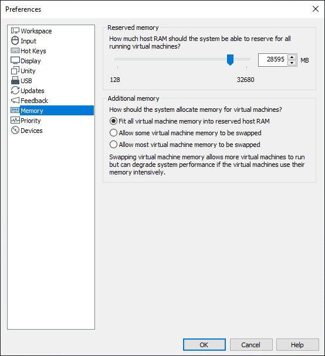

# 가상 머신을 위한 메모리 제한 설정하기

호스트 운영 체제에서 가상 머신을 실행할 때, 가상 머신이 자체 사용을 위한 여유 메모리가 부족하면 제대로 작동하지 않는 경향이 있어요. 특정 상황에서는 윈도우나 리눅스 호스트 운영 체제가 자체 사용을 위한 메모리조차 충분하지 않을 수 있어요. 이로 인해 가상 머신은 시스템 메모리의 일부를 디스크에 있는 호스트의 페이지 파일 사이에서 지속적으로 교체하며 성능 저하를 겪게 돼요.

VMware에서는 애플리케이션 설정에서 변경사항을 적용하여 메모리 양에 따라 한 번에 실행할 수 있는 가상 머신의 수에 제한을 설정할 수 있어요. 이렇게 하면 호스트 운영 체제를 사용하는 동안 가상 머신이 성능 저하를 일으키는 것을 방지할 수 있어요.

이 설정을 변경하려면 Edit > Preferences(CTRL+P)를 선택한 다음 Memory를 선택해요.

현재 가지고 있는 설정을 살펴보죠. 보시다시피 가상 머신을 실행하는 데 사용할 수 있는 호스트 시스템에 28GB가 예약되어 있어요.

"Additional memory" 섹션에서 세 가지 옵션을 볼 수 있어요:

- Fit all virtual machine memory into reserved host RAM — 설정된 예약 메모리 제한을 엄격하게 적용해요. 이 설정은 특정 시간에 실행될 수 있는 가상 머신의 수와 메모리 크기에 따라 다양한 엄격한 제한을 활성화해요. 가상 머신이 완전히 RAM에서 실행되므로 가능한 최상의 성능을 제공해요.
- Allow some virtual machine memory to be swapped — 필요한 경우 호스트 운영 체제가 일정량의 가상 머신 메모리를 디스크로 스왑할 수 있도록 해요. 이 설정을 사용하면 특정 시간에 호스트 시스템에서 실행할 수 있는 가상 머신의 수나 메모리 크기를 늘릴 수 있어요. 그러나 가상 머신 메모리와 호스트 스토리지 간에 가상 머신 메모리를 전송해야 하는 경우 성능이 저하될 수 있어요.
- Allow most virtual machine memory to be swapped — 호스트 운영 체제가 원하는 만큼 가능한 많은 가상 머신 메모리를 디스크로 스왑할 수 있도록 해요. 이 설정을 활성화하면 중간 설정보다 더 많은 메모리로 더 많은 가상 머신을 실행할 수 있어요. 그러나 가상 머신 메모리를 RAM과 디스크 사이에서 이동해야 하는 경우 성능이 더 낮을 수 있어요.

세 가지 옵션 중에서 "Fit all virtual machine memory into reserved host RAM"을 선택하면 가능한 최상의 성능을 위해 예약된 메모리 제한이 적용돼요.

# 참고자료
- https://communities.vmware.com/t5/VMware-Workstation-Pro/New-Install-VMWare-Workstation-16-extremely-slow-locking-up/td-p/2878643
- https://stuff.mit.edu/afs/sipb/project/vmdialup/lib/vmware-console/help/server/memory.htm#:~:text=To%20change%20this%20setting%2C%20choose,the%20top%20of%20the%20panel.
