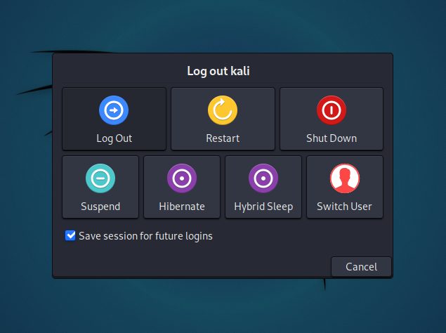
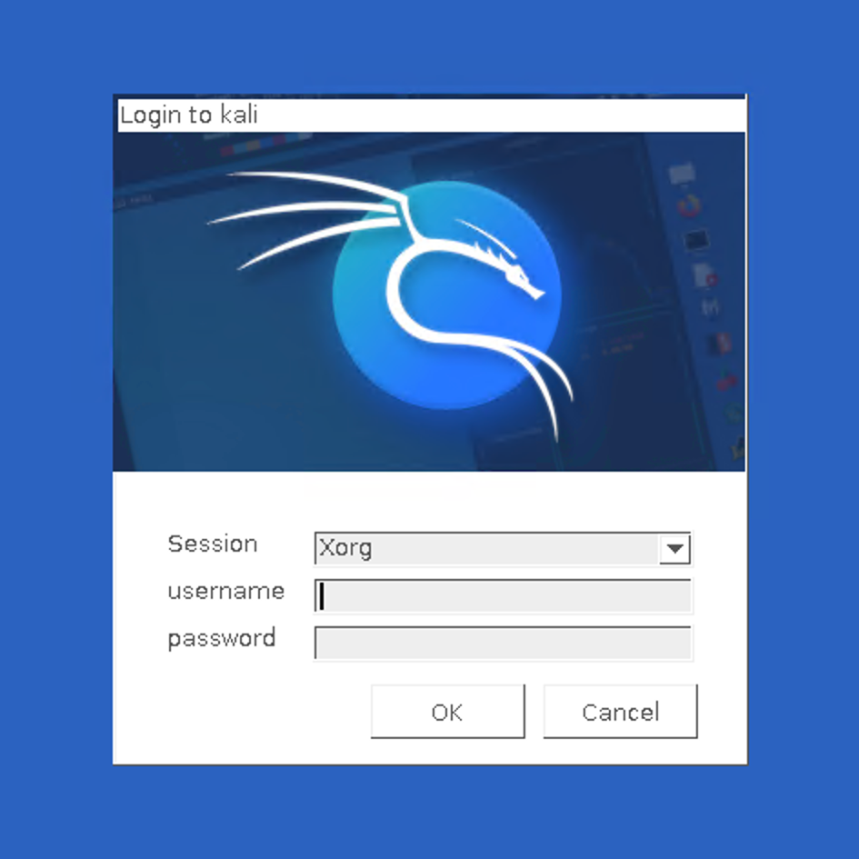

"게스트 VM 패키지"를 설치하면 일반적으로 VM에서 더 나은 사용자 경험을 제공해요. 이 때문에 칼리 리눅스 2019.3부터 [설정 과정](https://gitlab.com/kalilinux/build-scripts/live-build-config/-/blob/master/simple-cdd/profiles/offline.downloads) 중에 **칼리 리눅스가 VM 내부에 있는지 감지**해야 해요. 그렇다면 **추가 도구를 자동으로 설치**해요(Hyper-V의 경우 `hyperv-daemons`). 칼리 리눅스 라이브 이미지도 칼리 리눅스 2021.3부터 hyperv-daemons가 사전 설치되어 제공돼요.

하지만 이것이 끝이 아니며, 이후에 경험을 개선하기 위해 더 많은 것을 할 수 있어요. Hyper-V가 **원격 데스크톱 프로토콜** (RDP, Remote Desktop Protocol)을 사용하여 가상 머신에 연결할 수 있기 때문이에요.

이 글은 대기 시간을 개선하고 클립보드 공유 및 창 크기 조정 가능성을 열어주는 **[향상된 세션 모드](https://techcommunity.microsoft.com/t5/virtualization/sneak-peek-taking-a-spin-with-enhanced-linux-vms/ba-p/382415)**(Enhanced Session Mode)를 활성화하는 데 도움을 줄 거예요.


## 칼리 구성하기

Hyper-V 향상된 세션 모드용으로 칼리를 구성하려면 `kali-tweaks`를 실행하세요:

```console
kali@kali:~$ kali-tweaks
```

메뉴에서 *가상화*를 선택한 다음 *Hyper-V 향상된 세션 모드용 시스템 구성*을 선택하세요. 칼리 측에서 할 일은 이게 전부예요.

## 가상 머신 설정 변경하기

이제 **전송 유형**(transport type)을 VMBus에서 **HVSocket**으로 변경해야 해요.

먼저 현재 칼리 세션에서 로그아웃하세요:



이제 윈도우 호스트에서: 칼리 VM을 연결 해제하고, PowerShell을 (관리자 권한으로) 열고 다음 명령어를 실행하세요:

```PowerShell
> Set-VM "(YOUR VM NAME HERE)" -EnhancedSessionTransportType HVSocket
```


## 테스트 및 문제 해결

가상 머신을 다시 시작하여 성공했는지 테스트하고, xrdp를 사용하려고 할 때 다음 화면을 볼 수 있는지 확인할 수 있어요.



이 테스트가 성공하지 않으면 칼리 VM이나 윈도우 호스트를 재부팅해야 할 수도 있어요. 가장 편리한 것을 하세요. 하지만 칼리 라이브 이미지를 사용하고 있다면 재부팅하면 모든 변경사항이 손실된다는 점을 기억하세요: 칼리 측에서 구성 단계를 다시 해야 할 거예요.

## Hyper-V 향상된 세션 모드 비활성화하기

이 모드가 원했던 것이 아니라는 것을 알게 된다면, 칼리 측에서 구성을 취소하는 것이 가능해요. 어렵지 않지만 올바른 순서로 단계를 수행해야 하므로 여기에 자세히 설명할게요.

먼저 현재 칼리 세션에서 로그아웃하세요.

그다음 윈도우 호스트에서 칼리 VM을 연결 해제하고, PowerShell을 (관리자 권한으로) 열고 향상된 세션 모드를 비활성화하세요:

```PowerShell
> Set-VM "(YOUR VM NAME HERE)" -EnhancedSessionTransportType VMBus
```

다음으로 칼리에 로그인하고, 터미널을 열고 `kali-tweaks`를 다시 사용하세요:

```console
kali@kali:~$ kali-tweaks
```

*가상화* 메뉴에서 Hyper-V 향상된 세션 모드를 비활성화하는 설정을 찾을 수 있어요.

## 추가 참고사항

더 자세한 내용과 문제 해결은 다음 [GitLab 대화](https://gitlab.com/kalilinux/build-scripts/live-build-config/-/issues/32#note_650129582)에서 찾을 수 있어요.

이 기능은 스크립트를 (처음에는 우분투용) 칼리 리눅스로 포팅한 [Satoshi Mimura](https://github.com/mimura1133/linux-vm-tools)의 작업과, `kali-tweaks`용으로 재작업하는 데 도움을 주고 이 문서의 대부분의 자료를 제공한 Shane Bennett 덕분에 가능했어요. 감사합니다!
