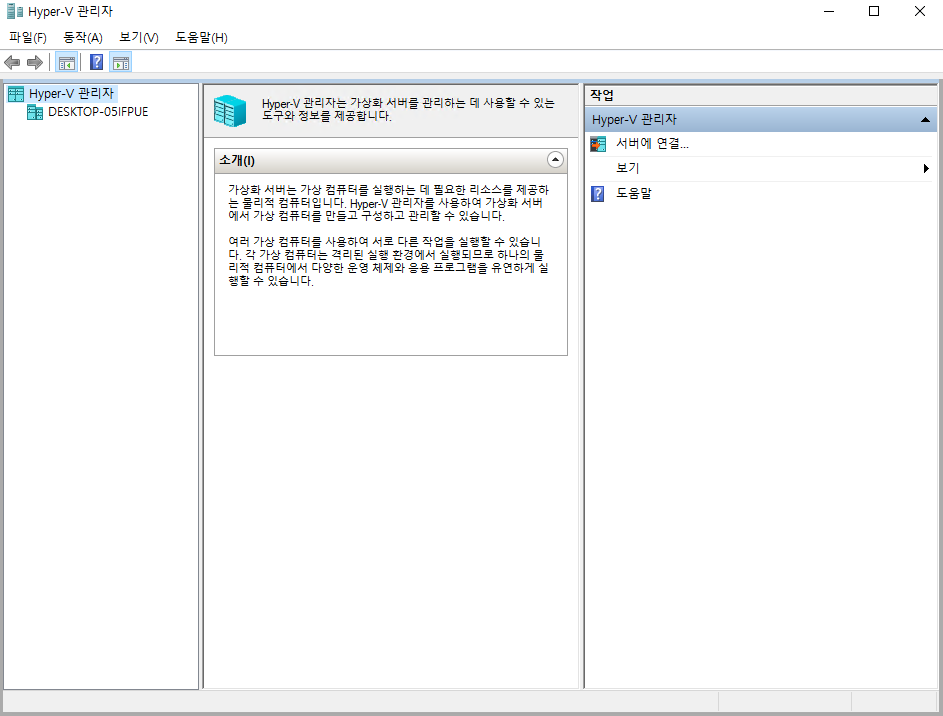
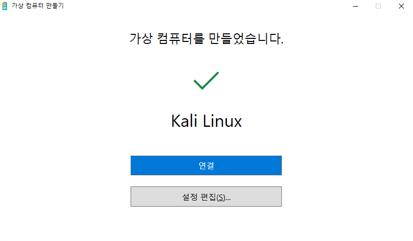
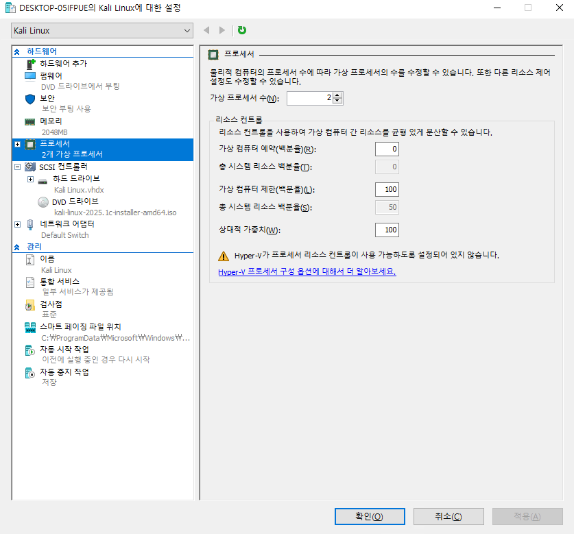
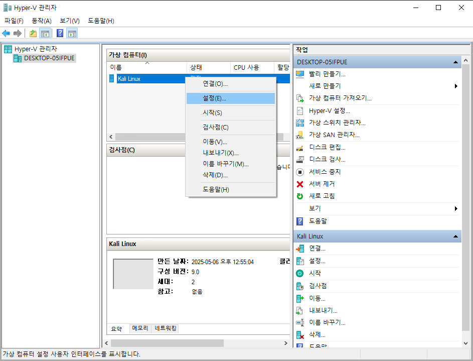
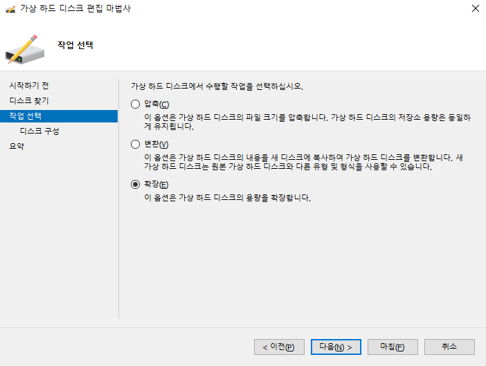
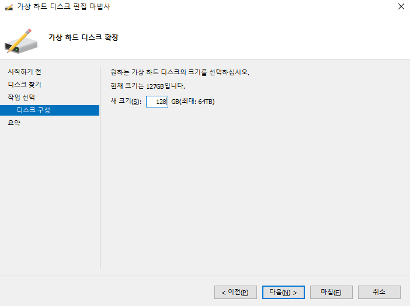

대부분의 윈도우 사용자들은 Hyper-V가 이미 활성화되어 있어요. 하지만, 시스템에서 활성화되어 있지 않은 경우 마이크로소프트의 문서 페이지를 따르세요:

- [윈도우 8, 8.1](https://docs.microsoft.com/en-us/previous-versions/windows/it-pro/windows-server-2012-R2-and-2012/hh846766(v=ws.11))용
- [윈도우 10, 11](https://docs.microsoft.com/en-us/virtualization/hyper-v-on-windows/quick-start/enable-hyper-v)용

Hyper-V가 활성화 되었다면 새로운 VM을 매우 쉽게 생성할 수 있어요. 우선 우리는 설치 iso [다운로드](/get-kali/)가 필요해요. 그런 다음 Hyper-V를 부팅할 수 있어요:

왼쪽의 'Hyper-V 관리자'에서 컴퓨터를 선택하세요:

오른쪽의 '빨리 만들기...'를 선택하세요:

이 화면에서 설정을 구성할 수 있어요. 먼저 '로컬 설치 원본'을 선택하고 '설치 소스 변경...'으로 iso를 선택하세요. 다음 '이 가상 컴퓨터에서 Windows 실행'을 선택 해제하고 '옵션 더 보기' 드롭다운 메뉴에서 가상 머신의 이름을 정할 수 있어요.

만족스러우면 '가상 컴퓨터 만들기'를 누르고 끝날 때까지 기다리세요. 그러면 다음과 같은 화면이 표시돼요:

Windows가 선택한 옵션이 괜찮다고 생각되면 '연결'을 선택하고, 그렇지 않다면 '설정 편집...'을 선택할 수 있어요:

이 가상 머신의 경우 변경이 필요한 항목은 가상 프로세서 수이고 6개에서 2개로 줄였어요. 이제 VM에 연결하여 [일반적인 설치 방법](/docs/installation/hard-disk-install/)으로 계속 진행하세요

---

### 스토리지 확장

##### Hyper-V:

kali linux 가상 머신이 꺼져 있는지 확인해야 해요.

---

Hyper-V 관리자에서 kali linux 가상 머신을 우클릭하고 설정을 클릭하세요.

---

kali linux 가상 머신의 가상 하드 드라이브를 클릭하고 오른쪽 대화 상자에서 편집 버튼을 클릭하세요.

---

다음을 클릭하세요.

---

확장 옵션을 클릭하세요.

---

가상 머신의 새 크기를 입력하고 다음을 클릭하세요.

---

마침을 클릭하세요.

