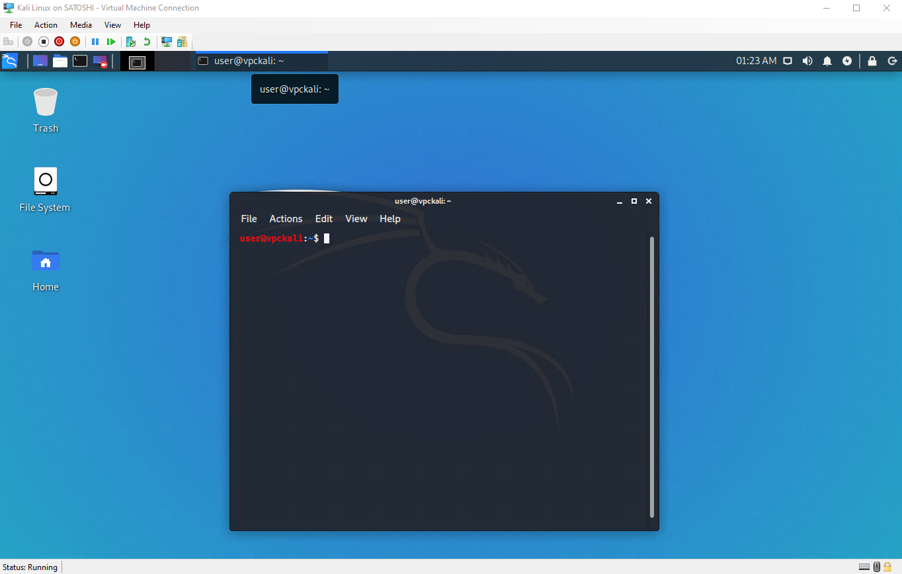

If you run Kali Linux as a "guest" within Hyper-V, this article will help you to enable the "Enhanced Session Mode".

Enhanced Session Mode lets Hyper-V connect to virtual machines using RDP (remote desktop protocol), and improve your virtual machine viewing experience.



## Execute the install script on Kali Linux.

Start up your Kali Linux virtual machine, open a terminal window and issue the following commands:

```markdown
git clone https://github.com/mimura1133/linux-vm-tools
chmod 0755 linux-vm-tools/kali/2020.x/install.sh
sudo linux-vm-tools/kali/2020.x/install.sh
```


The script will install xrdp and modify the configuration files.

If the script says "Reboot your machine to begin using XRDP", please shutdown the VM and close the window of "Virtual Machine Connection".

## Changing the Setting of the Virtual Machine.

You need to change the transport type to HVSocket from VMBus.

Open a PowerShell with Administrator on the Host, issue the following commands.

```markdown
Set-VM "(YOUR VM NAME HERE)" -EnhancedSessionTransportType HVSocket
```


Start the virtual machine again, check if the screen by a xrdp has appeared.


