이 가이드는 가상화 Parallels 안에서 Kali Linux를 가상화하고 Kali VM을 보유하는 방법에 대해 설명해요. 이는 호스트와 완전히 분리되어 있고, 다른 VM(호스트나 네트워크에 있는 다른 머신)과 상호작용 할 수 있고 스냅샷으로 되돌릴 수 있기 때문에 Kali를 사용하기에 좋은 방법이에요.

### 마법사

Parallels를 시작할 때, **더하기(+)** 마크를 선택하세요.

---

**설치 도우미**가 나타나게 돼요

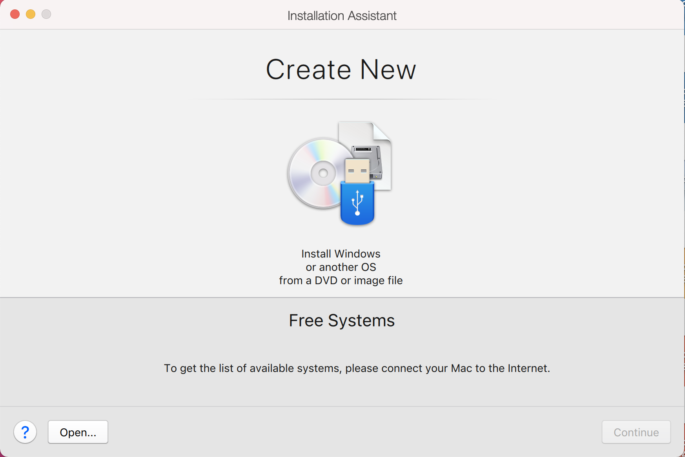

---

이제 **DVD 또는 이미지 파일의 Windows나 다른 OS 설치**를 선택하세요

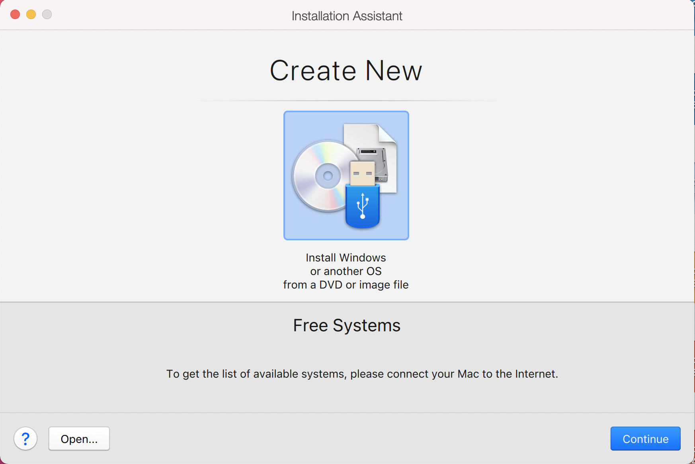

---

이 화면에서 설치에 사용할 Kali Linux 이미지를 선택하세요. "**수동 선택**"을 선택하고, [다운로드된](/docs/introduction/download-official-kali-linux-images/) ISO의 위치로 이동하세요. 더 많은 정보는 [다운로드할 이미지에 대해 가이드를 작성했어요](/docs/introduction/what-image-to-download/)

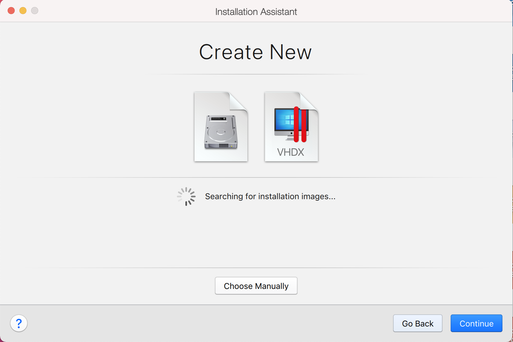

---

ISO 파일을 드래그 하거나 **파일 선택...** 을 골라 다운로드한 ISO로 이동하세요.

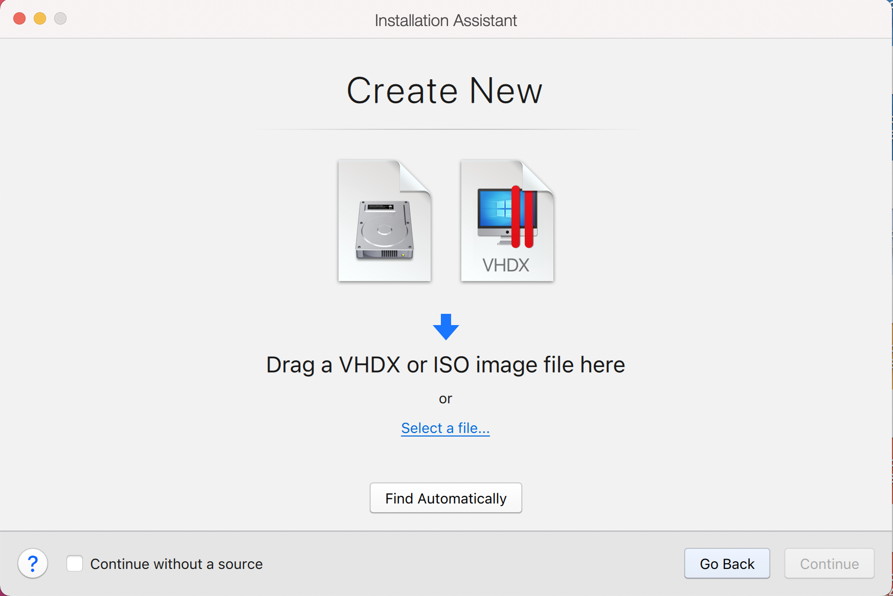
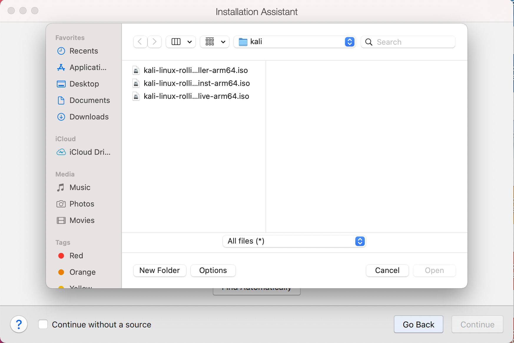
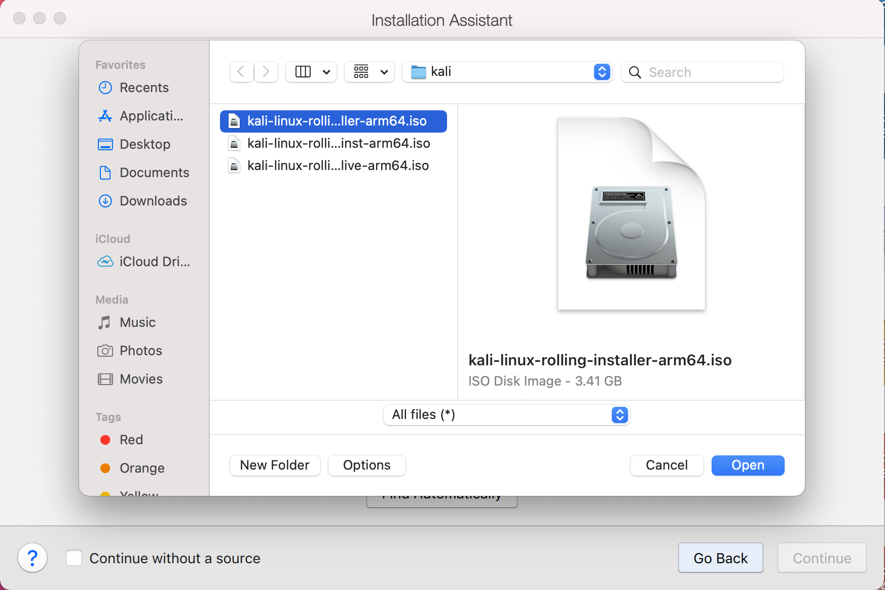

---

Parallels는 ISO로 OS를 인식하지 못해요, 따라서 **계속**을 선택하여 진행하세요.

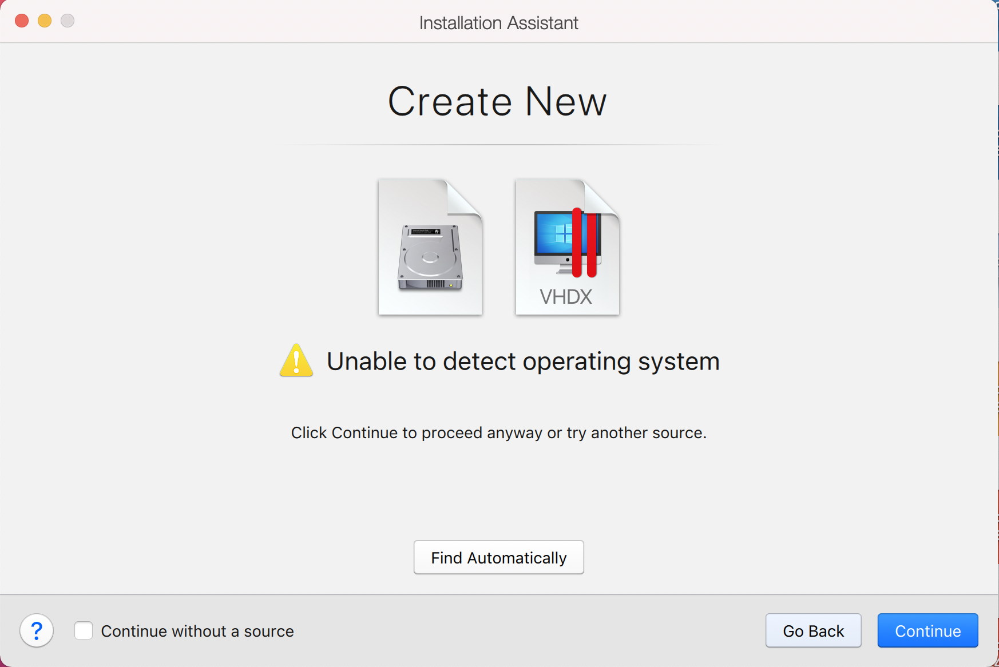 

---

**계속**을 클릭한 후, 드롭다운 목록에서 **Ubuntu**를 선택하세요. 일반적으로 **Debian**을 선택하지만 Parallels Tools에 버그가 존재하고, 이는 **Ubuntu**로 사용하면 발생하지 않아요.

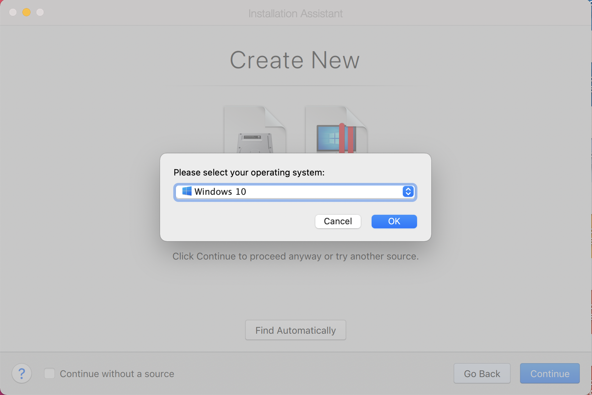

---

다음 화면은 VM의 이름을 지정하는 "이름과 위치"에요. 이 이름은 파일명에도 사용돼요. (이 시점부터 구성, 하드 디스크와 스냅샷 등은 변경되지 않음)

또한 **설치 전 설정 사용자 정의** 체크박스를 선택하세요

이 가이드에서는 **Kali Linux**라는 일반적인 용어를 사용해요 (Kali Linux는 [롤링 배포판](/docs/general-use/kali-branches/)이기에 우리는 [Kali Linux를 업데이트](/docs/general-use/updating-kali/)해요).

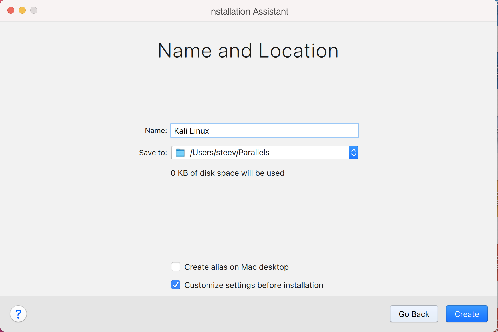

---

그러면 가상 머신에 대한 구성 화면이 나타나게 돼요.

다음 화면은 "프로세서"에요. 여기에서 얼마나 많은 자원을 VM에게 줄지 지정할 수 있어요. Kali에 더 많은 리소스가 할당되면 더 많은 작업을 빠르게 수행할 수 있어요. "**2 프로세서**"와 "**2048 MB**"를 선택하면, 총 2 코어과 2GB의 RAM을 주게돼요. 시스템 요구사항에 따라 더 많거나 더 적게도 할 수도 있어요.
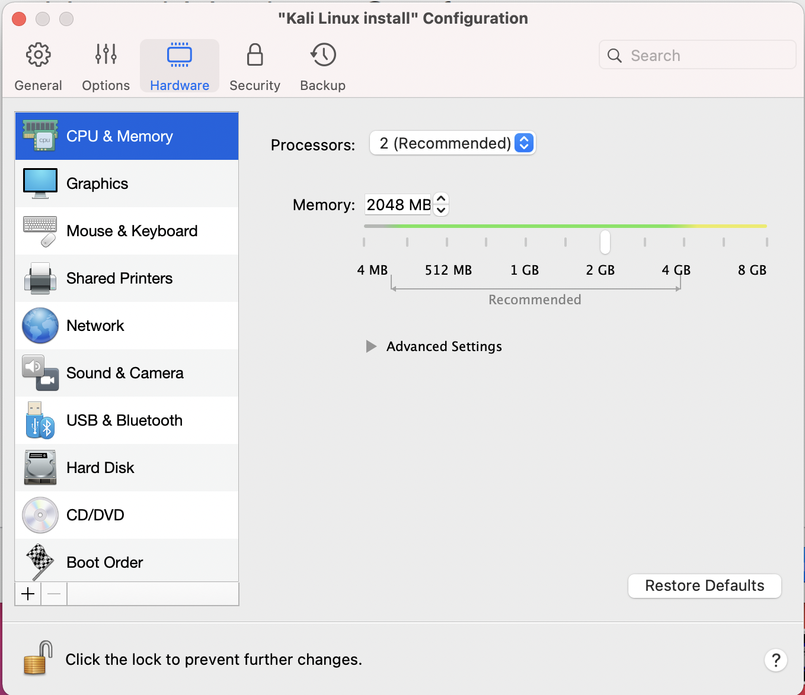

---

**하드 디스크**를 선택하면 하드 디스크의 크기를 조정할 수 있어요.

**속성** 버튼을 선택하세요

그리고 크기를 32GB로 줄이세요. 시스템 요구 사항에 따라 64GB로 두거나 더 늘릴 수도 있어요.

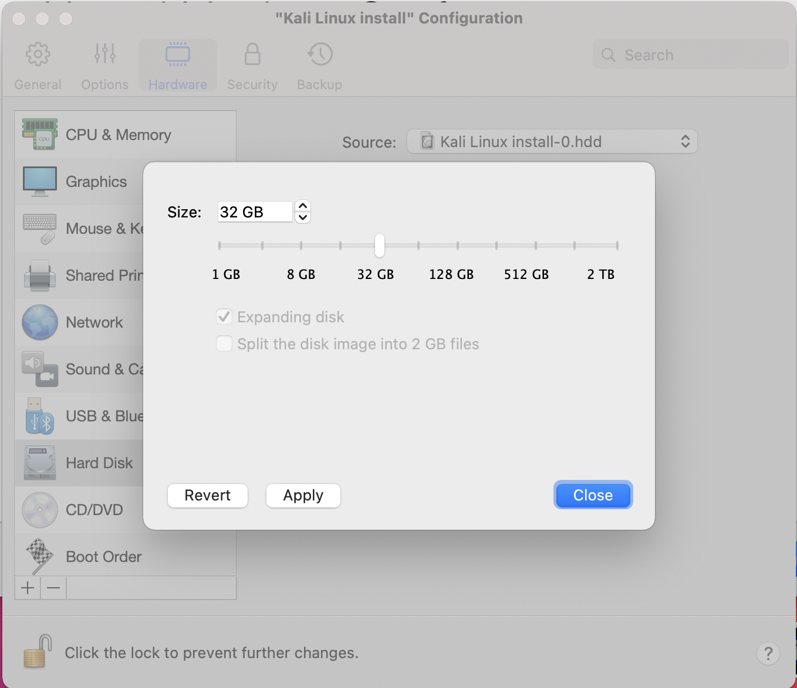

**적용**을 클릭하면 **계속**을 클릭하라는 메시지가 표시돼요

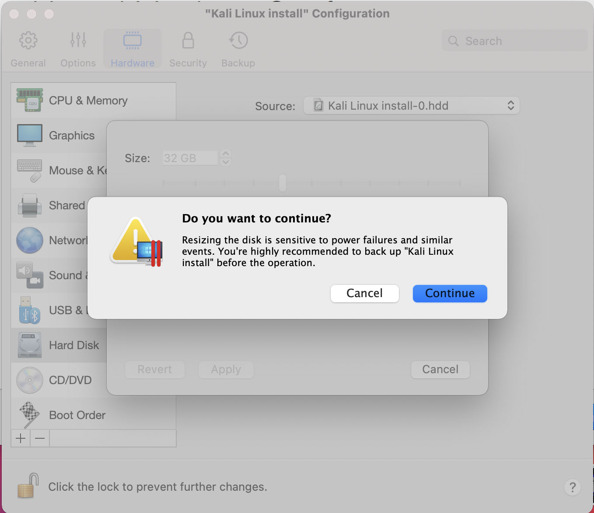

**계속**을 클릭하세요

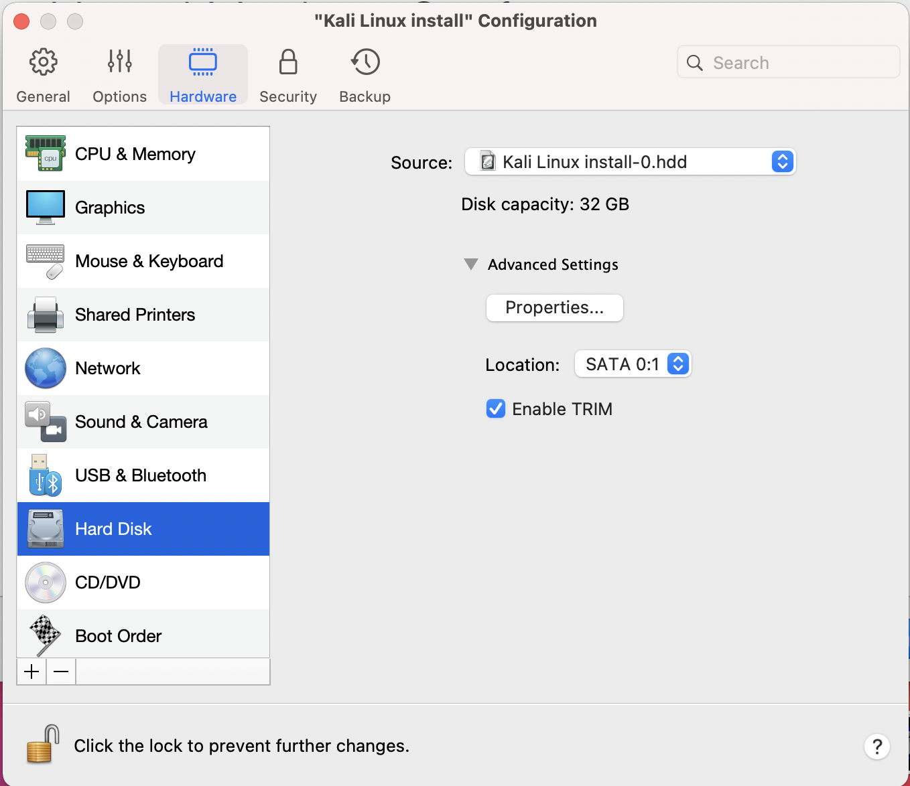

---

이제 **Kali Linux 구성** 창을 닫고, **설치 도우미** 창으로 돌아올 수 있어요.

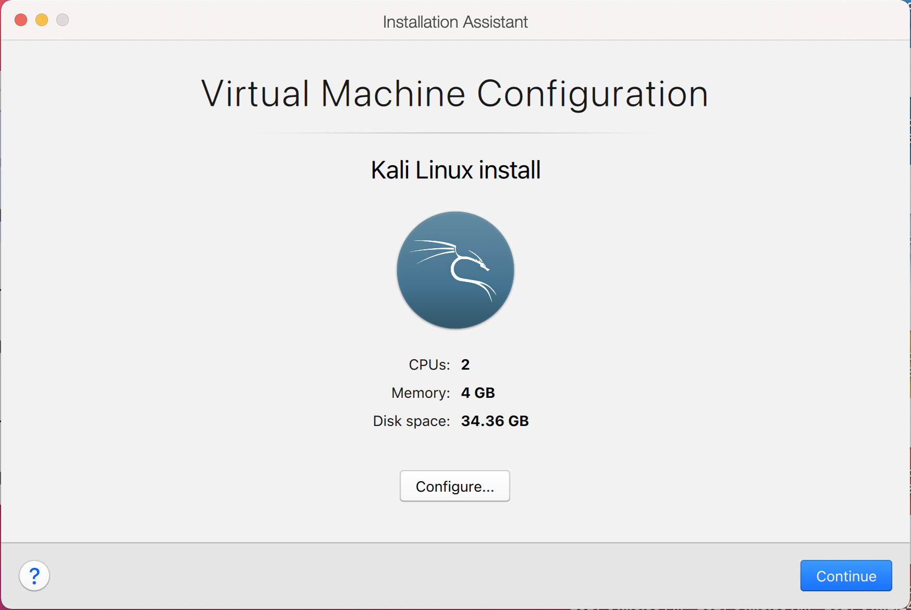

---

모두 마쳤으면 저장하고 VM을 시작하세요, 그런 다음 일반적인 [베어 메탈 설치](/docs/installation/hard-disk-install/) 처럼 Kali Linux 설치를 계속하세요. 
