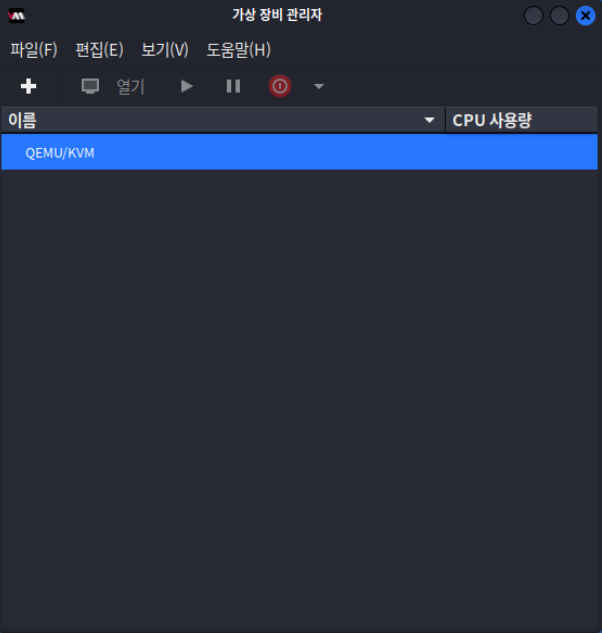
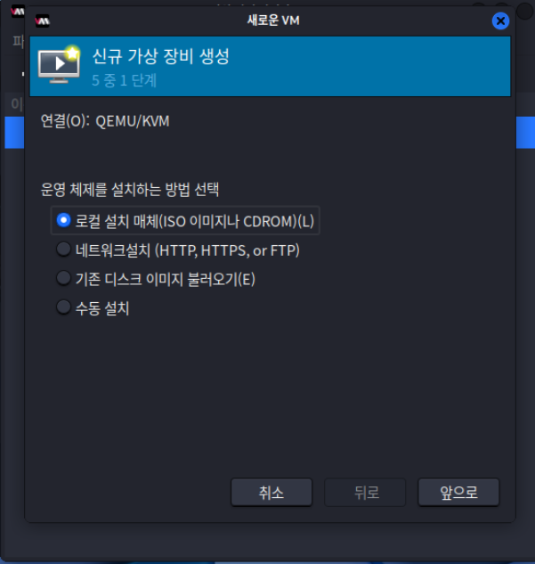

KVM과 QEMU로 다양한 VM을 만드는 방법이 많다는 것을 알고 있어요. 하지만 이 가이드에서는 가장 일반적인 옵션을 사용할 거예요.

데비안 기반 시스템을 준비하려면 간단히 다음 명령어를 실행하면 돼요:

```console
kali@kali:~$ sudo apt update && sudo apt install virt-manager -y
[...]
```

이렇게 하면 필요한 모든 패키지를 가져와서 VM을 문제없이 만들 수 있어요.

[`virt-manager`](https://manpages.debian.org/bullseye/virt-manager/virt-manager.1.en.html)(가상 장비 관리자)가 설치된 후, 실행하고 일부 작업에 관리자 권한이 필요하기 때문에 비밀번호를 입력해야 해요.

여기서 "+" 버튼을 선택하고 VM 생성을 시작할 수 있어요:



로컬 ISO 파일을 선택해야 해요:



ISO를 선택하고 OS 추측 옵션을 선택 해제한 다음 "Debian 11"을 입력해요:


2GB의 메모리와 2개의 CPU 코어를 사용하도록 설정해요:


시스템 크기를 20GB로 설정해요:


이제 시스템 이름을 "kali-linux"로 변경하여 설정을 마무리할 수 있어요:


여기서부터는 일반적인 [칼리 리눅스 설치](/docs/installation/hard-disk-install/) 방법을 따르면 돼요
