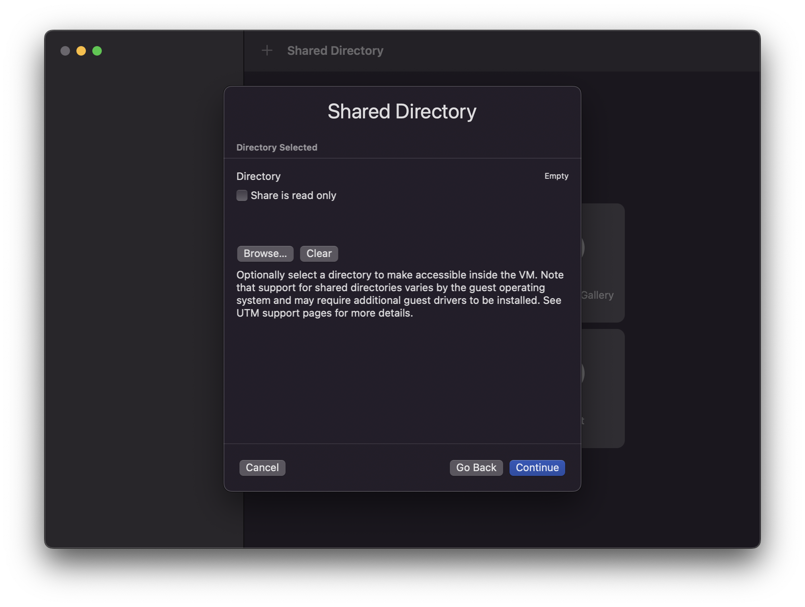

UTM VM으로 설치하는 것은 매우 간단합니다. 우선 [UTM](https://mac.getutm.app/)을 다운로드 하고 앱을 여세요. 그런 다음 VM을 생성하고 시작 버튼을 짧게 누르세요:

우리는 [Kali Apple M1 설치 프로그램](/get-kali/#kali-installer-images) iso를 사용할 거니 Virtualize를 눌러 다음 페이지로 이동하세요:

여기에서 "Other"을 선택하게 되면 다음으로 넘어가게 돼요:

"Boot ISO Image"를 선택하고 이전에 다운로드한 ISO를 선택하는 한 가지만 변경할게요. 완료되었다면 계속을 누를 수 있어요:

여기에서는 아무런 설정도 변경하지 않을 거니 계속 진행하세요:

여기에서 드라이브의 사이즈를 필요한 만큼 줄이거나 늘릴 수 있어요. 우리의 경우 20GB 미만으로 하고 계속할 거에요:

여기서도 아무런 변경 없이 넘길 거지만, 원한다면 공유 폴더를 자유롭게 추가하세요: 

이제 요약이 끝났으며 VM의 이름을 "Kali Linux"로 변경할 수 있어요. 완료되면 save를 누르세요. 

현재 UTM 버전에서는 버그가 있어 Kali를 콘솔 전용 모드로만 설치할 수 있어요.

{}

해당 문서는 2년 전에 작성되었으므로 버그가 해결됐을 수도 있어요.

{}

여기에서 "Devices" 아래에 "Serial" 장치를 추가할 수 있어요:

저장 후 VM을 실행하고 프롬프트가 표시되면 "Install"을 선택하세요:

설치가 완료되었다면, VM의 CD/DVD 드라이브에서 ISO를 제거하세요.

그런 다음, VM의 설정으로 가서 "Serial" 장치를 우클릭 하고 "Remove"를 선택하세요:

디스플레이 카드 에뮬레이터도 업데이트 해야해요. `virtio-gpu-pci` 옵션을 선택하세요:

아래로 내려서 "공유 디렉토리" 아래에 있는 설치 iso 이미지를 선택 후 제거하세요, 이제 VM을 일반적으로 사용할 수 있어요.
