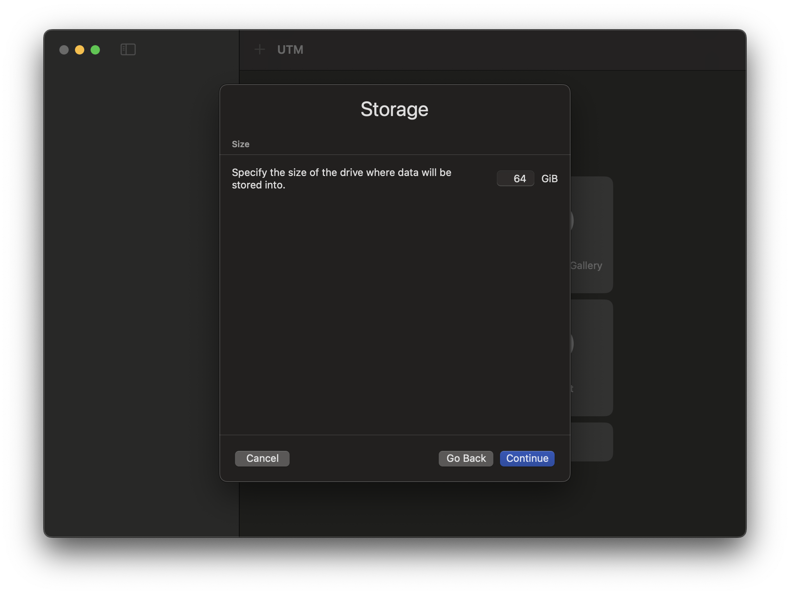

{}
It should be noted that if another hypervisor is available, it would be best to use that. UTM is quite slow compared to other Mac hypervisors.
{}

To install and set up a UTM VM it is pretty straightforward. We first download [UTM](https://mac.getutm.app/) and then launch the app. After this we can click create VM and start the short process:

We will select Virtualize, as we will be using a [Kali Apple M1 installer](https://www.kali.org/get-kali/#kali-bare-metal) iso which will bring us to the next page:

From here, we will select "Linux" which will again bring us to the next page:

Now we are only going to change one item, which is selecting our "Boot ISO Image" and choosing the ISO we downloaded previously. Once that is done we can hit continue:

We won't change any of the settings here, and will just continue forward:

Here we will be sure to lower or raise the size of the drive to what we will need. In our case, we will be lowering it to 20GB and continue:

We again will skip changing anything on this page, however if you want a shared directory feel free to add it:

Now we are at the summary and we can re-name our VM to be "Kali Linux". Once complete, we will hit save and then press the play button. From here we can proceed to [install Kali as normal](/docs/installation/hard-disk-install/).