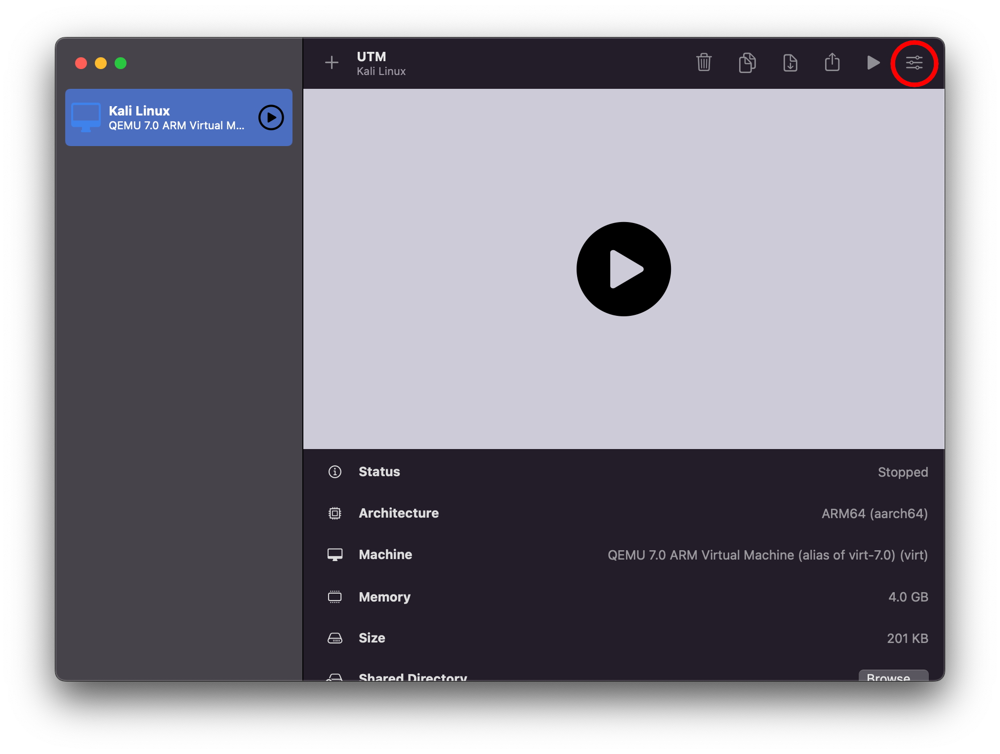
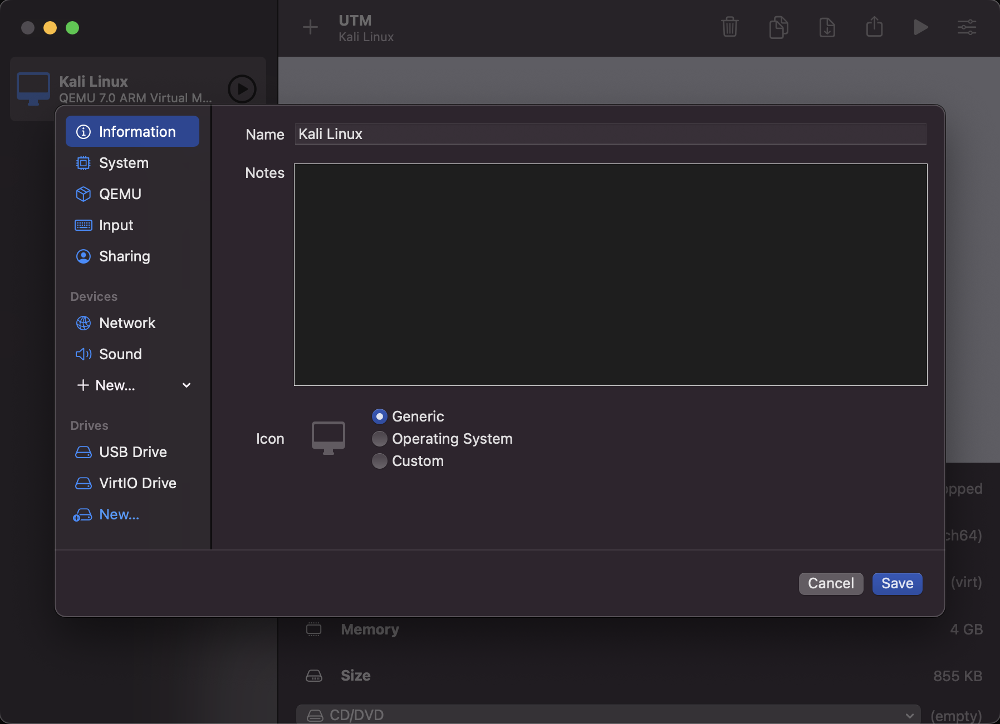

UTM VM을 설치하고 설정하는 것은 매우 간단해요. 우선 [UTM](https://mac.getutm.app/)을 다운로드하고 앱을 실행하세요. 그런 다음 VM 생성을 클릭하고 간단한 과정을 시작할 수 있어요:

[칼리 Apple M1 설치 프로그램](/get-kali/#kali-installer-images) iso를 사용할 것이므로 가상화(Virtualize)를 선택하면 다음 페이지로 이동해요:

여기에서 "Other"를 선택하면 다시 다음 페이지로 이동해요:

이제 한 가지만 변경할 거예요. "Boot ISO Image"를 선택하고 이전에 다운로드한 ISO를 선택하는 것이에요. 완료되면 계속을 누를 수 있어요:

여기서는 기본 크기를 사용할 거고 그냥 계속 진행할 거예요. 하지만 필요와 [설치 크기](/docs/installation/installation-sizes/)에 따라 늘리거나 줄일 수 있어요:

여기서도 아무것도 변경하지 않고 넘어갈 거예요. 하지만 공유 디렉토리를 원한다면 자유롭게 추가하세요:

이제 요약 화면이 나오고 VM의 이름을 "Kali Linux"로 변경할 수 있어요. 완료되면 저장을 누르고 설정 버튼을 누르세요. 현재 UTM 버전의 버그로 인해 칼리를 콘솔 전용 모드로만 설치해야 해요.

여기에서 "Devices" 아래에 "Serial" 장치를 추가할 수 있어요:

이제 저장하고 VM에서 재생을 누를 수 있어요. 프롬프트가 표시되면 "Install"을 선택하세요:

설치가 완료되면 VM의 CD/DVD 드라이브에서 ISO를 제거하세요.

그런 다음 VM의 설정으로 가서 "Serial" 장치를 마우스 오른쪽 버튼으로 클릭하고 "Remove"를 선택하여 제거하세요:

디스플레이 카드 에뮬레이션도 업데이트해야 해요. `virtio-gpu-pci` 옵션을 선택하세요:

"공유 디렉토리" 아래로 스크롤하여 설치 프로그램 iso 이미지를 선택하고 제거해야 해요. 이제 VM을 일반적으로 사용할 수 있어요.
