이 가이드는 VirtualBox 내부에서 칼리 리눅스를 가상화하여 칼리 가상머신을 갖는 방법에 관한 것이에요. 호스트와 완전히 분리되어 있고, 다른 가상머신들(호스트 머신 및 네트워크의 다른 머신들과 마찬가지로)과 상호작용할 수 있게 해주며, 스냅샷으로 되돌릴 수 있게 해주므로 칼리를 사용하는 좋은 방법이에요.

칼리 리눅스에 VirtualBox를 설치하려고 한다면([호스트](/docs/virtualization/install-virtualbox-host/)로서) 다른 가이드를 따르고 싶을 수도 있어요.

아래 가이드는 우리가 [미리 만들어진 칼리 리눅스 VirtualBox 이미지](/get-kali/#kali-virtual-machines)를 생성하는 데 사용하는 것이에요. 필요에 따라 이를 변경할 수 있어요. 우리는 항상 [최신 버전의 VirtualBox](https://www.virtualbox.org/wiki/Downloads)를 사용하여 이미지를 생성해요.

{}
가상화를 위해 BIOS/UEFI에서 가상화를 활성화해야 할 수도 있어요(예: Intel VT-x/AMD-V)
{}

### 마법사

VirtualBox를 시작하면 "새로 만들기"를 선택하세요(머신 -> 새로 만들기).

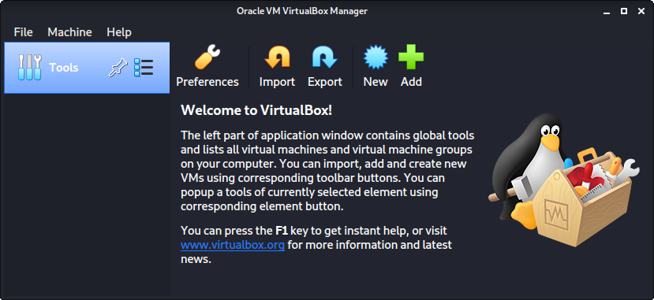

- - -

다음 화면은 "이름 및 운영 체제"로 가상머신의 이름을 지정하는 곳이에요. 이 이름은 파일명(구성, 하드 디스크 및 스냅샷 같은 - 이 시점부터 변경되지 않음)에도 사용돼요.

이 가이드에서는 일반적으로 유지하고 있어요(칼리는 [롤링 배포판](/docs/general-use/kali-branches/)이고 우리가 업데이트하기 때문에). 하지만 우리 릴리스의 경우 고정 릴리스이므로 이름에 버전 번호를 사용해요 _(`kali-linux-YYYY.N-vbox-ARCH`. 예시: `kali-linux-2025.1-vbox-amd64`)_.

"종류"의 경우 `Linux`로 설정해요. "버전"의 경우 x64 데스크톱 이미지를 사용할 것이므로 `Debian (64-bit)`를 선택할 거예요.

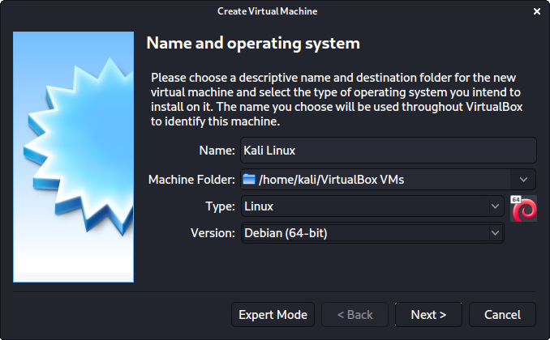

- - -

"메모리 크기"는 RAM을 얼마나 사용할지 정의할 수 있는 다음 섹션이에요. 다시 말하지만, RAM의 양이 높을수록 더 많은 애플리케이션을 열 수 있고 성능이 향상돼요. 칼리 내부의 다양한 도구들은 리소스를 많이 요구할 수 있어요. 일반 가상머신을 만들 때는 RAM으로 `2048 MB` (2GB)를 선택하지만, 칼리가 활용할 수 있는 여분의 RAM이 있는 고성능 장치를 가지고 있으므로 개인 머신에서는 종종 이를 늘려요.

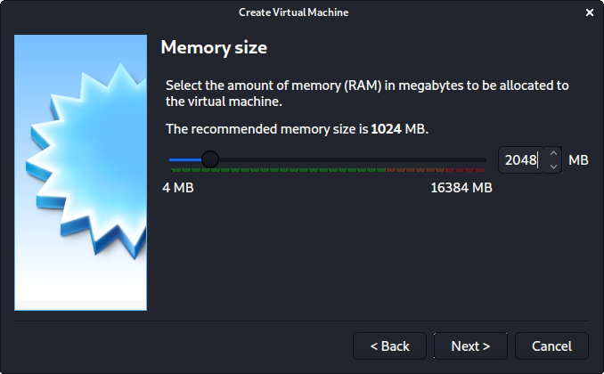

- - -

아래 화면인 "하드 디스크"에서는 `지금 새 가상 디스크 만들기`를 할 수 있어요.

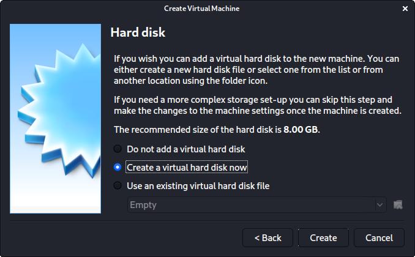

- - -

"하드 디스크 파일 형식"의 경우 `VDI (VirtualBox 디스크 이미지)`를 선택해요(그리고 이것이 기본 옵션이에요).

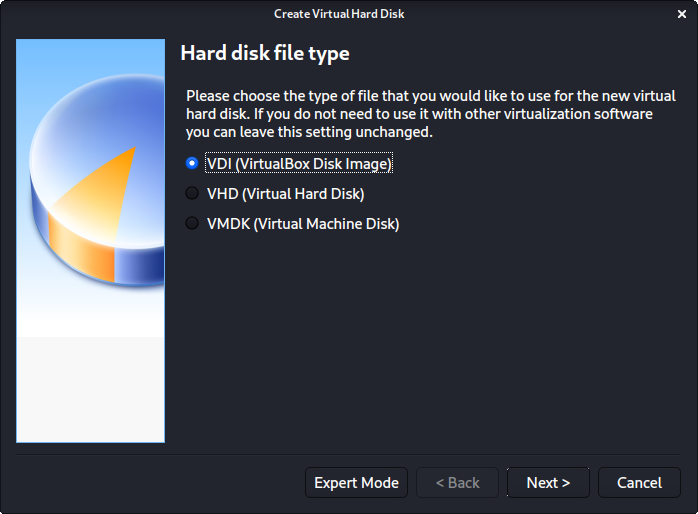

- - -

다음 화면인 "물리적 하드 디스크의 저장소"에서는 기본 옵션인 `동적 할당`을 선택해요.

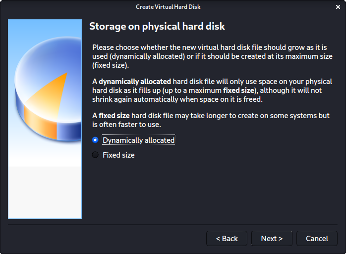

- - -

이제 "파일 위치 및 크기"에서 가상 하드 디스크가 얼마나 클지 정의할 수 있어요. 가상머신에는 `80.00 GB`를 사용해요.

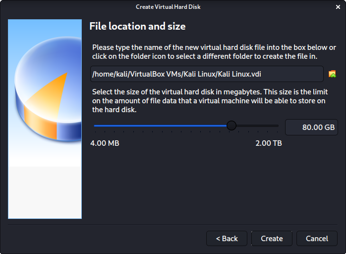

- - -

"만들기"를 클릭한 후 마법사가 완료돼요.

이제 "설정"을 클릭하여 가상머신을 더 자세히 커스터마이징해요.

- - -

"일반" -> "고급"에서 "공유 클립보드"를 `양방향`으로 설정하고 "드래그 앤 드롭"도 `양방향`으로 설정해야 해요.

- - -

"시스템" -> "마더보드"에서 "부팅 순서"를 변경하여 `하드 디스크`가 맨 위에 있고 `광학`이 두 번째가 되도록 해요. 나머지는 모두 비활성화돼요.

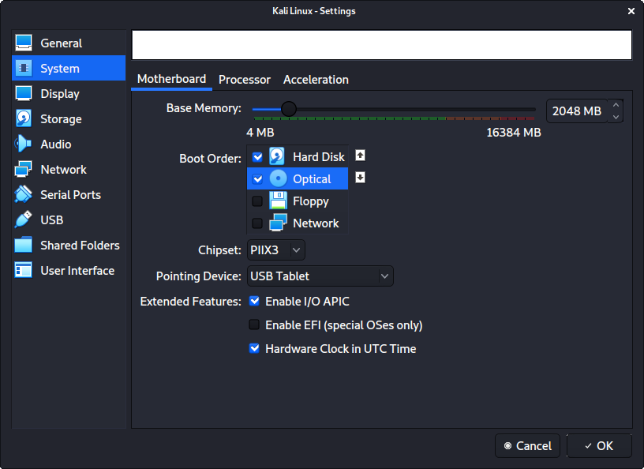

- - -

"시스템" -> "프로세서"에서 "프로세서"를 `2`로 늘려요.

동시에 `PAE/NX 활성화`를 위한 "확장 기능"도 활성화해요.

- - -

"디스플레이" -> "화면"에서 "비디오 메모리"가 `128 MB`로 설정되어 있는지 확인해요.

지적할 또 다른 항목은 "가속 3D 그래픽"이 **비활성화**되어 있는지 확인하는 것인데, 사람들이 이것이 문제를 일으킨다고 보고했거든요.

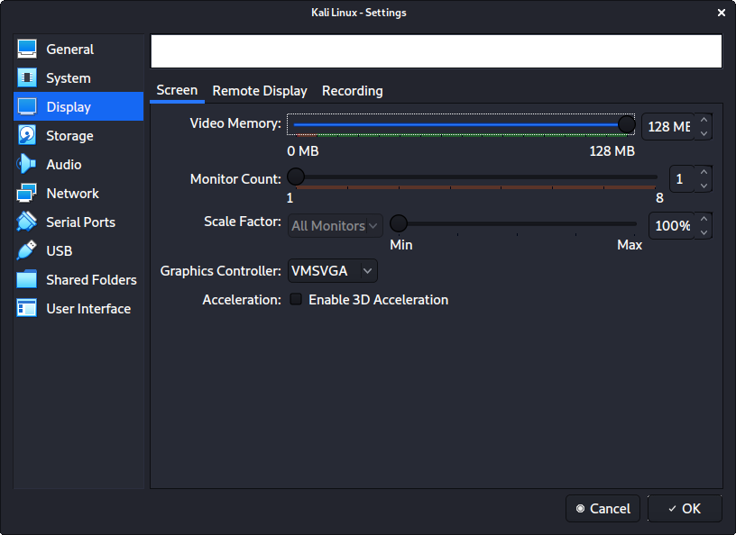

- - -

최종 설정 화면은 다음과 같이 보여요:

- - -

준비가 되면 "시작"을 누르세요.

처음 실행할 때 "시작 디스크"로 사용할 이미지를 마운트하고 싶은지 묻는 프롬프트가 나타날 거예요. 물리적 드라이브보다는 칼리 이미지를 사용하고 싶으므로 드롭다운 옆의 아이콘을 선택해요.

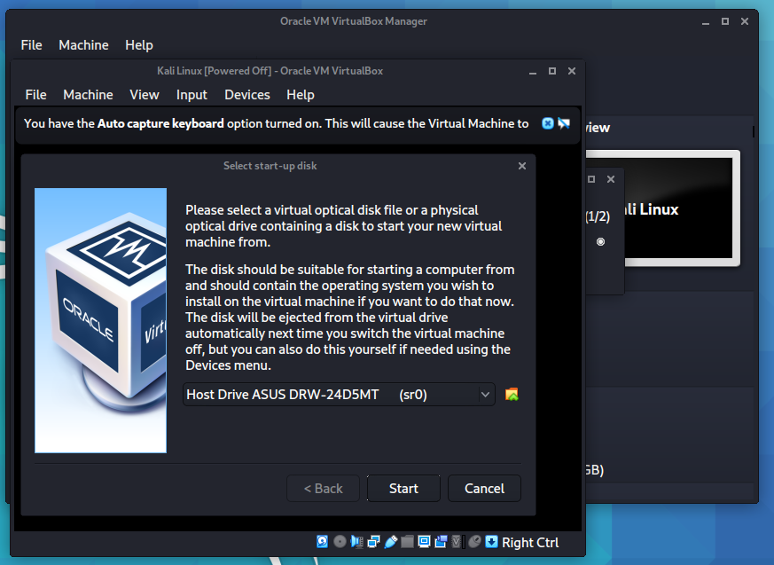

- - -

새 팝업이 열리는데, "광학 디스크 선택기"예요. 이제 "추가"를 누른 다음 ISO가 위치한 곳으로 이동해요.

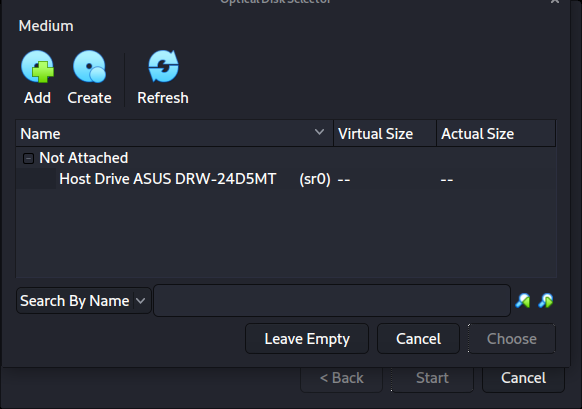

- - -

"열기"를 누른 후 추가된 것을 볼 수 있으므로 선택되어 있는지 확인하고 "선택"을 누르세요.

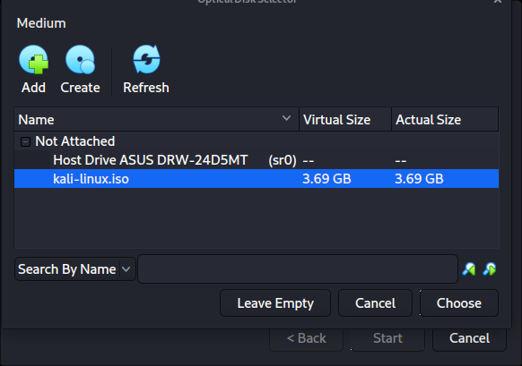

- - -

이제 남은 일은 "시작"을 누르는 것뿐이에요.

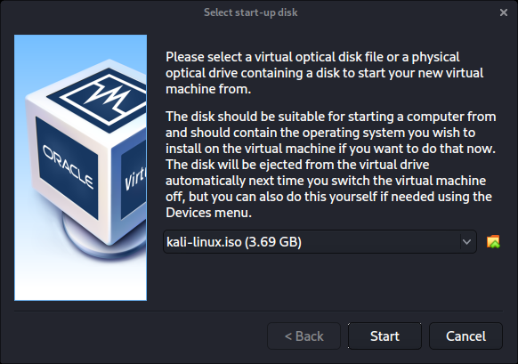

- - -

이 모든 것이 완료되면 저장하고, 가상머신을 시작한 다음, [베어메탈 설치](/docs/installation/hard-disk-install/)에서처럼 평소대로 칼리 리눅스 설치를 계속해요.

칼리 리눅스 설정 과정에서 [설치 마법사](https://gitlab.com/kalilinux/build-scripts/live-build-config/-/blob/master/simple-cdd/profiles/offline.downloads)는 **가상머신 내부에 있는지 감지**해야 해요. 그렇다면 더 나은 사용자 경험을 제공하기 위해 **추가 도구들을 자동으로 설치**해야 해요(`virtualbox-guest-x11` 같은). 수동으로 다시 설치하고 싶다면 [VirtualBox 게스트 가이드](/docs/virtualization/install-virtualbox-guest-additions/)를 참조할 수 있어요.

- - -

### 저장소 확장하기

##### Oracle VirtualBox 7.0:

칼리 리눅스 가상 머신이 종료되어 있는지 확인하세요.

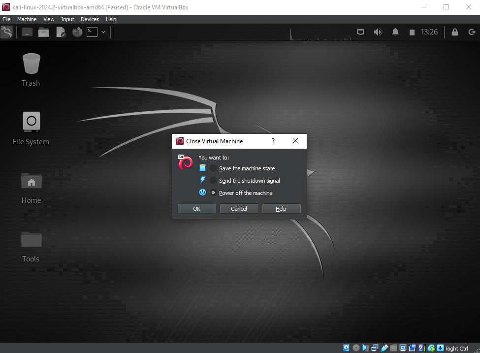

- - -

이제 Virtual Box 메뉴에서 가상 머신을 선택한 후 파일 -> 도구 -> 가상 미디어 관리자를 클릭하세요.

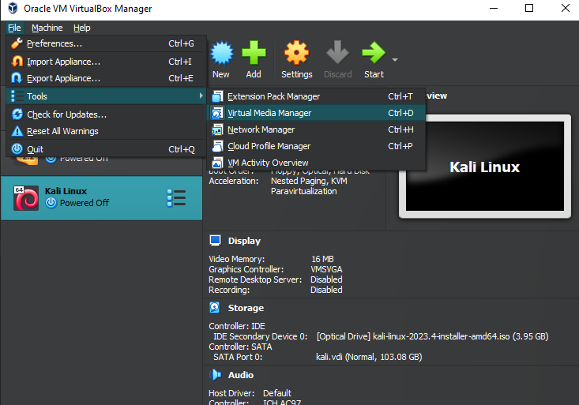

- - -

이제 가상 머신이 포함된 vdi 파일을 클릭하세요. 이제 가상 머신의 크기를 조정할 수 있어요. 크기를 조정한 후 '적용'을 클릭하세요.

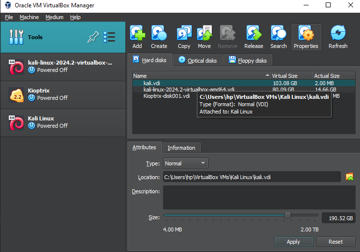

칼리 리눅스를 부팅하고 gparted나 비슷한 도구를 활용하여 파티션과 파일 시스템을 확장하고, 새 공간이 올바르게 할당되도록 하세요.