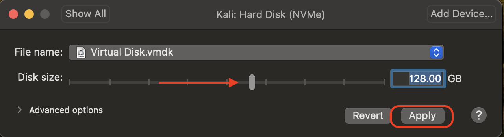

이 가이드는 VMware 내부에서 칼리 리눅스를 가상화하여 칼리 VM을 갖는 방법에 관한 것이에요. 호스트와 완전히 분리되어 있고, 다른 VM들(호스트 및 네트워크의 다른 머신들과 마찬가지로)과 상호작용할 수 있게 해주며, 스냅샷으로 되돌릴 수 있게 해주므로 칼리를 사용하는 좋은 방법이에요.

[칼리 리눅스에 VMware를 설치하려고 한다면(호스트로서)](/docs/virtualization/install-vmware-host/) 우리 가이드를 참조하세요.

아래 가이드는 우리가 [미리 만들어진 칼리 리눅스 VMware 이미지](/get-kali/#kali-virtual-machines)를 생성하는 데 사용하는 것이에요. 필요에 따라 이를 변경할 수 있어요. Player와 Fusion은 같은 수준의 기능과 설정 제어를 가지지 않으므로 항상 최신 버전의 VMware Workstation을 사용하여 이미지를 생성해요.

{}
가상화를 위해 BIOS/UEFI에서 가상화를 활성화해야 해요(예: Intel VT-x/AMD-V)
{}

### 마법사

VMware Workstation을 시작하면 "**Create a New Virtual Machine**"(새 가상 머신 만들기)를 선택하세요.

---

옵션이 있을 때 가상 머신 구성으로 "**Custom (advanced)**"(사용자 지정(고급))을 선택하세요. 이렇게 하면 VM 생성을 더 많이 제어할 수 있어요.

---

다음 화면은 "Virtual Machine Hardware Compatibility"(가상 머신 하드웨어 호환성)인데, "**Workstation 8.x**"를 사용해요.

이렇게 하면 더 많은 사용자가 (`.vmx` 파일을 편집하여 [다운그레이드](https://communities.vmware.com/thread/517825)할 필요 없이) 바로 칼리 리눅스의 혜택을 받을 수 있어요. v8보다 최신 버전의 VMware를 사용하고 있다면 시작 시 VMware가 VM 업그레이드에 대해 프롬프트를 표시할 거예요. 이는 이전 VMware 프로필로 인한 제한사항을 제거할 거예요.
하지만 대부분의 사용자는 칼리 리눅스 VM이 이런 모든 추가 리소스를 사용하지 않으므로(아래 스크린샷 참조) 최신 프로필을 갖는 것으로부터 혜택을 받지 못할 거예요. **이것이 우리가 구버전 프로필로 제공하는 이유예요**.

---

이 화면에서는 설치에 사용할 칼리 리눅스 이미지를 선택해요. "**Browse**"(찾아보기)를 선택하고 [다운로드](/docs/introduction/download-official-kali-linux-images/)한 ISO의 위치로 이동해요. [어떤 이미지를 다운로드할지에 대한 자세한 정보는 가이드를 작성했어요](/docs/introduction/what-image-to-download/).

---

"Guest Operating System"(게스트 운영 체제) 화면이 나타나면 "**Linux**"를 선택한 다음 ([칼리가 데비안 기반](/docs/policy/kali-linux-relationship-with-debian/)이므로) 버전으로 **최신 버전의 Debian**을 선택하세요. 이 예시에서는 Debian 10이에요. x64 이미지를 사용하여 칼리를 설치할 것이므로 64-bit를 선택했어요.

---

다음 화면은 "Virtual Machine Name"(가상 머신 이름)으로 VM의 이름을 지정하는 곳이에요. 이 이름은 파일명(구성, 하드 디스크 및 스냅샷 같은 - 이 시점부터 변경되지 않음)으로도 사용돼요.

"**Kali Linux**"를 사용하여 이 가이드에서는 일반적으로 유지하고 있어요(칼리 리눅스는 [롤링 배포판](/docs/general-use/kali-branches/)이고 우리가 [칼리 리눅스를 업데이트](/docs/general-use/updating-kali/)하기 때문에).
하지만 우리 릴리스의 경우 고정 릴리스이므로 이름에 버전 번호를 사용해요 _(`kali-linux-YYYY.N-vmware-ARCH`. 예시: `kali-linux-2025.3-vmware-amd64`)_.

---

다음 화면은 "Processors"(프로세서)예요. 여기서 VM에 제공할 리소스 수를 정의하기 시작할 수 있어요. 더 많은 리소스가 할당되면 칼리가 더 많은 작업을 동시에 수행하고 더 빠르게 수행할 수 있어요. "**2 processors**"(프로세서 2개)와 "**2 cores per processors**"(프로세서당 코어 2개)를 선택하여 총 4개 코어를 제공해요. 시스템 요구사항에 따라 더 많이 또는 더 적게 사용하고 싶을 수도 있어요.

---

"Memory"(메모리)는 RAM을 얼마나 사용할지 정의할 수 있는 다음 섹션이에요. 다시 말하지만, RAM의 양이 높을수록 더 많은 애플리케이션을 열 수 있고 성능이 향상돼요. 칼리 내부의 다양한 도구들은 리소스를 많이 요구할 수 있어요. 일반 VM을 만들 때는 RAM으로 2GB (**2048 MB**)를 선택하지만, 칼리가 활용할 수 있는 여분의 RAM이 있는 고성능 장치를 가지고 있으므로 개인 머신에서는 종종 이를 늘려요.

---

그다음 "Network Connection"(네트워크 연결)이 표시돼요. 기본적으로 **NAT** 연결을 사용해요. 하지만 이는 쉽게 변경할 수 있어요(VM이 켜져 있을 때도). 이를 통해 칼리 VM이 추가 IP 주소를 차지하지 않고도 인터넷과 LAN 연결의 나머지 부분과 통신할 수 있어요. 단점은 (VMware 내부에서 포트 포워딩 없이는) 리버스 셸을 받을 수 없다는 것이에요.

---

다음은 "I/O Controller Types"(I/O 컨트롤러 유형)이에요. "**LSI Logic**"의 기본값을 받아들여요.

---

다음은 "Virtual Disk Type"(가상 디스크 유형)이에요. "**SCSI**"의 기본값을 받아들여요.

---

다음 화면은 "Disk"(디스크)로 "**create a new virtual disk**"(새 가상 디스크 만들기)를 할 수 있어요.

---

아래 화면인 "Disk Size"(디스크 크기)에서는 가상 하드 디스크가 얼마나 클지 정의할 수 있어요. VM에는 "**80 GB**"를 사용해요.

또한 단일 파일이 아니라 "**Split virtual disk into multiple files**"(가상 디스크를 여러 파일로 분할)해요. "Allocate all disk space"(모든 디스크 공간 할당)을 활성화하지 않으므로 VM 하드 디스크는 시간이 지남에 따라 최대 크기까지 증가할 거예요.

VM이 생성된 후 하드 디스크를 늘리거나 줄이는 것이 가능하지만, 칼리를 설치한 경우 공간이 이를 반영하도록 파티션을 확장하거나 축소해야 해요.

---

"Disk File"(디스크 파일) 화면에서는 설정 과정 초기에 VM 이름에서 정의된 기본값을 받아들여요.

---

그러면 우리가 선택한 설정의 개요를 제공하는 VM 설정 마법사의 최종 화면이 표시돼요.

보여준 내용에 만족하므로 "**Finish**"(완료)를 누르세요. VM이 완전히 생성되기 전인 이 단계에서 "Customize Hardware"(하드웨어 사용자 지정)를 시도하면 모든 설정이 보이지 않아요.

---

마법사를 처음 사용하는 경우 "[VMware tools](/docs/virtualization/install-vmware-guest-tools/)"를 설치하면 VM 사용 시 더 나은 경험을 제공한다는 설명이 담긴 다음 프롬프트가 나타날 수도 있어요.

페이지를 읽고 이해한 후 닫기를 누르기 전에 "Don't show this page again"(다시 이 페이지 표시 안 함)을 체크하고 싶을 수도 있어요.

---

### 설정 편집

VM을 시작하기 전에 "**Edit virtual machine settings**"(가상 머신 설정 편집)을 눌러 설정을 편집해요.

---

프린터는 사용할 일이 없으므로 제거해요. "**Printer**"(프린터) 섹션으로 이동한 다음 "**Remove**"(제거)를 누르세요.

---

USB 장치가 어떻게 동작하는지 변경하기 위해 "**USB**" 설정을 편집하고 싶을 수도 있어요. 여기서는 "**Automatically connect new USB devices**"(새 USB 장치 자동 연결)을 비활성화하고 _(VMware 버전에 따라 옵션이 없을 수도 있어요)_ "**Show all USB input devices**"(모든 USB 입력 장치 표시)를 활성화했어요.

---

지적할 또 다른 항목은 "Display"(디스플레이) 섹션에 있어요. "**Accelerated 3D graphics**"(가속 3D 그래픽)이 **비활성화**되어 있는지 확인하세요. 사람들이 이것이 문제를 일으킨다고 보고했거든요.

---

그다음 "**Options**"(옵션) 탭으로 이동하여 "**Power**"(전원)로 이동해요. 랩톱/노트북에서 칼리를 사용하는 사용자에게 유용한 기능이므로 "**Report battery information to guests**"(게스트에 배터리 정보 보고)를 활성화하기로 선택해요.

---

"**Shared folders**"(공유 폴더)에서는 "**Always enable**"(항상 활성화)를 선택해요. 이 단계에서는 일부 사용자가 원하지 않을 수도 있으므로 경로를 공유하지 마세요.

---

변경하는 마지막 옵션은 "**Synchronize guest time with host**"(게스트 시간을 호스트와 동기화)를 활성화하는 "**VMware Tool**" 섹션이에요.

---

이 모든 것이 완료되면 저장하고, VM을 시작한 다음, [베어메탈 설치](/docs/installation/hard-disk-install/)에서처럼 평소대로 칼리 리눅스 설치를 계속해요.

칼리 리눅스 설정 과정에서 [설치 마법사](https://gitlab.com/kalilinux/build-scripts/live-build-config/-/blob/master/simple-cdd/profiles/offline.downloads)는 **VM 내부에 있는지 감지**해야 해요. 그렇다면 더 나은 사용자 경험을 제공하기 위해 **추가 도구들을 자동으로 설치**해야 해요(`open-vm-tools` 같은). 수동으로 다시 설치하고 싶다면 [VMware 게스트 도구 가이드](/docs/virtualization/install-vmware-guest-tools/)를 참조할 수 있어요.

### 저장소 확장

##### VMware Workstation/Fusion:

칼리 리눅스 VM을 종료하세요.

VM Settings -> Hard Disk(VM 설정 -> 하드 디스크)로 이동하세요.

원하는 디스크 크기를 늘리고 "Expand"(확장)를 클릭하세요.

칼리 리눅스를 부팅하고 gparted나 비슷한 도구를 활용하여 파티션과 파일 시스템을 확장하고, 새 공간이 올바르게 할당되도록 하세요.
