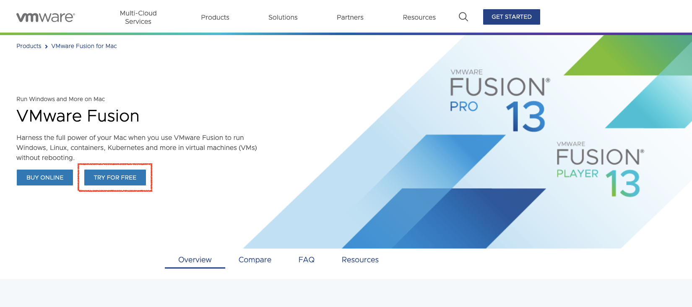
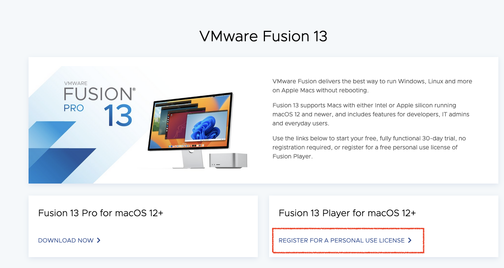
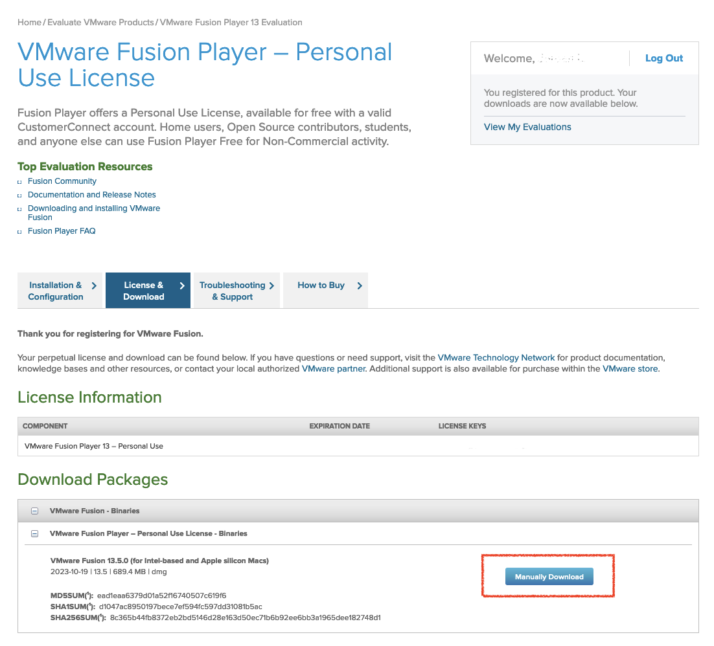
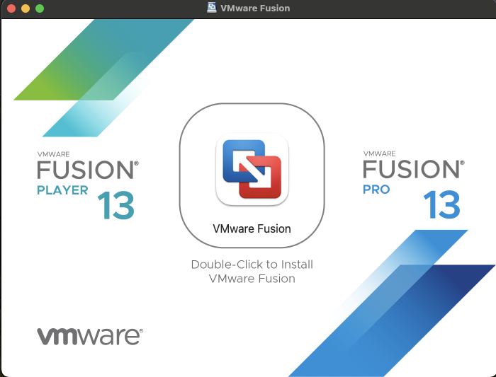
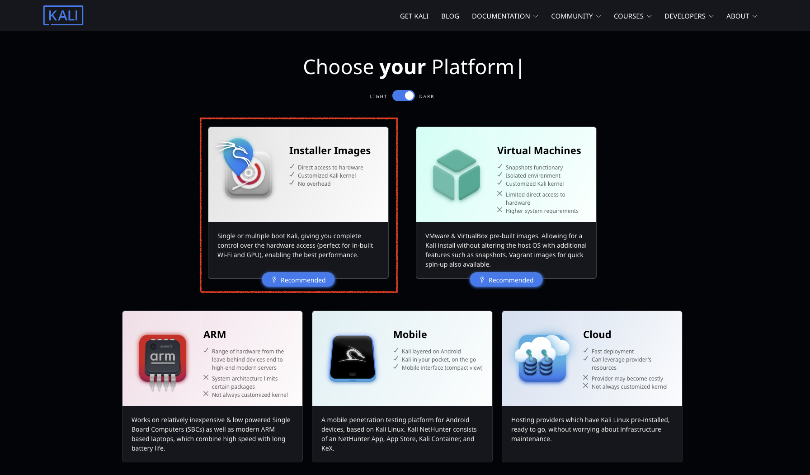
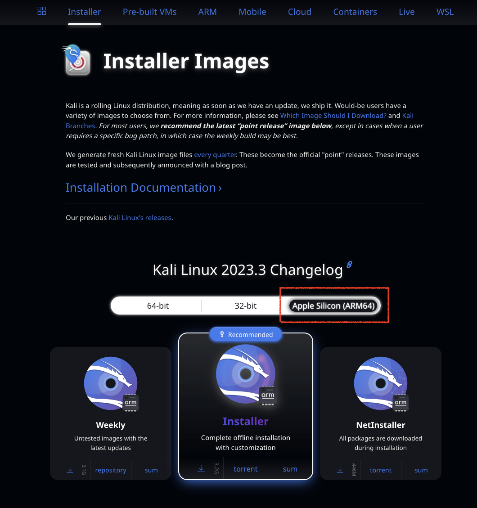
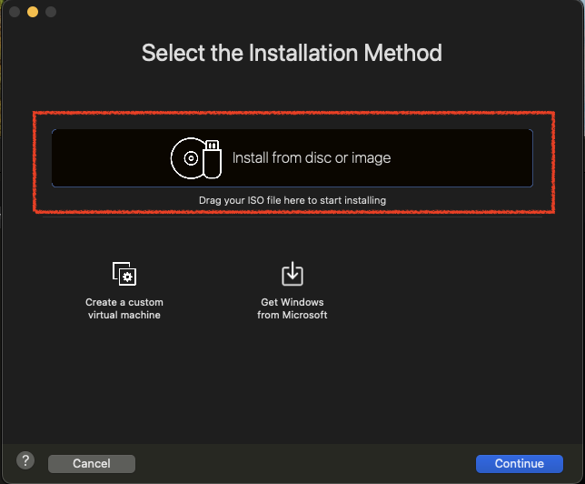
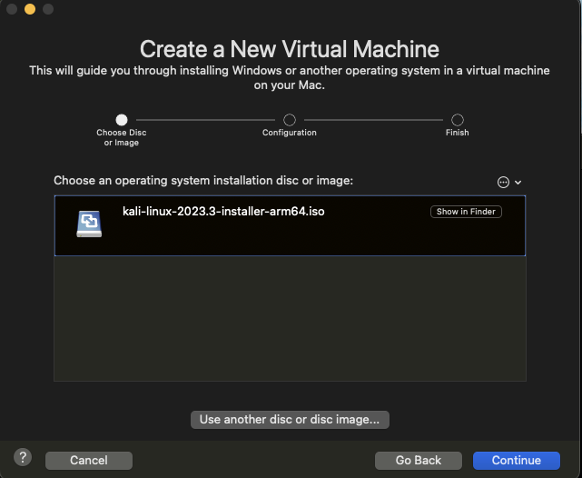
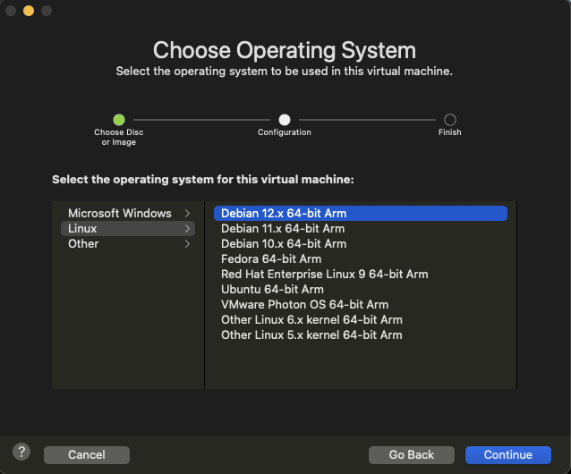
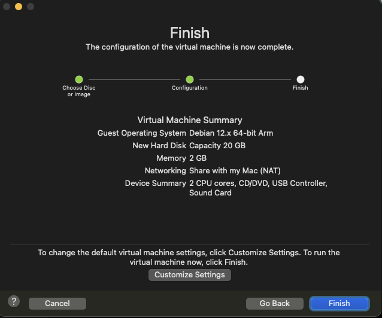

{}
구동을 위해서는 최소 VMware Fusion 13.x.x가 필요해요

VMware 업데이터 소프트웨어의 제한으로 이전 버전을 사용하고 있다면, 사용 가능한 버전이 없다고 떠요. VMware의 웹사이트에서 다운로드 후 수동으로 설치하세요.
{}

먼저 [Get Fusion](https://www.vmware.com/products/fusion.html)으로 이동하여 Pro 버전을 구매할지 아니면 무료로 시작할지 선택하세요.

계정을 생성하고 등록하면 VMware Fusion에 대한 개인용 라이센스를 요청할 수 있어요.

버전 13.x.x을 다운로드하세요.

더블 클릭하여 설치하세요.

다음으로 "[설치 이미지](https://www.kali.org/get-kali/#kali-installer-images)"를 받아야해요. 그냥 Apple Silicon (ARM64) 이미지를 선택하기만 하세요.

.iso가 저장된 위치를 적어두세요, VMware Fusion에서 설치하는데 필요합니다.

VMware Fusion 13을 설치한 후 처음 열면 사용자가 새로운 머신을 생성해야 해요. 한번 머신을 만들었다면, 옵션에서 "create new machine"을 선택하세요.

다운로드 후 .iso가 저장된 위치를 여세요.
새로 다운로드한 .iso를 드래그하여 설치를 시작하세요 (Debian 12.x 64-bit Arm).

VMware Fusion 애플리케이션 창에서 "install from disk or image"를 클릭하거나 "use another disc or disc image" 옵션을 선택하세요.

